<!-- TOC -->
* [Java 8 Streams vs Collections](#java-8-streams-vs-collections)
  * [🌊 Stream API Overview](#-stream-api-overview)
  * [Stream API](#stream-api)
  * [⚖️ Key Differences](#-key-differences)
  * [💡 Example Comparison](#-example-comparison)
  * [🧱 Stream Operations: Intermediate vs Terminal](#-stream-operations-intermediate-vs-terminal)
    * [🔁 Intermediate Operations](#-intermediate-operations)
    * [✅ Terminal Operations](#-terminal-operations)
      * [🧩 Summary](#-summary)
* [⚙️ **ForkJoinPool, Stream & ParallelStream — Summary**](#-forkjoinpool-stream--parallelstream--summary)
  * [🧩 **1️⃣ ForkJoinPool Overview**](#-1-forkjoinpool-overview)
    * [🔸 Example:](#-example)
  * [⚔️ **2️⃣ ForkJoinPool vs Threads vs ExecutorService**](#-2-forkjoinpool-vs-threads-vs-executorservice)
    * [⚡ **3️⃣ Still Used in Java 21?**](#-3-still-used-in-java-21)
    * [🧠 **4️⃣ Stream Internals**](#-4-stream-internals)
    * [⚡ **5️⃣ Parallel Stream — How It Works**](#-5-parallel-stream--how-it-works)
    * [🔍 **6️⃣ Stream vs ParallelStream**](#-6-stream-vs-parallelstream)
    * [⚖️ **7️⃣ When to Use Parallel Streams**](#-7-when-to-use-parallel-streams)
      * [✅ **In Short**](#-in-short)
  * [📦 `Collectors` from `java.util.stream`](#-collectors-from-javautilstream)
    * [🔧 Common Collector Methods](#-common-collector-methods)
    * [🔗 Joining Strings](#-joining-strings)
    * [🔢 Counting & Summarizing](#-counting--summarizing)
    * [🧮 Grouping & Partitioning](#-grouping--partitioning)
    * [➕ Reducing](#-reducing)
    * [🛠️ Post-processing](#-post-processing)
    * [🔝 Min / Max](#-min--max)
* [📘 Java Features from 8 to 21 (LTS)](#-java-features-from-8-to-21-lts)
    * [☕ Java 8 (2014)](#-java-8-2014)
    * [☕ Java 9 (2017)](#-java-9-2017)
    * [☕ Java 10 (2018)](#-java-10-2018)
    * [☕ Java 11 (2018) – LTS](#-java-11-2018--lts)
    * [☕ Java 12 (2019)](#-java-12-2019)
    * [☕ Java 13–14 (2019–2020)](#-java-1314-20192020)
    * [☕ Java 15–16 (2020–2021)](#-java-1516-20202021)
    * [☕ Java 17 (2021) – LTS](#-java-17-2021--lts)
    * [☕ Java 19–20 (2022–2023)](#-java-1920-20222023)
    * [☕ Java 21 (2023) – LTS](#-java-21-2023--lts)
    * [✅ Summary Table](#-summary-table)
  * [Java 8](#java8)
    * [1. Lambda Expressions & Stream API](#1-lambda-expressions--streamapi)
      * [Stream Basics](#stream-basics)
    * [2. Method References](#2-method-references)
    * [3. Default & Static Methods in Interfaces](#3-default--static-methods-in-interfaces)
    * [4. Type Annotations & Repeating Annotations](#4-type-annotations--repeating-annotations)
    * [5. Method Parameter Reflection](#5-method-parameter-reflection)
    * [6. Optional, Date‑Time, and CompletableFuture](#6-optional-datetime-and-completablefuture)
    * [7. `java.util.function` Package](#7-javautilfunction-package)
    * [8. Collections & Comparator Improvements](#8-collections--comparator-improvements)
    * [9. Primitive Streams & Spliterator](#9-primitive-streams--spliterator)
    * [Java 8 Key Features](#java-8-key-features)
* [@SafeVarargs in Java](#safevarargs-in-java)
  * [What is `@SafeVarargs`?](#what-is-safevarargs)
  * [Why use `@SafeVarargs`?](#why-use-safevarargs)
  * [Example without `@SafeVarargs` (generates warning)](#example-without-safevarargs-generates-warning)
  * [Example with `@SafeVarargs` (no warning)](#example-with-safevarargs-no-warning)
  * [Important Notes](#important-notes)
  * [When to use?](#when-to-use)
* [Java 8](#java-8)
  * [1. Lambda Expressions](#1-lambda-expressions)
  * [2. Functional Interfaces](#2-functional-interfaces)
  * [3. Streams API](#3-streams-api)
  * [4. Optional Class](#4-optional-class)
  * [**Java Optional Cheat Sheet**](#java-optional-cheat-sheet)
    * [**Example Using Multiple Methods**](#example-using-multiple-methods)
    * [**How to Read It**](#how-to-read-it)
  * [5. Default and Static Methods in Interfaces](#5-default-and-static-methods-in-interfaces)
  * [6. Date and Time API (`java.time`)](#6-date-and-time-api-javatime)
  * [7. Method References](#7-method-references)
  * [8. Repeatable Annotations](#8-repeatable-annotations)
  * [9. Type Annotations](#9-type-annotations)
  * [10. Nashorn JavaScript Engine](#10-nashorn-javascript-engine)
* [Java 9](#java-9)
  * [1. Module System (Project Jigsaw)](#1-module-system-project-jigsaw)
  * [2. JShell (REPL)](#2-jshell-repl)
  * [3. Private Methods in Interfaces](#3-private-methods-in-interfaces)
  * [4. Collection Factory Methods](#4-collection-factory-methods)
  * [5. Stream API Improvements](#5-stream-api-improvements)
  * [6. Optional Enhancements](#6-optional-enhancements)
  * [7. Process API Updates](#7-process-api-updates)
* [Java 10](#java-10)
  * [1. Local-Variable Type Inference (`var`)](#1-local-variable-type-inference-var)
  * [2. Application Class-Data Sharing (AppCDS)](#2-application-class-data-sharing-appcds)
  * [3. Parallel Full GC for G1](#3-parallel-full-gc-for-g1)
  * [4. Thread-Local Handshakes](#4-thread-local-handshakes)
  * [5. Root Certificates in JDK](#5-root-certificates-in-jdk)
* [Java 11](#java-11)
  * [1. HTTP Client API (Standardized)](#1-http-client-api-standardized)
  * [2. Local-Variable Syntax for Lambda Parameters](#2-local-variable-syntax-for-lambda-parameters)
  * [3. New String Methods](#3-new-string-methods)
  * [4. Collection toArray(IntFunction)](#4-collection-toarrayintfunction)
  * [5. File Methods (`readString`, `writeString`)](#5-file-methods-readstring-writestring)
  * [6. Running Java Files Directly](#6-running-java-files-directly)
  * [7. Other Notable Features](#7-other-notable-features)
* [Java 12](#java-12)
  * [1. Switch Expressions (Preview)](#1-switch-expressions-preview)
  * [2. New JVM Constants API](#2-new-jvm-constants-api)
  * [3. Shenandoah & Abortable Mixed GC Improvements](#3-shenandoah--abortable-mixed-gc-improvements)
  * [4. Compact Number Formatting](#4-compact-number-formatting)
  * [5. Additional Features](#5-additional-features)
* [Java 13](#java-13)
  * [1. Text Blocks (Preview)](#1-text-blocks-preview)
  * [2. Switch Expressions Enhancements](#2-switch-expressions-enhancements)
  * [3. Reimplement the Legacy Socket API](#3-reimplement-the-legacy-socket-api)
  * [4. Other Minor Features](#4-other-minor-features)
* [Java 14](#java-14)
  * [1. Records (Preview)](#1-records-preview)
  * [2. Pattern Matching for `instanceof` (Preview)](#2-pattern-matching-for-instanceof-preview)
  * [3. Helpful NullPointerExceptions](#3-helpful-nullpointerexceptions)
  * [4. Switch Expressions (Second Preview)](#4-switch-expressions-second-preview)
  * [5. Records, Pattern Matching, and NVM-support for JFR](#5-records-pattern-matching-and-nvm-support-for-jfr)
* [Java 15](#java-15)
  * [1. Sealed Classes (Preview)](#1-sealed-classes-preview)
  * [2. Hidden Classes](#2-hidden-classes)
  * [3. Text Blocks (Standardized)](#3-text-blocks-standardized)
  * [4. Records (Second Preview)](#4-records-second-preview)
  * [5. Pattern Matching for `instanceof` (Second Preview)](#5-pattern-matching-for-instanceof-second-preview)
  * [6. Other Notable Features](#6-other-notable-features)
* [Java 16](#java-16)
  * [1. Records (Standardized)](#1-records-standardized)
  * [2. Pattern Matching for `instanceof` (Standardized)](#2-pattern-matching-for-instanceof-standardized)
  * [3. Sealed Classes (Second Preview)](#3-sealed-classes-second-preview)
  * [4. Vector API (Incubator)](#4-vector-api-incubator)
  * [5. Foreign Linker API (Incubator)](#5-foreign-linker-api-incubator)
  * [6. Other Features](#6-other-features)
* [Java 17](#java-17)
  * [1. Sealed Classes (Standardized)](#1-sealed-classes-standardized)
  * [2. Pattern Matching for `switch` (Preview)](#2-pattern-matching-for-switch-preview)
  * [3. Strong Encapsulation of JDK Internals](#3-strong-encapsulation-of-jdk-internals)
  * [4. New macOS Rendering Pipeline](#4-new-macos-rendering-pipeline)
  * [5. Foreign Function & Memory API (Incubator)](#5-foreign-function--memory-api-incubator)
  * [6. Other Notable Features](#6-other-notable-features-1)
* [Java 18](#java-18)
  * [1. Simple Web Server](#1-simple-web-server)
  * [2. UTF-8 by Default](#2-utf-8-by-default)
  * [3. Vector API (Second Incubator)](#3-vector-api-second-incubator)
  * [4. Code Snippets in Java API Documentation](#4-code-snippets-in-java-api-documentation)
  * [5. Other Notable Features](#5-other-notable-features)
* [Java 19](#java-19)
  * [1. Virtual Threads (Preview)](#1-virtual-threads-preview)
  * [2. Record Patterns (Preview)](#2-record-patterns-preview)
  * [3. Pattern Matching for `switch` (Second Preview)](#3-pattern-matching-for-switch-second-preview)
  * [4. Foreign Function & Memory API (Second Incubator)](#4-foreign-function--memory-api-second-incubator)
  * [5. Other Notable Features](#5-other-notable-features-1)
* [Java 20](#java-20)
  * [1. Virtual Threads (Second Preview)](#1-virtual-threads-second-preview)
  * [2. Record Patterns (Second Preview)](#2-record-patterns-second-preview)
  * [3. Pattern Matching for `switch` (Third Preview)](#3-pattern-matching-for-switch-third-preview)
  * [4. Scoped Values (Incubator)](#4-scoped-values-incubator)
  * [5. Foreign Function & Memory API (Third Incubator)](#5-foreign-function--memory-api-third-incubator)
  * [6. Other Notable Features](#6-other-notable-features-2)
* [Java 21](#java-21)
  * [1. Virtual Threads (Standardized)](#1-virtual-threads-standardized)
  * [2. Pattern Matching for `switch` (Standardized)](#2-pattern-matching-for-switch-standardized)
  * [3. Sequenced Collections](#3-sequenced-collections)
  * [4. String Templates (Preview)](#4-string-templates-preview)
  * [5. Record Patterns (Third Preview)](#5-record-patterns-third-preview)
  * [6. Structured Concurrency (Incubator)](#6-structured-concurrency-incubator)
  * [7. Foreign Function & Memory API (Fourth Incubator)](#7-foreign-function--memory-api-fourth-incubator)
<!-- TOC -->

# [Java 8 Streams vs Collections](https://www.java2novice.com/java_interview_questions/java-8-streams-vs-collection-framework/)

📺 [Video Explanation](https://youtu.be/lyl2Y5rwfx4?si=WiTKZxZDzVDnEVFV)

---

## 🌊 Stream API Overview

In Java, **Collections** and **Streams** serve different purposes:

| Collections                                                                       | Streams                                                                                          |
| --------------------------------------------------------------------------------- | ------------------------------------------------------------------------------------------------ |
| **Purpose**: Store and manage groups of objects like `List`, `Set`, `Map`, etc.   | **Purpose**: Process data in a functional and declarative manner using filter, map, reduce, etc. |
| **Data Storage**: In-memory storage with CRUD operations.                         | **Data Processing**: Pipeline-based processing; does not store data.                             |
| **Mutability**: Collections can be modified.                                      | **Immutability**: Streams are immutable; operations return new streams.                          |
| **Iteration**: External iteration (e.g., `for-each`).                             | **Iteration**: Internal iteration handled by the stream API.                                     |
| **Performance**: Varies with collection type (e.g., `ArrayList` vs `LinkedList`). | **Performance**: Efficient, especially with parallel streams.                                    |
| **Thread Safety**: Some are thread-safe (`Vector`, `Hashtable`), others are not.  | **Thread Safety**: Streams are not thread-safe unless explicitly handled.                        |


## [Stream API](https://www.tutorialspoint.com/java8/java8_streams.htm)

- Using collections framework in Java, a developer has to use loops and make repeated checks. Another concern is efficiency; as multi-core processors are available at ease, a Java developer has to write parallel code processing that can be pretty error-prone.

- To resolve such issues, Java 8 introduced the concept of stream that lets the developer to proccess data declaratively and leverage multicore architecture without the need to write any specific code for it.

- **forEach()** - to iterate each element of the stream.

```java
Random random = new Random();
random.ints().limit(10).forEach(System.out::println);
```

- **map()** - used to map each element to its corresponding result.

```java
List<Integer> numbers = Arrays.asList(3, 2, 2, 3, 7, 3, 5);
//get list of unique squares
List<Integer> squaresList = numbers.stream().map( i -> i*i).distinct().collect(Collectors.toList());
```

- **filter()** - used to eliminate elements based on a criteria.

```java
List<String>strings = Arrays.asList("abc", "", "bc", "efg", "abcd","", "jkl");
//get count of empty string
int count = strings.stream().filter(string -> string.isEmpty()).count();
```

- **sorted()** - Used to sort the stream

```java
Random random = new Random();
random.ints().limit(10).sorted().forEach(System.out::println);
```

---

## ⚖️ Key Differences

* **Collections** are for **storing** and **manipulating** data.
* **Streams** are for **processing** data.
* Streams are **lazy**, **stateless**, and **functional**.
* Collections are **eager**, **stateful**, and **imperative**.
* Streams support easy **parallelism** (`parallelStream()`).

---

## 💡 Example Comparison

<details open>
<summary><strong>📚 Collections Example</strong></summary>

```java
List<String> names = new ArrayList<>();
names.add("Alice");
names.add("Bob");
names.add("Charlie");

for (String name : names) {
    System.out.println(name);
}
```

</details>

<details open>
<summary><strong>🚀 Streams Example</strong></summary>

```java
List<String> names = Arrays.asList("Alice", "Bob", "Charlie");

names.stream()
     .filter(name -> name.startsWith("A"))
     .map(String::toUpperCase)
     .forEach(System.out::println);  // Outputs: ALICE
```

</details>

---

## 🧱 Stream Operations: Intermediate vs Terminal

Stream operations are divided into:

* **Intermediate operations** (lazy, return a stream)
* **Terminal operations** (eager, return a result)

---

### 🔁 Intermediate Operations

<details>
<summary><strong>Intermediate Operations</strong></summary>

| Method                            | Description                    | Example                                    |
|-----------------------------------|--------------------------------|--------------------------------------------|
| `filter(Predicate<T>)`            | Filters elements by condition. | `stream.filter(x -> x > 5)`                |
| `map(Function<T, R>)`             | Transforms elements.           | `stream.map(x -> x * 2)`                   |
| `flatMap(Function<T, Stream<R>>)` | Flattens nested streams.       | `stream.flatMap(x -> Stream.of(x, x * 2))` |
| `distinct()`                      | Removes duplicates.            | `stream.distinct()`                        |
| `sorted()`                        | Sorts elements.                | `stream.sorted()`                          |
| `peek(Consumer<T>)`               | Performs action for debugging. | `stream.peek(System.out::println)`         |
| `limit(long)`                     | Truncates stream size.         | `stream.limit(5)`                          |
| `skip(long)`                      | Skips first n elements.        | `stream.skip(3)`                           |

</details>

---

### ✅ Terminal Operations

<details>
<summary><strong>Terminal Operations</strong></summary>

| Method                                                         | Description                       | Example                                 |
|----------------------------------------------------------------|-----------------------------------|-----------------------------------------|
| `forEach(Consumer<T>)`                                         | Performs action on each element.  | `stream.forEach(System.out::println)`   |
| `toArray()`                                                    | Converts stream to array.         | `Object[] arr = stream.toArray()`       |
| `reduce(BinaryOperator<T>)`                                    | Reduces elements to single value. | `stream.reduce((a, b) -> a + b)`        |
| `collect(Collector<T, A, R>)`                                  | Collects results into container.  | `stream.collect(Collectors.toList())`   |
| `min(Comparator<T>)` / `max(...)`                              | Finds min/max elements.           | `stream.min(Comparator.naturalOrder())` |
| `count()`                                                      | Counts number of elements.        | `stream.count()`                        |
| `anyMatch(...)` / `allMatch(...)` / `noneMatch(...)`           | Matches based on conditions.      | `stream.anyMatch(x -> x > 10)`          |
| `findFirst()` / `findAny()`                                    | Finds first/any element.          | `stream.findFirst()`                    |
| `iterator()` / `spliterator()`                                 | Provides stream iterator.         | `stream.iterator()`                     |
| `isParallel()` / `parallel()` / `sequential()` / `unordered()` | Stream configuration.             | `stream.parallel()`                     |

</details>

---

#### 🧩 Summary

| Feature       | Collections     | Streams                      |
|---------------|-----------------|------------------------------|
| Data Handling | Stores data     | Processes data               |
| Mutability    | Mutable         | Immutable                    |
| Evaluation    | Eager           | Lazy                         |
| Iteration     | External        | Internal                     |
| Use Case      | CRUD operations | Data transformation          |
| Parallelism   | Manual          | Easy with `parallelStream()` |

---

# ⚙️ **ForkJoinPool, Stream & ParallelStream — Summary**

<details>
<summary><strong>**ForkJoinPool** and **Stream / ParallelStream (internal working)** — all key points kept intact 👇</strong></summary>

## 🧩 **1️⃣ ForkJoinPool Overview**

* Introduced in **Java 7** for **parallel, divide-and-conquer** tasks.
* Uses **work-stealing algorithm** — idle threads “steal” tasks from others.
* Backbone for **parallel streams** and **CompletableFuture**.

### 🔸 Example:

```java
ForkJoinPool pool = new ForkJoinPool();
pool.invoke(new RecursiveTaskExample());
```

---

## ⚔️ **2️⃣ ForkJoinPool vs Threads vs ExecutorService**

| Feature    | Thread                | ExecutorService                   | ForkJoinPool                |
| ---------- | --------------------- | --------------------------------- | --------------------------- |
| Creation   | Manual (`new Thread`) | Managed pool                      | Specialized pool            |
| Work Model | 1 task/thread         | Queued tasks                      | Split–merge recursive tasks |
| Best For   | Simple async jobs     | Batch tasks                       | CPU-bound parallel compute  |
| Example    | `new Thread()`        | `Executors.newFixedThreadPool(5)` | `new ForkJoinPool()`        |

---

### ⚡ **3️⃣ Still Used in Java 21?**

✅ **Yes** — powers:

* `parallelStream()`
* `CompletableFuture`
* Some structured concurrency APIs

But now we also have **Virtual Threads** (Java 21) for **I/O-bound** concurrency.

| Feature  | ForkJoinPool               | Virtual Threads         |
| -------- | -------------------------- | ----------------------- |
| Model    | Work-stealing              | Lightweight threads     |
| Best For | CPU-bound parallel compute | Massive I/O concurrency |
| Threads  | Few (≈ CPU cores)          | Thousands possible      |

---

### 🧠 **4️⃣ Stream Internals**

A **Stream** is a **lazy pipeline** of operations:

```
Source → Intermediate Ops → Terminal Op
```

* **Source:** collection, array, I/O
* **Intermediate:** `filter()`, `map()`, etc. (lazy)
* **Terminal:** `forEach()`, `collect()` → triggers execution

Each element flows through all ops in order once a terminal op runs.

Internally uses:

* **Spliterator** → splits data
* **PipelineHelper / Sink** → chains ops
* **StreamOpFlags** → manage properties (ORDERED, DISTINCT, etc.)

---

### ⚡ **5️⃣ Parallel Stream — How It Works**

When you call `parallelStream()`:

1. **Spliterator** divides source into chunks.
2. Tasks submitted to **ForkJoinPool.commonPool()**.
3. Threads process chunks in parallel.
4. Results are merged (joined).

```
Source → Split → Threads → Join → Output
```

---

### 🔍 **6️⃣ Stream vs ParallelStream**

| Feature     | `stream()`     | `parallelStream()`          |
| ----------- | -------------- | --------------------------- |
| Execution   | Single thread  | Multi-thread (ForkJoinPool) |
| Thread Pool | Main thread    | `ForkJoinPool.commonPool()` |
| Ordering    | Maintained     | May reorder                 |
| Performance | Small / simple | Large, CPU-bound            |
| Best For    | Small data     | Large data, heavy CPU tasks |

---

### ⚖️ **7️⃣ When to Use Parallel Streams**

✅ Use when:

* Data is large
* CPU-bound (no I/O)
* No shared mutable state

❌ Avoid when:

* Task is I/O-bound
* Order must be preserved
* Shared state causes race conditions

---

#### ✅ **In Short**

| Concept                    | Description                                          |
| -------------------------- | ---------------------------------------------------- |
| **ForkJoinPool**           | Core parallel engine (split + join tasks)            |
| **Stream**                 | Sequential lazy pipeline                             |
| **ParallelStream**         | Same pipeline, but split across ForkJoinPool threads |
| **Spliterator**            | Splits source data                                   |
| **Still used in Java 21?** | ✅ Yes — for parallel compute (CPU tasks)             |
| **Virtual Threads**        | 🚀 New in Java 21 — for I/O-bound concurrency        |

---

> 🧠 **Summary Tip:**
> **Stream** → sequential (main thread)
> **ParallelStream** → multi-threaded using **ForkJoinPool**
> **Virtual Threads** → many lightweight threads for I/O.

</details>

---

## 📦 `Collectors` from `java.util.stream`

The `Collectors` class provides static utility methods for collecting and transforming elements in a Java Stream.

---

### 🔧 Common Collector Methods

<details>
<summary><strong>1. <code>toList()</code></strong> — Collect to List</summary>

```java
List<String> list = stream.collect(Collectors.toList());
```

</details>

<details>
<summary><strong>2. <code>toSet()</code></strong> — Collect to Set</summary>

```java
Set<String> set = stream.collect(Collectors.toSet());
```

</details>

<details>
<summary><strong>3. <code>toMap()</code></strong> — Collect to Map</summary>

```java
Map<Integer, String> map = stream.collect(Collectors.toMap(String::length, Function.identity()));
```

</details>

<details>
<summary><strong>4. <code>toCollection()</code></strong> — Custom Collection Type</summary>

```java
Collection<String> collection = stream.collect(Collectors.toCollection(ArrayList::new));
```

</details>

---

### 🔗 Joining Strings

<details>
<summary><strong>5. <code>joining()</code></strong> — Concatenate Elements</summary>

```java
String result = stream.collect(Collectors.joining());
```

</details>

<details>
<summary><strong>6. <code>joining(CharSequence delimiter)</code></strong></summary>

```java
String result = stream.collect(Collectors.joining(", "));
```

</details>

<details>
<summary><strong>7. <code>joining(delimiter, prefix, suffix)</code></strong></summary>

```java
String result = stream.collect(Collectors.joining(", ", "[", "]"));
```

</details>

---

### 🔢 Counting & Summarizing

<details>
<summary><strong>8. <code>counting()</code></strong></summary>

```java
long count = stream.collect(Collectors.counting());
```

</details>

<details>
<summary><strong>9. <code>summarizingInt()</code></strong></summary>

```java
IntSummaryStatistics stats = stream.collect(Collectors.summarizingInt(String::length));
```

</details>

<details>
<summary><strong>10. <code>summarizingDouble()</code></strong></summary>

```java
DoubleSummaryStatistics stats = stream.collect(Collectors.summarizingDouble(String::length));
```

</details>

<details>
<summary><strong>11. <code>summarizingLong()</code></strong></summary>

```java
LongSummaryStatistics stats = stream.collect(Collectors.summarizingLong(String::length));
```

</details>

<details>
<summary><strong>12. <code>averagingInt()</code></strong></summary>

```java
double avg = stream.collect(Collectors.averagingInt(String::length));
```

</details>

<details>
<summary><strong>13. <code>averagingDouble()</code></strong></summary>

```java
double avg = stream.collect(Collectors.averagingDouble(String::length));
```

</details>

<details>
<summary><strong>14. <code>averagingLong()</code></strong></summary>

```java
double avg = stream.collect(Collectors.averagingLong(String::length));
```

</details>

---

### 🧮 Grouping & Partitioning

<details>
<summary><strong>15. <code>groupingBy(classifier)</code></strong></summary>

```java
Map<Integer, List<String>> grouped = stream.collect(Collectors.groupingBy(String::length));
```

</details>

<details>
<summary><strong>16. <code>groupingBy(classifier, downstream)</code></strong></summary>

```java
Map<Integer, Set<String>> grouped = stream.collect(Collectors.groupingBy(String::length, Collectors.toSet()));
```

</details>

<details>
<summary><strong>17. <code>partitioningBy(predicate)</code></strong></summary>

```java
Map<Boolean, List<String>> result = stream.collect(Collectors.partitioningBy(s -> s.length() > 3));
```

</details>

<details>
<summary><strong>18. <code>partitioningBy(predicate, downstream)</code></strong></summary>

```java
Map<Boolean, Set<String>> result = stream.collect(Collectors.partitioningBy(s -> s.length() > 3, Collectors.toSet()));
```

</details>

---

### ➕ Reducing

<details>
<summary><strong>19. <code>reducing(BinaryOperator)</code></strong></summary>

```java
Optional<String> result = stream.collect(Collectors.reducing(String::concat));
```

</details>

<details>
<summary><strong>20. <code>reducing(identity, BinaryOperator)</code></strong></summary>

```java
String result = stream.collect(Collectors.reducing("", String::concat));
```

</details>

<details>
<summary><strong>21. <code>reducing(identity, mapper, BinaryOperator)</code></strong></summary>

```java
Integer sum = stream.collect(Collectors.reducing(0, String::length, Integer::sum));
```

</details>

---

### 🛠️ Post-processing

<details>
<summary><strong>22. <code>collectingAndThen(downstream, finisher)</code></strong></summary>

```java
List<String> immutable = stream.collect(Collectors.collectingAndThen(Collectors.toList(), Collections::unmodifiableList));
```

</details>

---

### 🔝 Min / Max

<details>
<summary><strong>23. <code>maxBy(comparator)</code></strong></summary>

```java
Optional<String> max = stream.collect(Collectors.maxBy(Comparator.naturalOrder()));
```

</details>

<details>
<summary><strong>24. <code>minBy(comparator)</code></strong></summary>

```java
Optional<String> min = stream.collect(Collectors.minBy(Comparator.naturalOrder()));
```

</details>

---

# 📘 Java Features from 8 to 21 (LTS)

<details>
<summary><strong>Java Features from 8 to 21 (LTS) with Examples</strong></summary>

> 🔗 References: [Reflectoring](https://reflectoring.io/java-release-notes/) | [Pretius](https://pretius.com/blog/java-17-features/)

---

### ☕ Java 8 (2014)
- ✅ **Lambda Expressions**
```java
List<String> names = List.of("A", "B", "C");
names.forEach(n -> System.out.println(n));
````

* ✅ **Stream API**

```java
int sum = IntStream.range(1, 5).sum(); // 10
```

* ✅ **New Date-Time API**

```java
LocalDate today = LocalDate.now();
```

---

### ☕ Java 9 (2017)

* ✅ **Factory Methods**

```java
List<String> list = List.of("A", "B");
Set<Integer> set = Set.of(1, 2, 3);
```

* ✅ **Modules**

```java
module com.example.myapp { requires java.sql; }
```

* ✅ **JShell**

```shell
jshell> 1 + 2
$1 ==> 3
```

---

### ☕ Java 10 (2018)

* ✅ **`var` keyword**

```java
var msg = "Hello"; // type inferred as String
```

---

### ☕ Java 11 (2018) – LTS

* ✅ **New String methods**

```java
"  hi ".strip();     // "hi"
"java".repeat(3);    // "javajavajava"
```

* ✅ **HTTP Client**

```java
HttpClient client = HttpClient.newHttpClient();
HttpRequest req = HttpRequest.newBuilder(URI.create("https://example.com")).build();
```

---

### ☕ Java 12 (2019)

* 🧪 **Switch Expressions (Preview)**

```java
int numLetters = switch (day) {
    case MONDAY, FRIDAY -> 6;
    default -> 7;
};
```

---

### ☕ Java 13–14 (2019–2020)

* ✅ **Text Blocks**

```java
String json = """
              {
                 "name": "Alice",
                 "age": 30
              }
              """;
```

* 🧪 **Records (Preview in 14)**

```java
record Point(int x, int y) {}
```

---

### ☕ Java 15–16 (2020–2021)

* ✅ **Records Finalized (16)**

```java
record Person(String name, int age) {}
```

* ✅ **Pattern Matching for `instanceof`**

```java
if (obj instanceof String s) {
    System.out.println(s.toUpperCase());
}
```

---

### ☕ Java 17 (2021) – LTS

* ✅ **Sealed Classes**

```java
sealed interface Shape permits Circle, Square {}
final class Circle implements Shape {}
final class Square implements Shape {}
```

* 🧪 **Pattern Matching for `switch`**

```java
String formatted = switch (obj) {
    case Integer i -> "int: " + i;
    case String s -> "str: " + s;
    default -> obj.toString();
};
```

---

### ☕ Java 19–20 (2022–2023)

* 🧪 **Virtual Threads (Preview)**

```java
Thread.startVirtualThread(() -> System.out.println("Hello!"));
```

* 🧪 **Record Patterns**

```java
record Point(int x, int y) {}
if (p instanceof Point(int x, int y)) {
    System.out.println(x + ", " + y);
}
```

---

### ☕ Java 21 (2023) – LTS

* ✅ **Virtual Threads (Finalized)**

```java
try (var executor = Executors.newVirtualThreadPerTaskExecutor()) {
    executor.submit(() -> System.out.println(Thread.currentThread()));
}
```

* ✅ **Sequenced Collections**

```java
SequencedCollection<String> sc = new ArrayList<>();
sc.addFirst("A");
sc.addLast("B");
```

* ✅ **String Templates (Preview)**

```java
String name = "Alice";
String msg = STR."Hello, \{name}!";
```

---

### ✅ Summary Table

```mermaid

timeline
    title Java Features (8 → 21 LTS)
    section Java 8 (2014) – LTS
      Lambda Expressions, Stream API, Date-Time API : Java 8
    section Java 9 (2017)
      Modules (Project Jigsaw), JShell, Factory Methods : Java 9
    section Java 10 (2018)
      var keyword, GC Abstraction : Java 10
    section Java 11 (2018) – LTS
      HTTP Client, String Methods, Removed Java EE : Java 11
    section Java 12–14 (2019–2020)
      Switch Expressions, Text Blocks, Records (preview), Helpful NPEs : Java 12-14
    section Java 15–16 (2020–2021)
      Text Blocks Final, Records Final, Sealed Classes (preview), Pattern Matching : Java 15-16
    section Java 17 (2021) – LTS
      Sealed Classes, Pattern Matching for switch (preview), Foreign API (incubator) : Java 17
    section Java 18–20 (2022–2023)
      Virtual Threads (preview), Structured Concurrency, Record Patterns : Java 18-20
    section Java 21 (2023) – LTS
      Virtual Threads Final, Sequenced Collections, Record Patterns, String Templates : Java 21
```



</details>

---

## [Java 8](https://www.tutorialspoint.com/java8/index.htm)

1. [Lambda Expressions & Stream API](#1-lambda-expressions--stream-api)
2. [Method References](#2-method-references)
3. [Default & Static Methods in Interfaces](#3-default--static-methods-in-interfaces)
4. [Type Annotations & Repeating Annotations](#4-type-annotations--repeating-annotations)
5. [Method Parameter Reflection](#5-method-parameter-reflection)
6. [Optional, Date‑Time, and CompletableFuture](#6-optional-date-time-and-completablefuture)
7. [java.util.function Package](#7-javautilfunction-package)
8. [Collections & Comparator Improvements](#8-collections--comparator-improvements)
9. [Primitive Streams & Spliterator](#9-primitive‑streams--spliterator)

---

### 1. Lambda Expressions & Stream API

<details>
<summary><strong>▶ Why Lambdas?</strong></summary>

* **Conciseness**: Replace one‑method anonymous classes with compact expressions
* **Functional Style**: Ideal for use with Streams, Predicates, Functions
* **Readability**: Focus on “what” rather than “how”

```java
// pre‑Java 8
Runnable r1 = new Runnable() {
  public void run() { System.out.println("Hi"); }
};

// Java 8 lambda
Runnable r2 = () -> System.out.println("Hi");
```

#### Stream Basics

```java
List<Car> cheapCars =
  cars.stream()
      .filter(c -> c.getKm() < 50_000)
      .map(Car::getModel)
      .distinct()
      .collect(Collectors.toList());
```

* **Intermediate ops** (`filter`, `map`, `sorted`, `flatMap`, etc.) are *lazy*
* **Terminal ops** (`forEach`, `collect`, `reduce`, `count`, etc.) trigger execution
* **Parallel streams**: `cars.parallelStream()` for multi‑core processing

</details>

---

### 2. Method References

<details>
<summary><strong>▶ Shortcut to Lambdas</strong></summary>

| Syntax                     | Example                                            |
| -------------------------- | -------------------------------------------------- |
| `Class::staticMethod`      | `Stream.of("a","b").forEach(System.out::println);` |
| `instance::instanceMethod` | `list.sort(String::compareToIgnoreCase);`          |
| `Class::instanceMethod`    | `Stream.of("a","b").map(String::toUpperCase)`      |
| `Class::new`               | `Supplier<List<String>> s = ArrayList::new;`       |

</details>

---

### 3. Default & Static Methods in Interfaces

<details>
<summary><strong>▶ Add behavior without breaking impls</strong></summary>

```java
public interface MyService {
  void execute();

  // new in Java 8:
  default void log(String msg) {
    System.out.println("LOG: " + msg);
  }
  static void helper() { … }
}
```

</details>

---

### 4. Type Annotations & Repeating Annotations

<details>
<summary><strong>▶ Stronger, repeatable metadata</strong></summary>

* **Type annotations**: `@NonNull String str`
* **Repeatable annotations**:

  ```java
  @Review("alice")  
  @Review("bob")
  class MyClass { … }
  ```

  becomes…

  ```java
  @Reviews({ @Review("alice"), @Review("bob") })
  class MyClass { … }
  ```

</details>

---

### 5. Method Parameter Reflection

<details>
<summary><strong>▶ `-parameters` flag in `javac`</strong></summary>

```java
public void foo(int x, String y) { … }
// at runtime:
Method m = MyClass.class.getMethod("foo", int.class, String.class);
for (Parameter p : m.getParameters()) {
  System.out.println(p.getName());  // "x", "y" instead of "arg0", "arg1"
}
```

</details>

---

### 6. Optional, Date‑Time, and CompletableFuture

<details>
<summary><strong>▶ Null‑safe, modern APIs</strong></summary>

* **Optional**:

  ```java
  Optional<String> o = Optional.ofNullable(maybeNull);
  o.ifPresent(System.out::println);
  ```
* **Date & Time API** (`java.time`):

  ```java
  LocalDate today = LocalDate.now();
  LocalDate oneMonth = today.plusMonths(1);
  ```
* **CompletableFuture**: Async, composable computations

  ```java
  CompletableFuture
    .supplyAsync(() -> fetchData())
    .thenApply(Data::process)
    .thenAccept(System.out::println);
  ```

</details>

---

### 7. `java.util.function` Package

<details>
<summary><strong>▶ Core functional interfaces</strong></summary>

| Interface           | Signature     |
| ------------------- | ------------- |
| `Predicate<T>`      | `T → boolean` |
| `Function<T,R>`     | `T → R`       |
| `Consumer<T>`       | `T → void`    |
| `Supplier<T>`       | `() → T`      |
| `BiFunction<T,U,R>` | `(T,U) → R`   |
| `UnaryOperator<T>`  | `T → T`       |
| `BinaryOperator<T>` | `(T,T) → T`   |

</details>

---

### 8. Collections & Comparator Improvements

<details>
<summary><strong>▶ New methods & utilities</strong></summary>

* **Collection defaults**:

  ```java
  list.removeIf(x -> x.isObsolete());
  list.replaceAll(String::trim);
  list.forEach(System.out::println);
  ```
* **Factory methods**: `List.of(...)`, `Set.of(...)`, `Map.of(...)`
* **Comparator enhancements**:

  ```java
  Comparator<Person> cmp = 
    Comparator.comparing(Person::getAge)
              .thenComparing(Person::getName)
              .reversed();
  ```

</details>

---

### 9. Primitive Streams & Spliterator

<details>
<summary><strong>▶ Specialized streams for perf & parallelism</strong></summary>

* **Primitive streams**: `IntStream`, `LongStream`, `DoubleStream`
* **Range ops**: `IntStream.range(1, 10).sum()`
* **Spliterator**:

    * Efficient, parallel‑friendly iteration
    * Obtained via `collection.spliterator()`

</details>

---

### Java 8 Key Features

<details>
<summary><strong>1. Method Reference</strong> <a href="https://www.javatpoint.com/java-8-method-reference">(Learn more)</a></summary>

A method reference allows you to refer to methods directly using `::`. Four types:

* Static method reference
* Instance method on an object
* Instance method on a class type
* Constructor reference

**Without Method Reference**

```java
List<String> result = cars.stream().map(car -> car.toString()).collect(Collectors.toList());
```

**With Method Reference**

```java
List<String> result = cars.stream().map(Car::toString).collect(Collectors.toList());
```

</details>

<details>
<summary><strong>2. Default Methods in Interfaces</strong></summary>

Default methods let you add new methods to interfaces without breaking implementations.

```java
public interface Logging {
    void log(String message);

    default void log(String message, Date date) {
        System.out.println(date.toString() + ": " + message);
    }
}
```

</details>

<details>
<summary><strong>3. Type Annotations</strong></summary>

Allows annotations on almost every use of a type: generics, casts, throws, etc.

```java
@NotNull String name = args[0];
List<@Email String> emails;
List<String> request = new @NotEmpty ArrayList<>();
```

</details>

<details>
<summary><strong>4. Double Colon Operator (::)</strong></summary>

Method reference operator that acts like a shortcut for lambda expressions.

```java
<ClassName>::<methodName>
```

It improves code readability and avoids boilerplate.

</details>

<details>
<summary><strong>5. Optional API</strong></summary>

Avoid `NullPointerException` by using `Optional`, a container for possibly-null values.

```java
Optional<String> name = Optional.ofNullable(getName());
name.ifPresent(val -> System.out.println("Hello " + val));
```

Use methods like `map`, `filter`, `flatMap`, `orElse`, `ifPresent`, etc.

</details>

<details>
<summary><strong>6. New Date and Time API</strong> <a href="https://www.geeksforgeeks.org/new-date-time-api-java8/">(Learn more)</a></summary>

* Immutable and thread-safe
* Fluent API for manipulating date and time

```java
LocalDate today = LocalDate.now();
LocalDate tomorrow = today.plusDays(1);
```

</details>

<details>
<summary><strong>7. StringJoiner Utility</strong> <a href="https://www.javatpoint.com/java-stringjoiner">(Learn more)</a></summary>

Allows joining strings with delimiters, prefixes, and suffixes.

```java
StringJoiner joiner = new StringJoiner(", ", "[", "]");
joiner.add("A").add("B").add("C");
System.out.println(joiner.toString()); // [A, B, C]
```

</details>

<details>
<summary><strong>8. Record Class & Sealed Classes (Introduced Later)</strong></summary>

* Record: concise syntax for immutable data classes
* Sealed classes: restrict which classes can extend them (added in Java 15+)

</details>

<details>
<summary><strong>9. Functional Interface Rules</strong></summary>

Functional interfaces have only one abstract method. Can be extended if no new abstract methods are added.

```java
@FunctionalInterface
interface A { void methodA(); }

@FunctionalInterface
interface B extends A { }
```

</details>

<details>
<summary><strong>10. Collections Improvements</strong></summary>

**Stream API Enhancements**

```java
myList.stream().filter(s -> s.startsWith("a")).forEach(System.out::println);
```

**Default Collection Methods**: `forEach`, `removeIf`, `spliterator`, `stream`, `parallelStream`

**Map Enhancements**

* `getOrDefault`, `putIfAbsent`, `remove`, `replace`, `compute`, `merge`

**Concurrent Collections**

```java
map.forEach((k, v) -> System.out.println(k + "=" + v));
```

</details>

<details>
<summary><strong>11. Collectors Utility</strong></summary>

Useful for reduction operations.

```java
List<String> list = stream.collect(Collectors.toList());
Map<Boolean, List<String>> partitioned = stream.collect(Collectors.partitioningBy(s -> s.length() > 3));
```

</details>

<details>
<summary><strong>12. Stream Operations: map() vs flatMap()</strong></summary>

**map()**: one-to-one transformation.

```java
List<Integer> lengths = words.stream().map(String::length).collect(Collectors.toList());
```

**flatMap()**: one-to-many transformation.

```java
List<Integer> flatList = listOfLists.stream().flatMap(List::stream).collect(Collectors.toList());
```

</details>

# @SafeVarargs in Java

<details>
<summary><strong>@SafeVarargs in Java — Explanation & Example</strong></summary>

---

## What is `@SafeVarargs`?

* Suppresses unchecked warnings related to **generic varargs**.
* Indicates the method/constructor **does not perform unsafe operations** on varargs.
* Can be applied only to:

  * `final` methods
  * `static` methods
  * constructors

---

## Why use `@SafeVarargs`?

* Java varargs use arrays internally, and generics + arrays are unsafe by nature.
* Using generic varargs causes compiler **unchecked warnings**.
* `@SafeVarargs` tells the compiler **"this is safe, don’t warn me."**

---

## Example without `@SafeVarargs` (generates warning)

```java
public class Example {
    public static <T> void printAll(T... items) {
        for (T item : items) {
            System.out.println(item);
        }
    }

    public static void main(String[] args) {
        printAll("Hello", "World"); // Warning about unchecked generic array creation
    }
}
```

---

## Example with `@SafeVarargs` (no warning)

```java
public class Example {
    @SafeVarargs
    public static <T> void printAll(T... items) {
        for (T item : items) {
            System.out.println(item);
        }
    }

    public static void main(String[] args) {
        printAll("Hello", "World"); // No warning now
    }
}
```

---

## Important Notes

* **Cannot** annotate non-final instance methods.
* Use only when method **does not perform unsafe operations** on varargs.
* Helps **document intent** and keeps builds warning-free.

---

## When to use?

* Static or final utility methods with generic varargs.
* When sure the varargs usage is safe.

</details>

---

 **Java 8 through Java 21**:

| Java Version            | Key Features Introduced                                                                                                                                                                                                                                                                     |
| ----------------------- | ------------------------------------------------------------------------------------------------------------------------------------------------------------------------------------------------------------------------------------------------------------------------------------------- |
| **Java 8 (2014)**       | - Lambda Expressions<br>- Functional Interfaces<br>- Streams API<br>- Optional Class<br>- Default and Static Methods in Interfaces<br>- Date and Time API (java.time)<br>- Nashorn JavaScript Engine<br>- Method References<br>- Repeatable Annotations<br>- Type Annotations               |
| **Java 9 (2017)**       | - Module System (Project Jigsaw)<br>- JShell (REPL)<br>- Private Methods in Interfaces<br>- Collection Factory Methods (List.of, Set.of, Map.of)<br>- Stream API Improvements (takeWhile, dropWhile, iterate)<br>- Optional enhancements (ifPresentOrElse, stream)<br>- Process API Updates |
| **Java 10 (2018)**      | - Local-Variable Type Inference (`var`)<br>- Application Class-Data Sharing<br>- Parallel Full GC for G1<br>- Thread-Local Handshakes<br>- Root Certificates in JDK                                                                                                                         |
| **Java 11 (2018)**      | - HTTP Client API (Standardized)<br>- Local-Variable Syntax for Lambda Parameters<br>- String Methods (`isBlank`, `lines`, `strip`, `repeat`)<br>- Collection toArray(IntFunction)<br>- File Methods (`readString`, `writeString`)<br>- Running Java Files with `java <file>.java`          |
| **Java 12 (2019)**      | - Switch Expressions (preview)<br>- New JVM Constants API<br>- Shenandoah & Abortable Mixed GC improvements<br>- Compact Number Formatting                                                                                                                                                  |
| **Java 13 (2019)**      | - Text Blocks (preview)<br>- Switch Expressions Enhancements<br>- Reimplement the Legacy Socket API                                                                                                                                                                                         |
| **Java 14 (2020)**      | - Records (preview)<br>- Pattern Matching for `instanceof` (preview)<br>- NVM-support for JFR<br>- Helpful NullPointerExceptions                                                                                                                                                            |
| **Java 15 (2020)**      | - Sealed Classes (preview)<br>- Hidden Classes<br>- Text Blocks (standardized)<br>- Records (second preview)<br>- Pattern Matching for `instanceof` (second preview)                                                                                                                        |
| **Java 16 (2021)**      | - Records (standardized)<br>- Pattern Matching for `instanceof` (standardized)<br>- Sealed Classes (second preview)<br>- Vector API (incubator)<br>- Foreign Linker API (incubator)                                                                                                         |
| **Java 17 (2021, LTS)** | - Sealed Classes (standardized)<br>- Pattern Matching for switch (preview)<br>- Strong Encapsulation of JDK Internals<br>- New macOS rendering pipeline<br>- Foreign Function & Memory API (incubator)                                                                                      |
| **Java 18 (2022)**      | - Simple Web Server<br>- UTF-8 by default<br>- Vector API (second incubator)<br>- Code Snippets in Java API Documentation                                                                                                                                                                   |
| **Java 19 (2022)**      | - Virtual Threads (preview)<br>- Record Patterns (preview)<br>- Pattern Matching for switch (second preview)<br>- Foreign Function & Memory API (second incubator)                                                                                                                          |
| **Java 20 (2023)**      | - Scoped Values (incubator)<br>- Record Patterns (second preview)<br>- Pattern Matching for switch (third preview)<br>- Virtual Threads (second preview)<br>- Foreign Function & Memory API (third incubator)                                                                               |
| **Java 21 (2023, LTS)** | - Virtual Threads (standardized)<br>- Sequenced Collections<br>- String Templates (preview)<br>- Pattern Matching for switch (standardized)<br>- Record Patterns (third preview)<br>- Structured Concurrency (incubator)<br>- Foreign Function & Memory API (fourth incubator)              |

---

Perfect! Let’s start with **Java 8**. I’ll organize it in the expandable `<details>` format for clarity.

---

# Java 8

<details>
<summary><strong>Features Introduced in Java 8</strong></summary>

## 1. Lambda Expressions

**Description:** Lambda expressions provide a clear and concise way to represent a single method interface using an expression.
**Syntax:** `(parameters) -> expression` or `(parameters) -> { statements; }`

**Example:**

```java
List<String> names = Arrays.asList("Alice", "Bob", "Charlie");
names.forEach(name -> System.out.println(name));
```

**Notes:**

* Reduces boilerplate code for implementing interfaces.
* Works with Functional Interfaces (interfaces with a single abstract method).

---

## 2. Functional Interfaces

**Description:** Interfaces with a single abstract method. Lambda expressions can be used to implement them.
**Common Examples:** `Runnable`, `Callable`, `Predicate`, `Function`, `Consumer`.

**Example:**

```java
@FunctionalInterface
interface Greeting {
    void sayHello(String name);
}

Greeting greeting = name -> System.out.println("Hello, " + name);
greeting.sayHello("Alice");
```

---

## 3. Streams API

**Description:** Provides a functional approach to process sequences of elements (like collections) efficiently.
**Example:**

```java
List<Integer> numbers = Arrays.asList(1, 2, 3, 4, 5);
List<Integer> squared = numbers.stream()
                               .map(n -> n * n)
                               .collect(Collectors.toList());
System.out.println(squared); // [1, 4, 9, 16, 25]
```

**Notes:**

* Supports operations like `map`, `filter`, `reduce`, `collect`, `sorted`.

---

## 4. Optional Class

**Description:** A container that may or may not contain a value to avoid `NullPointerException`.
**Example:**

```java
Optional<String> optional = Optional.of("Hello");
optional.ifPresent(System.out::println); // Prints "Hello"
```

---

## **Java Optional Cheat Sheet**

| Method                                                              | Description                                                       | Example                                                                           |
|---------------------------------------------------------------------|-------------------------------------------------------------------|-----------------------------------------------------------------------------------|
| `of(T value)`                                                       | Returns an Optional with a **non-null** value; throws NPE if null | `Optional<String> opt = Optional.of("Hello");`                                    |
| `ofNullable(T value)`                                               | Returns Optional containing value if non-null, else empty         | `Optional<String> opt = Optional.ofNullable(possibleNull);`                       |
| `empty()`                                                           | Returns an empty Optional                                         | `Optional<String> opt = Optional.empty();`                                        |
| `isPresent()`                                                       | Checks if a value is present                                      | `if(opt.isPresent()) { ... }`                                                     |
| `isEmpty()`                                                         | Checks if Optional is empty (Java 11+)                            | `if(opt.isEmpty()) { ... }`                                                       |
| `ifPresent(Consumer<? super T> action)`                             | Executes action if value is present                               | `opt.ifPresent(System.out::println);`                                             |
| `ifPresentOrElse(Consumer<? super T> action, Runnable emptyAction)` | Executes action if present, else emptyAction (Java 9+)            | `opt.ifPresentOrElse(System.out::println, () -> System.out.println("No value"));` |
| `get()`                                                             | Returns value if present, else throws `NoSuchElementException`    | `String s = opt.get();`                                                           |
| `orElse(T other)`                                                   | Returns value if present, else `other`                            | `String s = opt.orElse("Default");`                                               |
| `orElseGet(Supplier<? extends T> supplier)`                         | Returns value if present, else invokes supplier                   | `String s = opt.orElseGet(() -> "Generated");`                                    |
| `orElseThrow()`                                                     | Returns value if present, else throws `NoSuchElementException`    | `String s = opt.orElseThrow();`                                                   |
| `orElseThrow(Supplier<? extends X> exceptionSupplier)`              | Returns value if present, else throws custom exception            | `String s = opt.orElseThrow(() -> new RuntimeException("Missing"));`              |
| `map(Function<? super T,? extends U> mapper)`                       | Transforms value if present and wraps in Optional                 | `Optional<Integer> len = opt.map(String::length);`                                |
| `flatMap(Function<? super T, Optional<U>> mapper)`                  | Transforms value and avoids nested Optional                       | `Optional<Integer> len = opt.flatMap(s -> Optional.of(s.length()));`              |
| `filter(Predicate<? super T> predicate)`                            | Returns Optional if value matches predicate, else empty           | `opt.filter(s -> s.length() > 3);`                                                |
| `stream()`                                                          | Converts Optional to Stream (Java 9+)                             | `opt.stream().forEach(System.out::println);`                                      |

---

### **Example Using Multiple Methods**

```java
Optional<String> optional = Optional.ofNullable("Java");

optional
    .filter(s -> s.length() > 3)          // keeps "Java"
    .map(String::toUpperCase)             // transforms to "JAVA"
    .ifPresentOrElse(
        System.out::println, 
        () -> System.out.println("No value")
    );

String result = optional
    .map(String::toLowerCase)
    .orElse("default");                    // returns "java"
```

✅ **Key Notes:**

* Use `map` for transformations, `flatMap` to avoid nested Optionals.
* Prefer `orElseGet` for **expensive default computations**.
* Use `ifPresentOrElse` instead of manually checking `isPresent()`.
* `stream()` is great for functional pipelines.

---

```
       Optional<T>
       ┌─────────┐
       │ present?│
       └─────┬───┘
          yes│        no
             ▼
         ┌──────────┐
         │ map/     │  <-- Transform value if present
         │ flatMap  │
         └─────┬────┘
               │
        ┌──────▼─────┐
        │ filter     │  <-- Keep value if predicate true
        └──────┬─────┘
               │
          ┌────▼────┐
          │ ifPresent │ <-- Execute action if value exists
          └────┬────┘
               │
         ┌─────▼─────┐
         │ orElse    │ <-- Return default if empty
         │ orElseGet │
         │ orElseThrow│
         └───────────┘
```

### **How to Read It**

1. Start with an `Optional<T>`.
2. Check if value is **present**.
3. If yes:

  * Transform with `map`/`flatMap`.
  * Filter with `filter`.
  * Use `ifPresent` or continue chaining.
4. If value is absent, handle with:

  * `orElse` / `orElseGet` / `orElseThrow`.

---

## 5. Default and Static Methods in Interfaces

**Description:** Interfaces can have method implementations.
**Example:**

```java
interface Vehicle {
    default void start() {
        System.out.println("Vehicle started");
    }

    static void info() {
        System.out.println("Vehicles are means of transport");
    }
}

class Car implements Vehicle {}

Car car = new Car();
car.start();       // Vehicle started
Vehicle.info();    // Vehicles are means of transport
```

---

## 6. Date and Time API (`java.time`)

**Description:** Modern API to handle date and time instead of `Date` and `Calendar`.
**Example:**

```java
LocalDate today = LocalDate.now();
LocalDate birthday = LocalDate.of(1990, Month.JANUARY, 1);
Period age = Period.between(birthday, today);
System.out.println("Age: " + age.getYears());
```

**Notes:**

* Classes: `LocalDate`, `LocalTime`, `LocalDateTime`, `ZonedDateTime`, `Period`, `Duration`.

---

## 7. Method References

**Description:** A shorthand for calling a method using `::`.
**Example:**

```java
List<String> names = Arrays.asList("Alice", "Bob", "Charlie");
names.forEach(System.out::println); // same as lambda
```

---

## 8. Repeatable Annotations

**Description:** Annotations that can be applied multiple times on the same element.
**Example:**

```java
@Repeatable(Schedules.class)
@interface Schedule {
    String day();
}

@interface Schedules {
    Schedule[] value();
}

@Schedule(day="Monday")
@Schedule(day="Tuesday")
class Work {}
```

---

## 9. Type Annotations

**Description:** Can be used wherever types are used (useful with tools like Checker Framework).
**Example:**

```java
@NonNull String name;
```

---

## 10. Nashorn JavaScript Engine

**Description:** Java 8 included a lightweight JavaScript engine to execute JS code from Java.
**Example:**

```java
ScriptEngine engine = new ScriptEngineManager().getEngineByName("nashorn");
engine.eval("print('Hello from JavaScript')");
```

</details>

---

# Java 9

<details>
<summary><strong>Features Introduced in Java 9</strong></summary>

## 1. Module System (Project Jigsaw)

**Description:** Java 9 introduced modules to improve modularity and encapsulation. A module groups packages and defines dependencies.

**Example:**

```java
// module-info.java
module my.module {
    requires java.sql;
    exports com.example.myapp;
}
```

**Notes:**

* Helps in better packaging and reducing classpath issues.
* Allows strong encapsulation of code.

---

## 2. JShell (REPL)

**Description:** JShell is a Read-Eval-Print Loop for executing Java code interactively. Useful for learning, testing, and prototyping.

**Example Usage:**

```bash
$ jshell
jshell> int a = 10;
jshell> a * 2
$2 ==> 20
```

**Notes:**

* No need to write full class or main method for quick testing.

---

## 3. Private Methods in Interfaces

**Description:** Interfaces can have private methods to avoid code duplication in default methods.

**Example:**

```java
interface Vehicle {
    default void start() {
        log("Vehicle started");
    }
    
    private void log(String message) {
        System.out.println(message);
    }
}

class Car implements Vehicle {}
new Car().start(); // Vehicle started
```

---

## 4. Collection Factory Methods

**Description:** Provides convenient static factory methods for collections like `List`, `Set`, and `Map`.

**Example:**

```java
List<String> list = List.of("A", "B", "C");
Set<Integer> set = Set.of(1, 2, 3);
Map<String, Integer> map = Map.of("Alice", 1, "Bob", 2);
```

**Notes:**

* Collections created are immutable.

---

## 5. Stream API Improvements

**Description:** New methods for streams to make operations easier.

**Examples:**

```java
List<Integer> numbers = List.of(1, 2, 3, 4, 5);

// takeWhile
numbers.stream().takeWhile(n -> n < 4).forEach(System.out::println); // 1 2 3

// dropWhile
numbers.stream().dropWhile(n -> n < 4).forEach(System.out::println); // 4 5

// iterate with predicate
Stream.iterate(1, n -> n < 10, n -> n * 2).forEach(System.out::println); // 1 2 4 8
```

---

## 6. Optional Enhancements

**Description:** Added `ifPresentOrElse()` and `stream()` methods.

**Example:**

```java
Optional<String> optional = Optional.of("Hello");

// ifPresentOrElse
optional.ifPresentOrElse(System.out::println, () -> System.out.println("Empty"));

// stream
optional.stream().forEach(System.out::println);
```

---

## 7. Process API Updates

**Description:** New API to handle and control OS processes more easily.

**Example:**

```java
ProcessHandle processHandle = ProcessHandle.current();
System.out.println("PID: " + processHandle.pid());
```

**Notes:**

* Can get process info, children processes, and manage processes efficiently.

</details>

---

# Java 10

<details>
<summary><strong>Features Introduced in Java 10</strong></summary>

## 1. Local-Variable Type Inference (`var`)

**Description:** Allows the compiler to infer the type of a local variable, reducing boilerplate code.

**Example:**

```java
var name = "Alice";  // inferred as String
var numbers = List.of(1, 2, 3); // inferred as List<Integer>

System.out.println(name);    // Alice
System.out.println(numbers); // [1, 2, 3]
```

**Notes:**

* Only works for local variables, not for method parameters or fields.
* Improves readability without losing type safety.

---

## 2. Application Class-Data Sharing (AppCDS)

**Description:** Enhances JVM startup performance by sharing common class metadata between multiple Java processes.

**Usage Example:**

```bash
# Dump shared classes
java -Xshare:dump -classpath myApp.jar

# Run using shared classes
java -Xshare:on -cp myApp.jar MyApp
```

**Notes:**

* Reduces startup time and memory footprint for large applications.

---

## 3. Parallel Full GC for G1

**Description:** G1 Garbage Collector now performs full GC in parallel, improving pause times.

**Example:**

```bash
java -XX:+UseG1GC -jar MyApp.jar
```

**Notes:**

* Enhances performance in memory-intensive applications.

---

## 4. Thread-Local Handshakes

**Description:** Allows the JVM to perform thread-local operations without stopping all threads.

**Example:**

* Internal JVM improvement; not visible directly in code, but improves performance of JVM tooling and GC.

---

## 5. Root Certificates in JDK

**Description:** JDK now includes a set of default root certificates for secure connections.

**Example:**

```java
URL url = new URL("https://example.com");
HttpsURLConnection conn = (HttpsURLConnection) url.openConnection();
conn.connect();
System.out.println(conn.getResponseCode());
```

**Notes:**

* Simplifies SSL/TLS usage without requiring external certificate imports.

</details>

---

# Java 11

<details>
<summary><strong>Features Introduced in Java 11</strong></summary>

## 1. HTTP Client API (Standardized)

**Description:** Provides a modern, easy-to-use API for HTTP requests and responses. Supports synchronous and asynchronous calls.

**Example (Synchronous):**

```java
HttpClient client = HttpClient.newHttpClient();
HttpRequest request = HttpRequest.newBuilder()
    .uri(URI.create("https://jsonplaceholder.typicode.com/todos/1"))
    .build();

HttpResponse<String> response = client.send(request, HttpResponse.BodyHandlers.ofString());
System.out.println(response.body());
```

**Example (Asynchronous):**

```java
client.sendAsync(request, HttpResponse.BodyHandlers.ofString())
      .thenAccept(System.out::println);
```

---

## 2. Local-Variable Syntax for Lambda Parameters

**Description:** `var` can now be used in lambda parameters, enabling annotations and type inference.

**Example:**

```java
BiFunction<Integer, Integer, Integer> sum = (var a, var b) -> a + b;
System.out.println(sum.apply(5, 10)); // 15
```

---

## 3. New String Methods

**Description:** Several utility methods added to `String` class.

**Examples:**

```java
String str = "  Hello World  ";

System.out.println(str.isBlank()); // false
System.out.println(str.strip());   // "Hello World"
System.out.println(str.lines().count()); // 1
System.out.println("Hi!".repeat(3)); // Hi!Hi!Hi!
```

---

## 4. Collection toArray(IntFunction)

**Description:** New way to convert collections to arrays.

**Example:**

```java
List<String> names = List.of("Alice", "Bob", "Charlie");
String[] arr = names.toArray(String[]::new);
System.out.println(Arrays.toString(arr)); // [Alice, Bob, Charlie]
```

---

## 5. File Methods (`readString`, `writeString`)

**Description:** Simplifies reading and writing files with strings.

**Example:**

```java
Path filePath = Path.of("example.txt");

// Write to file
Files.writeString(filePath, "Hello Java 11!");

// Read from file
String content = Files.readString(filePath);
System.out.println(content); // Hello Java 11!
```

---

## 6. Running Java Files Directly

**Description:** Run a single Java file without compiling it manually.

**Example:**

```bash
java HelloWorld.java
```

**HelloWorld.java:**

```java
public class HelloWorld {
    public static void main(String[] args) {
        System.out.println("Hello from Java 11!");
    }
}
```

---

## 7. Other Notable Features

* `var` can be used for lambda parameters.
* Improved `Optional` API for better functional programming support.
* Removal of deprecated APIs like `java EE` and `CORBA` modules.

</details>

---

# Java 12

<details>
<summary><strong>Features Introduced in Java 12</strong></summary>

## 1. Switch Expressions (Preview)

**Description:** `switch` can now return a value and use a more concise syntax with `->`.

**Example:**

```java
int day = 3;
String dayName = switch (day) {
    case 1 -> "Monday";
    case 2 -> "Tuesday";
    case 3 -> "Wednesday";
    case 4 -> "Thursday";
    case 5 -> "Friday";
    default -> "Weekend";
};
System.out.println(dayName); // Wednesday
```

**Notes:**

* Can use multiple labels: `case 1, 2, 3 -> ...`.
* Reduces boilerplate and allows using `yield` for complex expressions.

---

## 2. New JVM Constants API

**Description:** Provides an API to model class-file constants, improving JVM tooling.

**Example:**

```java
// Internal usage, mostly for framework developers
// Example: Lookup constants in classes dynamically
```

**Notes:**

* Useful for libraries that need to inspect or generate class files.

---

## 3. Shenandoah & Abortable Mixed GC Improvements

**Description:** Enhancements to Garbage Collectors (G1 & Shenandoah) for lower pause times.

**Example:**

```bash
java -XX:+UseG1GC -XX:+UnlockExperimentalVMOptions -jar MyApp.jar
```

**Notes:**

* Improves performance for large heaps.

---

## 4. Compact Number Formatting

**Description:** Provides a simple way to format numbers in compact forms like `1.2K` or `3.4M`.

**Example:**

```java
NumberFormat nf = NumberFormat.getCompactNumberInstance(
        Locale.US, NumberFormat.Style.SHORT);
System.out.println(nf.format(1234));    // 1.2K
System.out.println(nf.format(1234567)); // 1.2M
```

---

## 5. Additional Features

* **JVM Improvements:** Better startup and GC performance.
* **Strings & Collections:** Minor enhancements for internal APIs.

</details>

---

# Java 13

<details>
<summary><strong>Features Introduced in Java 13</strong></summary>

## 1. Text Blocks (Preview)
**Description:** Multi-line string literals using triple quotes (`"""`) for easier readability.

**Example:**
```java
String html = """
    <html>
        <body>
            <h1>Hello, Java 13!</h1>
        </body>
    </html>
    """;
System.out.println(html);
```

**Notes:**
- Preserves formatting and reduces the need for `\n` or string concatenation.
- Useful for SQL queries, JSON, XML, HTML, or other multi-line strings.

---

## 2. Switch Expressions Enhancements
**Description:** Continued improvements from Java 12 preview.

**Example:**
```java
String result = switch (2) {
    case 1 -> "One";
    case 2 -> "Two";
    default -> "Other";
};
System.out.println(result); // Two
```
**Notes:**
- Simplifies code, reduces `break` statements.
- Can be used both as statements and expressions.

---

## 3. Reimplement the Legacy Socket API
**Description:** The `Socket` and `ServerSocket` APIs were reimplemented for better maintainability.

**Example:**
```java
try (ServerSocket serverSocket = new ServerSocket(8080)) {
    Socket client = serverSocket.accept();
    System.out.println("Client connected: " + client.getInetAddress());
}
```
**Notes:**
- No visible API change, mostly internal improvements for performance and reliability.

---

## 4. Other Minor Features
- JVM: Improved memory allocation and performance.
- Deprecation of some internal APIs.
- Flight Recorder: Continuous improvements for monitoring and diagnostics.

</details>

---

# Java 14

<details>
<summary><strong>Features Introduced in Java 14</strong></summary>

## 1. Records (Preview)
**Description:** Records are a compact way to declare classes that are primarily used to store data. They automatically generate `equals()`, `hashCode()`, `toString()`, and getters.

**Example:**
```java
record Person(String name, int age) {}

Person p = new Person("Alice", 25);
System.out.println(p.name()); // Alice
System.out.println(p.age());  // 25
System.out.println(p);        // Person[name=Alice, age=25]
```

**Notes:**
- Ideal for DTOs, immutable data carriers.
- Can implement interfaces but cannot extend other classes.

---

## 2. Pattern Matching for `instanceof` (Preview)
**Description:** Simplifies type casting with `instanceof`.

**Example:**
```java
Object obj = "Hello Java 14";

if (obj instanceof String s) {
    System.out.println(s.toUpperCase()); // HELLO JAVA 14
}
```

**Notes:**
- Reduces boilerplate casting code.
- Enhances readability and safety.

---

## 3. Helpful NullPointerExceptions
**Description:** JVM provides detailed NPE messages to identify the exact variable causing the exception.

**Example:**
```java
String text = null;
System.out.println(text.toUpperCase());
```
**Output:**
```
java.lang.NullPointerException: Cannot invoke "String.toUpperCase()" because "text" is null
```

---

## 4. Switch Expressions (Second Preview)
**Description:** Further improvements and refinements from previous previews.

**Example:**
```java
String day = "MONDAY";
String type = switch (day) {
    case "MONDAY", "FRIDAY" -> "Start/End of Week";
    case "TUESDAY", "WEDNESDAY", "THURSDAY" -> "Midweek";
    default -> "Weekend";
};
System.out.println(type); // Start/End of Week
```

---

## 5. Records, Pattern Matching, and NVM-support for JFR
**Other Features:**
- Non-Volatile Memory (NVM) support for Java Flight Recorder.
- NUMA-aware memory allocation for better performance on large memory systems.

</details>

---

# Java 15

<details>
<summary><strong>Features Introduced in Java 15</strong></summary>

## 1. Sealed Classes (Preview)

**Description:** Sealed classes restrict which classes can extend or implement them. Useful for controlling inheritance.

**Example:**

```java
sealed interface Shape permits Circle, Rectangle {}

final class Circle implements Shape {}
final class Rectangle implements Shape {}
// class Triangle implements Shape {} // Not allowed
```

**Notes:**

* Ensures controlled hierarchy.
* Works with interfaces and abstract classes.

---

## 2. Hidden Classes

**Description:** JVM can define classes that are not discoverable by other classes. Useful for frameworks and dynamic code generation.

**Example:**

```java
// Mostly used by frameworks like Hibernate or Spring
// No direct API for standard applications
```

---

## 3. Text Blocks (Standardized)

**Description:** Multi-line string literals are now permanent in Java.

**Example:**

```java
String json = """
    {
        "name": "Alice",
        "age": 25
    }
    """;
System.out.println(json);
```

---

## 4. Records (Second Preview)

**Description:** Continued improvements for data-centric classes. Same syntax as Java 14.

**Example:**

```java
record Point(int x, int y) {}

Point p = new Point(10, 20);
System.out.println(p); // Point[x=10, y=20]
```

---

## 5. Pattern Matching for `instanceof` (Second Preview)

**Description:** Enhanced type checking and casting, same as Java 14 but with refinements.

**Example:**

```java
Object obj = "Hello Java 15";
if (obj instanceof String s) {
    System.out.println(s.toLowerCase()); // hello java 15
}
```

---

## 6. Other Notable Features

* ZGC (Z Garbage Collector) improvements.
* Foreign-Memory Access API (incubator) to interact with memory outside the JVM safely.

</details>

---

# Java 16

<details>
<summary><strong>Features Introduced in Java 16</strong></summary>

## 1. Records (Standardized)
**Description:** Records are now a permanent feature for creating immutable data classes.

**Example:**
```java
record Person(String name, int age) {}

Person p = new Person("Alice", 30);
System.out.println(p.name()); // Alice
System.out.println(p.age());  // 30
System.out.println(p);        // Person[name=Alice, age=30]
```

---

## 2. Pattern Matching for `instanceof` (Standardized)
**Description:** Simplifies type checking and casting.

**Example:**
```java
Object obj = "Java 16";

if (obj instanceof String s) {
    System.out.println(s.toUpperCase()); // JAVA 16
}
```

---

## 3. Sealed Classes (Second Preview)
**Description:** Restricts which classes can extend or implement a class or interface.

**Example:**
```java
sealed interface Shape permits Circle, Rectangle {}

final class Circle implements Shape {}
final class Rectangle implements Shape {}
```

---

## 4. Vector API (Incubator)
**Description:** Provides a way to write vector computations for performance optimization on modern CPUs.

**Example:**
```java
// Simple illustration using FloatVector API
// Vector API is mostly used in high-performance numeric computing
```

---

## 5. Foreign Linker API (Incubator)
**Description:** Simplifies calling native code (C libraries) from Java safely.

**Example:**
```java
// Example: calling a C function from Java
// Uses the java.foreign package (incubator)
```

---

## 6. Other Features
- `toList()` method on Streams: `stream.collect(Collectors.toList())` → `stream.toList()`
- Unix-Domain Socket Channels: Simplifies IPC in Java.
- JEP 376: ZGC improvements and performance enhancements.

</details>

---

# Java 17

<details>
<summary><strong>Features Introduced in Java 17 (LTS)</strong></summary>

## 1. Sealed Classes (Standardized)
**Description:** Controls which classes can extend or implement a class/interface.

**Example:**
```java
sealed interface Shape permits Circle, Rectangle {}

final class Circle implements Shape {}
final class Rectangle implements Shape {}
```
**Notes:**
- Helps enforce a fixed hierarchy.
- Works with interfaces and abstract classes.

---

## 2. Pattern Matching for `switch` (Preview)
**Description:** Switch statements can now handle patterns, reducing boilerplate and improving readability.

**Example:**
```java
Object obj = 42;
String result = switch (obj) {
    case Integer i -> "Integer: " + i;
    case String s -> "String: " + s;
    default -> "Unknown type";
};
System.out.println(result); // Integer: 42
```

---

## 3. Strong Encapsulation of JDK Internals
**Description:** Internal APIs (like `sun.misc`) are strongly encapsulated to improve security and maintainability.

**Notes:**
- Encourages developers to use standard APIs or incubator APIs.

---

## 4. New macOS Rendering Pipeline
**Description:** Modernized rendering pipeline using Apple Metal framework instead of deprecated OpenGL.

**Notes:**
- Improves graphics performance on macOS.

---

## 5. Foreign Function & Memory API (Incubator)
**Description:** Allows Java programs to interact with native code and memory safely.

**Example (Illustration):**
```java
// Example: calling a C library or allocating off-heap memory safely
// Uses java.foreign API (incubator)
```

---

## 6. Other Notable Features
- Deprecation of Applet API.
- `RandomGenerator` interface and implementations for more flexible random number generation.
- JEP 356: Enhanced Pseudo-Random Number Generators.

</details>

---

# Java 18

<details>
<summary><strong>Features Introduced in Java 18</strong></summary>

## 1. Simple Web Server

**Description:** Lightweight HTTP server for prototyping, testing, and development purposes.

**Example:**

```bash
# Start a simple web server on port 8080 serving current directory
$ java -m jdk.httpserver
```

**Notes:**

* Ideal for quick file sharing or local testing.
* Supports basic GET requests; not for production use.

---

## 2. UTF-8 by Default

**Description:** UTF-8 is now the default charset for standard Java APIs like `FileReader` and `InputStreamReader`.

**Example:**

```java
String content = Files.readString(Path.of("example.txt")); 
System.out.println(content);
```

**Notes:**

* Eliminates platform-dependent charset issues.

---

## 3. Vector API (Second Incubator)

**Description:** Enhancements to the vector API for better performance on SIMD hardware instructions.

**Example:**

```java
// Illustration: performing vectorized operations
// Actual use: numerical computing and performance-sensitive applications
```

---

## 4. Code Snippets in Java API Documentation

**Description:** API docs now support including example code snippets to improve readability.

**Example in Javadoc:**

```java
/**
 * Adds two numbers.
 * <pre>{@code
 * int result = Calculator.add(2, 3);
 * System.out.println(result); // 5
 * }</pre>
 */
public int add(int a, int b) {
    return a + b;
}
```

---

## 5. Other Notable Features

* Minor JVM improvements for startup and performance.
* Continued incubation of foreign function and memory APIs.

</details>

---

# Java 19

<details>
<summary><strong>Features Introduced in Java 19</strong></summary>

## 1. Virtual Threads (Preview)

**Description:** Lightweight threads managed by the JVM, allowing millions of concurrent threads efficiently.

**Example:**

```java
Runnable task = () -> System.out.println("Running in virtual thread");
Thread.startVirtualThread(task);
```

**Notes:**

* Greatly improves scalability for concurrent applications.
* Compatible with existing thread APIs.

---

## 2. Record Patterns (Preview)

**Description:** Allows destructuring of records directly in patterns for easier data extraction.

**Example:**

```java
record Point(int x, int y) {}

Point p = new Point(3, 4);
if (p instanceof Point(int x, int y)) {
    System.out.println("X: " + x + ", Y: " + y); // X: 3, Y: 4
}
```

---

## 3. Pattern Matching for `switch` (Second Preview)

**Description:** Further refinement of pattern matching in switch expressions.

**Example:**

```java
Object obj = 42;
String result = switch (obj) {
    case Integer i -> "Integer: " + i;
    case String s  -> "String: " + s;
    default -> "Unknown";
};
System.out.println(result); // Integer: 42
```

---

## 4. Foreign Function & Memory API (Second Incubator)

**Description:** Improved API to interact with native memory and libraries safely.

**Example (Illustration):**

```java
// Example: calling C functions or allocating off-heap memory
// Uses java.foreign API (incubator)
```

---

## 5. Other Notable Features

* Minor JVM performance and GC improvements.
* Continued incubation of vector and foreign memory APIs.

</details>

---

# Java 20

<details>
<summary><strong>Features Introduced in Java 20</strong></summary>

## 1. Virtual Threads (Second Preview)

**Description:** Improved virtual threads for high-concurrency applications.

**Example:**

```java
Runnable task = () -> System.out.println("Running in virtual thread");
Thread vThread = Thread.startVirtualThread(task);
vThread.join();
```

**Notes:**

* Allows lightweight threads that are cheaper than platform threads.
* Works seamlessly with existing concurrency APIs.

---

## 2. Record Patterns (Second Preview)

**Description:** Enhanced record destructuring in patterns for easier and readable code.

**Example:**

```java
record Point(int x, int y) {}

Point p = new Point(10, 20);
if (p instanceof Point(int x, int y)) {
    System.out.println("X: " + x + ", Y: " + y); // X: 10, Y: 20
}
```

---

## 3. Pattern Matching for `switch` (Third Preview)

**Description:** Further refinements for pattern matching in `switch`.

**Example:**

```java
Object obj = "Hello Java 20";
String result = switch (obj) {
    case Integer i -> "Integer: " + i;
    case String s  -> "String: " + s;
    default -> "Unknown";
};
System.out.println(result); // String: Hello Java 20
```

---

## 4. Scoped Values (Incubator)

**Description:** Provides a way to share immutable data across threads safely without using `ThreadLocal`.

**Example:**

```java
ScopedValue<String> user = ScopedValue.newInstance();

Runnable task = () -> System.out.println("User: " + user.get());
ScopedValue.where(user, "Alice").run(task); // User: Alice
```

---

## 5. Foreign Function & Memory API (Third Incubator)

**Description:** Continued improvements for interacting with native code safely.

**Example (Illustration):**

```java
// Example: safely calling C functions or accessing off-heap memory
```

---

## 6. Other Notable Features

* Minor performance and GC improvements.
* Continued evolution of incubator APIs like Vector API and Foreign Memory API.

</details>

---

# Java 21

<details>
<summary><strong>Features Introduced in Java 21 (LTS)</strong></summary>

## 1. Virtual Threads (Standardized)

**Description:** Lightweight threads for high-concurrency applications are now fully supported.

**Example:**

```java
Runnable task = () -> System.out.println("Running in virtual thread");
Thread vThread = Thread.startVirtualThread(task);
vThread.join();
```

**Notes:**

* Millions of concurrent threads are possible without heavy resource usage.
* Seamlessly integrates with existing concurrency APIs.

---

## 2. Pattern Matching for `switch` (Standardized)

**Description:** Allows type-safe pattern matching in `switch` expressions.

**Example:**

```java
Object obj = 42;
String result = switch (obj) {
    case Integer i -> "Integer: " + i;
    case String s  -> "String: " + s;
    default -> "Unknown";
};
System.out.println(result); // Integer: 42
```

---

## 3. Sequenced Collections

**Description:** New collection types guarantee a defined encounter order.

**Example:**

```java
List<Integer> numbers = List.of(3, 1, 4, 2);
Set<Integer> sequencedSet = Set.of(3, 1, 4, 2); // iteration order is maintained
System.out.println(sequencedSet);
```

---

## 4. String Templates (Preview)

**Description:** Simplifies string interpolation and formatting.

**Example:**

```java
String name = "Alice";
int age = 30;
String message = STR."My name is \{name} and I am \{age} years old.";
System.out.println(message); // My name is Alice and I am 30 years old.
```

---

## 5. Record Patterns (Third Preview)

**Description:** Enhanced destructuring for records, making data access concise and readable.

**Example:**

```java
record Point(int x, int y) {}
Point p = new Point(5, 10);

if (p instanceof Point(int x, int y)) {
    System.out.println("X: " + x + ", Y: " + y); // X: 5, Y: 10
}
```

---

## 6. Structured Concurrency (Incubator)

**Description:** Simplifies management of multiple concurrent tasks as a single unit.

**Example:**

```java
try (var scope = new StructuredTaskScope.ShutdownOnFailure()) {
    Future<String> f1 = scope.fork(() -> "Task 1");
    Future<String> f2 = scope.fork(() -> "Task 2");
    scope.join(); // waits for all
    System.out.println(f1.resultNow() + ", " + f2.resultNow()); // Task 1, Task 2
}
```

---

## 7. Foreign Function & Memory API (Fourth Incubator)

**Description:** Continued enhancements for safely interacting with native code.

**Example (Illustration):**

```java
// Allocating off-heap memory or calling native C functions
```

</details>

---

