# [Java 8 Streams vs Collections](https://www.java2novice.com/java_interview_questions/java-8-streams-vs-collection-framework/)

## 📺 [Video Explanation](https://youtu.be/lyl2Y5rwfx4?si=WiTKZxZDzVDnEVFV)

---

## 🌊 Stream API Overview

In Java, **Collections** and **Streams** serve different purposes:

| Collections                                                                       | Streams                                                                                          |
| --------------------------------------------------------------------------------- | ------------------------------------------------------------------------------------------------ |
| **Purpose**: Store and manage groups of objects like `List`, `Set`, `Map`, etc.   | **Purpose**: Process data in a functional and declarative manner using filter, map, reduce, etc. |
| **Data Storage**: In-memory storage with CRUD operations.                         | **Data Processing**: Pipeline-based processing; does not store data.                             |
| **Mutability**: Collections can be modified.                                      | **Immutability**: Streams are immutable; operations return new streams.                          |
| **Iteration**: External iteration (e.g., `for-each`).                             | **Iteration**: Internal iteration handled by the stream API.                                     |
| **Performance**: Varies with collection type (e.g., `ArrayList` vs `LinkedList`). | **Performance**: Efficient, especially with parallel streams.                                    |
| **Thread Safety**: Some are thread-safe (`Vector`, `Hashtable`), others are not.  | **Thread Safety**: Streams are not thread-safe unless explicitly handled.                        |

---

## ⚖️ Key Differences

* **Collections** are for **storing** and **manipulating** data.
* **Streams** are for **processing** data.
* Streams are **lazy**, **stateless**, and **functional**.
* Collections are **eager**, **stateful**, and **imperative**.
* Streams support easy **parallelism** (`parallelStream()`).

---

## 💡 Example Comparison

<details>
<summary><strong>📚 Collections Example</strong></summary>

```java
List<String> names = new ArrayList<>();
names.add("Alice");
names.add("Bob");
names.add("Charlie");

for (String name : names) {
    System.out.println(name);
}
```

</details>

<details>
<summary><strong>🚀 Streams Example</strong></summary>

```java
List<String> names = Arrays.asList("Alice", "Bob", "Charlie");

names.stream()
     .filter(name -> name.startsWith("A"))
     .map(String::toUpperCase)
     .forEach(System.out::println);  // Outputs: ALICE
```

</details>

---

## 🧱 Stream Operations: Intermediate vs Terminal

Stream operations are divided into:

* **Intermediate operations** (lazy, return a stream)
* **Terminal operations** (eager, return a result)

---

### 🔁 Intermediate Operations

<details>
<summary><strong>Click to view Intermediate Operations</strong></summary>

| Method                            | Description                    | Example                                    |
| --------------------------------- | ------------------------------ | ------------------------------------------ |
| `filter(Predicate<T>)`            | Filters elements by condition. | `stream.filter(x -> x > 5)`                |
| `map(Function<T, R>)`             | Transforms elements.           | `stream.map(x -> x * 2)`                   |
| `flatMap(Function<T, Stream<R>>)` | Flattens nested streams.       | `stream.flatMap(x -> Stream.of(x, x * 2))` |
| `distinct()`                      | Removes duplicates.            | `stream.distinct()`                        |
| `sorted()`                        | Sorts elements.                | `stream.sorted()`                          |
| `peek(Consumer<T>)`               | Performs action for debugging. | `stream.peek(System.out::println)`         |
| `limit(long)`                     | Truncates stream size.         | `stream.limit(5)`                          |
| `skip(long)`                      | Skips first n elements.        | `stream.skip(3)`                           |

</details>

---

### ✅ Terminal Operations

<details>
<summary><strong>Click to view Terminal Operations</strong></summary>

| Method                                                         | Description                       | Example                                 |
| -------------------------------------------------------------- | --------------------------------- | --------------------------------------- |
| `forEach(Consumer<T>)`                                         | Performs action on each element.  | `stream.forEach(System.out::println)`   |
| `toArray()`                                                    | Converts stream to array.         | `Object[] arr = stream.toArray()`       |
| `reduce(BinaryOperator<T>)`                                    | Reduces elements to single value. | `stream.reduce((a, b) -> a + b)`        |
| `collect(Collector<T, A, R>)`                                  | Collects results into container.  | `stream.collect(Collectors.toList())`   |
| `min(Comparator<T>)` / `max(...)`                              | Finds min/max elements.           | `stream.min(Comparator.naturalOrder())` |
| `count()`                                                      | Counts number of elements.        | `stream.count()`                        |
| `anyMatch(...)` / `allMatch(...)` / `noneMatch(...)`           | Matches based on conditions.      | `stream.anyMatch(x -> x > 10)`          |
| `findFirst()` / `findAny()`                                    | Finds first/any element.          | `stream.findFirst()`                    |
| `iterator()` / `spliterator()`                                 | Provides stream iterator.         | `stream.iterator()`                     |
| `isParallel()` / `parallel()` / `sequential()` / `unordered()` | Stream configuration.             | `stream.parallel()`                     |

</details>

---

## 🧩 Summary

| Feature       | Collections     | Streams                      |
| ------------- | --------------- | ---------------------------- |
| Data Handling | Stores data     | Processes data               |
| Mutability    | Mutable         | Immutable                    |
| Evaluation    | Eager           | Lazy                         |
| Iteration     | External        | Internal                     |
| Use Case      | CRUD operations | Data transformation          |
| Parallelism   | Manual          | Easy with `parallelStream()` |

---

## 📦 `Collectors` from `java.util.stream`

The `Collectors` class provides static utility methods for collecting and transforming elements in a Java Stream.

---

### 🔧 Common Collector Methods

<details>
<summary><strong>1. <code>toList()</code></strong> — Collect to List</summary>

```java
List<String> list = stream.collect(Collectors.toList());
```

</details>

<details>
<summary><strong>2. <code>toSet()</code></strong> — Collect to Set</summary>

```java
Set<String> set = stream.collect(Collectors.toSet());
```

</details>

<details>
<summary><strong>3. <code>toMap()</code></strong> — Collect to Map</summary>

```java
Map<Integer, String> map = stream.collect(Collectors.toMap(String::length, Function.identity()));
```

</details>

<details>
<summary><strong>4. <code>toCollection()</code></strong> — Custom Collection Type</summary>

```java
Collection<String> collection = stream.collect(Collectors.toCollection(ArrayList::new));
```

</details>

---

### 🔗 Joining Strings

<details>
<summary><strong>5. <code>joining()</code></strong> — Concatenate Elements</summary>

```java
String result = stream.collect(Collectors.joining());
```

</details>

<details>
<summary><strong>6. <code>joining(CharSequence delimiter)</code></strong></summary>

```java
String result = stream.collect(Collectors.joining(", "));
```

</details>

<details>
<summary><strong>7. <code>joining(delimiter, prefix, suffix)</code></strong></summary>

```java
String result = stream.collect(Collectors.joining(", ", "[", "]"));
```

</details>

---

### 🔢 Counting & Summarizing

<details>
<summary><strong>8. <code>counting()</code></strong></summary>

```java
long count = stream.collect(Collectors.counting());
```

</details>

<details>
<summary><strong>9. <code>summarizingInt()</code></strong></summary>

```java
IntSummaryStatistics stats = stream.collect(Collectors.summarizingInt(String::length));
```

</details>

<details>
<summary><strong>10. <code>summarizingDouble()</code></strong></summary>

```java
DoubleSummaryStatistics stats = stream.collect(Collectors.summarizingDouble(String::length));
```

</details>

<details>
<summary><strong>11. <code>summarizingLong()</code></strong></summary>

```java
LongSummaryStatistics stats = stream.collect(Collectors.summarizingLong(String::length));
```

</details>

<details>
<summary><strong>12. <code>averagingInt()</code></strong></summary>

```java
double avg = stream.collect(Collectors.averagingInt(String::length));
```

</details>

<details>
<summary><strong>13. <code>averagingDouble()</code></strong></summary>

```java
double avg = stream.collect(Collectors.averagingDouble(String::length));
```

</details>

<details>
<summary><strong>14. <code>averagingLong()</code></strong></summary>

```java
double avg = stream.collect(Collectors.averagingLong(String::length));
```

</details>

---

### 🧮 Grouping & Partitioning

<details>
<summary><strong>15. <code>groupingBy(classifier)</code></strong></summary>

```java
Map<Integer, List<String>> grouped = stream.collect(Collectors.groupingBy(String::length));
```

</details>

<details>
<summary><strong>16. <code>groupingBy(classifier, downstream)</code></strong></summary>

```java
Map<Integer, Set<String>> grouped = stream.collect(Collectors.groupingBy(String::length, Collectors.toSet()));
```

</details>

<details>
<summary><strong>17. <code>partitioningBy(predicate)</code></strong></summary>

```java
Map<Boolean, List<String>> result = stream.collect(Collectors.partitioningBy(s -> s.length() > 3));
```

</details>

<details>
<summary><strong>18. <code>partitioningBy(predicate, downstream)</code></strong></summary>

```java
Map<Boolean, Set<String>> result = stream.collect(Collectors.partitioningBy(s -> s.length() > 3, Collectors.toSet()));
```

</details>

---

### ➕ Reducing

<details>
<summary><strong>19. <code>reducing(BinaryOperator)</code></strong></summary>

```java
Optional<String> result = stream.collect(Collectors.reducing(String::concat));
```

</details>

<details>
<summary><strong>20. <code>reducing(identity, BinaryOperator)</code></strong></summary>

```java
String result = stream.collect(Collectors.reducing("", String::concat));
```

</details>

<details>
<summary><strong>21. <code>reducing(identity, mapper, BinaryOperator)</code></strong></summary>

```java
Integer sum = stream.collect(Collectors.reducing(0, String::length, Integer::sum));
```

</details>

---

### 🛠️ Post-processing

<details>
<summary><strong>22. <code>collectingAndThen(downstream, finisher)</code></strong></summary>

```java
List<String> immutable = stream.collect(Collectors.collectingAndThen(Collectors.toList(), Collections::unmodifiableList));
```

</details>

---

### 🔝 Min / Max

<details>
<summary><strong>23. <code>maxBy(comparator)</code></strong></summary>

```java
Optional<String> max = stream.collect(Collectors.maxBy(Comparator.naturalOrder()));
```

</details>

<details>
<summary><strong>24. <code>minBy(comparator)</code></strong></summary>

```java
Optional<String> min = stream.collect(Collectors.minBy(Comparator.naturalOrder()));
```

</details>

---

# 📘 Java Features from 8 to 21 (LTS)

<details>
<summary><strong>Java Features from 8 to 21 (LTS) with Examples</strong></summary>

> 🔗 References: [Reflectoring](https://reflectoring.io/java-release-notes/) | [Pretius](https://pretius.com/blog/java-17-features/)

---

### ☕ Java 8 (2014)
- ✅ **Lambda Expressions**
```java
List<String> names = List.of("A", "B", "C");
names.forEach(n -> System.out.println(n));
````

* ✅ **Stream API**

```java
int sum = IntStream.range(1, 5).sum(); // 10
```

* ✅ **New Date-Time API**

```java
LocalDate today = LocalDate.now();
```

---

### ☕ Java 9 (2017)

* ✅ **Factory Methods**

```java
List<String> list = List.of("A", "B");
Set<Integer> set = Set.of(1, 2, 3);
```

* ✅ **Modules**

```java
module com.example.myapp { requires java.sql; }
```

* ✅ **JShell**

```shell
jshell> 1 + 2
$1 ==> 3
```

---

### ☕ Java 10 (2018)

* ✅ **`var` keyword**

```java
var msg = "Hello"; // type inferred as String
```

---

### ☕ Java 11 (2018) – LTS

* ✅ **New String methods**

```java
"  hi ".strip();     // "hi"
"java".repeat(3);    // "javajavajava"
```

* ✅ **HTTP Client**

```java
HttpClient client = HttpClient.newHttpClient();
HttpRequest req = HttpRequest.newBuilder(URI.create("https://example.com")).build();
```

---

### ☕ Java 12 (2019)

* 🧪 **Switch Expressions (Preview)**

```java
int numLetters = switch (day) {
    case MONDAY, FRIDAY -> 6;
    default -> 7;
};
```

---

### ☕ Java 13–14 (2019–2020)

* ✅ **Text Blocks**

```java
String json = """
              {
                 "name": "Alice",
                 "age": 30
              }
              """;
```

* 🧪 **Records (Preview in 14)**

```java
record Point(int x, int y) {}
```

---

### ☕ Java 15–16 (2020–2021)

* ✅ **Records Finalized (16)**

```java
record Person(String name, int age) {}
```

* ✅ **Pattern Matching for `instanceof`**

```java
if (obj instanceof String s) {
    System.out.println(s.toUpperCase());
}
```

---

### ☕ Java 17 (2021) – LTS

* ✅ **Sealed Classes**

```java
sealed interface Shape permits Circle, Square {}
final class Circle implements Shape {}
final class Square implements Shape {}
```

* 🧪 **Pattern Matching for `switch`**

```java
String formatted = switch (obj) {
    case Integer i -> "int: " + i;
    case String s -> "str: " + s;
    default -> obj.toString();
};
```

---

### ☕ Java 19–20 (2022–2023)

* 🧪 **Virtual Threads (Preview)**

```java
Thread.startVirtualThread(() -> System.out.println("Hello!"));
```

* 🧪 **Record Patterns**

```java
record Point(int x, int y) {}
if (p instanceof Point(int x, int y)) {
    System.out.println(x + ", " + y);
}
```

---

### ☕ Java 21 (2023) – LTS

* ✅ **Virtual Threads (Finalized)**

```java
try (var executor = Executors.newVirtualThreadPerTaskExecutor()) {
    executor.submit(() -> System.out.println(Thread.currentThread()));
}
```

* ✅ **Sequenced Collections**

```java
SequencedCollection<String> sc = new ArrayList<>();
sc.addFirst("A");
sc.addLast("B");
```

* ✅ **String Templates (Preview)**

```java
String name = "Alice";
String msg = STR."Hello, \{name}!";
```

---

### ✅ Summary Table

```mermaid

timeline
    title Java Features (8 → 21 LTS)
    section Java 8 (2014) – LTS
      Lambda Expressions, Stream API, Date-Time API : Java 8
    section Java 9 (2017)
      Modules (Project Jigsaw), JShell, Factory Methods : Java 9
    section Java 10 (2018)
      var keyword, GC Abstraction : Java 10
    section Java 11 (2018) – LTS
      HTTP Client, String Methods, Removed Java EE : Java 11
    section Java 12–14 (2019–2020)
      Switch Expressions, Text Blocks, Records (preview), Helpful NPEs : Java 12-14
    section Java 15–16 (2020–2021)
      Text Blocks Final, Records Final, Sealed Classes (preview), Pattern Matching : Java 15-16
    section Java 17 (2021) – LTS
      Sealed Classes, Pattern Matching for switch (preview), Foreign API (incubator) : Java 17
    section Java 18–20 (2022–2023)
      Virtual Threads (preview), Structured Concurrency, Record Patterns : Java 18-20
    section Java 21 (2023) – LTS
      Virtual Threads Final, Sequenced Collections, Record Patterns, String Templates : Java 21
```



</details>

---

Here’s a **refactored**, **expanded**, and **collapsible** Markdown cheat‑sheet for **Java 8**. I’ve added a few commonly overlooked features and organized each feature into its own `<details>` block.

---

## [Java 8](https://www.tutorialspoint.com/java8/index.htm)

1. [Lambda Expressions & Stream API](#1-lambda-expressions--stream-api)
2. [Method References](#2-method-references)
3. [Default & Static Methods in Interfaces](#3-default--static-methods-in-interfaces)
4. [Type Annotations & Repeating Annotations](#4-type-annotations--repeating-annotations)
5. [Method Parameter Reflection](#5-method-parameter-reflection)
6. [Optional, Date‑Time, and CompletableFuture](#6-optional-date-time-and-completablefuture)
7. [java.util.function Package](#7-javautilfunction-package)
8. [Collections & Comparator Improvements](#8-collections--comparator-improvements)
9. [Primitive Streams & Spliterator](#9-primitive‑streams--spliterator)

---

### 1. Lambda Expressions & Stream API

<details>
<summary><strong>▶ Why Lambdas?</strong></summary>

* **Conciseness**: Replace one‑method anonymous classes with compact expressions
* **Functional Style**: Ideal for use with Streams, Predicates, Functions
* **Readability**: Focus on “what” rather than “how”

```java
// pre‑Java 8
Runnable r1 = new Runnable() {
  public void run() { System.out.println("Hi"); }
};

// Java 8 lambda
Runnable r2 = () -> System.out.println("Hi");
```

#### Stream Basics

```java
List<Car> cheapCars =
  cars.stream()
      .filter(c -> c.getKm() < 50_000)
      .map(Car::getModel)
      .distinct()
      .collect(Collectors.toList());
```

* **Intermediate ops** (`filter`, `map`, `sorted`, `flatMap`, etc.) are *lazy*
* **Terminal ops** (`forEach`, `collect`, `reduce`, `count`, etc.) trigger execution
* **Parallel streams**: `cars.parallelStream()` for multi‑core processing

</details>

---

### 2. Method References

<details>
<summary><strong>▶ Shortcut to Lambdas</strong></summary>

| Syntax                     | Example                                            |
| -------------------------- | -------------------------------------------------- |
| `Class::staticMethod`      | `Stream.of("a","b").forEach(System.out::println);` |
| `instance::instanceMethod` | `list.sort(String::compareToIgnoreCase);`          |
| `Class::instanceMethod`    | `Stream.of("a","b").map(String::toUpperCase)`      |
| `Class::new`               | `Supplier<List<String>> s = ArrayList::new;`       |

</details>

---

### 3. Default & Static Methods in Interfaces

<details>
<summary><strong>▶ Add behavior without breaking impls</strong></summary>

```java
public interface MyService {
  void execute();

  // new in Java 8:
  default void log(String msg) {
    System.out.println("LOG: " + msg);
  }
  static void helper() { … }
}
```

</details>

---

### 4. Type Annotations & Repeating Annotations

<details>
<summary><strong>▶ Stronger, repeatable metadata</strong></summary>

* **Type annotations**: `@NonNull String str`
* **Repeatable annotations**:

  ```java
  @Review("alice")  
  @Review("bob")
  class MyClass { … }
  ```

  becomes…

  ```java
  @Reviews({ @Review("alice"), @Review("bob") })
  class MyClass { … }
  ```

</details>

---

### 5. Method Parameter Reflection

<details>
<summary><strong>▶ `-parameters` flag in `javac`</strong></summary>

```java
public void foo(int x, String y) { … }
// at runtime:
Method m = MyClass.class.getMethod("foo", int.class, String.class);
for (Parameter p : m.getParameters()) {
  System.out.println(p.getName());  // "x", "y" instead of "arg0", "arg1"
}
```

</details>

---

### 6. Optional, Date‑Time, and CompletableFuture

<details>
<summary><strong>▶ Null‑safe, modern APIs</strong></summary>

* **Optional**:

  ```java
  Optional<String> o = Optional.ofNullable(maybeNull);
  o.ifPresent(System.out::println);
  ```
* **Date & Time API** (`java.time`):

  ```java
  LocalDate today = LocalDate.now();
  LocalDate oneMonth = today.plusMonths(1);
  ```
* **CompletableFuture**: Async, composable computations

  ```java
  CompletableFuture
    .supplyAsync(() -> fetchData())
    .thenApply(Data::process)
    .thenAccept(System.out::println);
  ```

</details>

---

### 7. `java.util.function` Package

<details>
<summary><strong>▶ Core functional interfaces</strong></summary>

| Interface           | Signature     |
| ------------------- | ------------- |
| `Predicate<T>`      | `T → boolean` |
| `Function<T,R>`     | `T → R`       |
| `Consumer<T>`       | `T → void`    |
| `Supplier<T>`       | `() → T`      |
| `BiFunction<T,U,R>` | `(T,U) → R`   |
| `UnaryOperator<T>`  | `T → T`       |
| `BinaryOperator<T>` | `(T,T) → T`   |

</details>

---

### 8. Collections & Comparator Improvements

<details>
<summary><strong>▶ New methods & utilities</strong></summary>

* **Collection defaults**:

  ```java
  list.removeIf(x -> x.isObsolete());
  list.replaceAll(String::trim);
  list.forEach(System.out::println);
  ```
* **Factory methods**: `List.of(...)`, `Set.of(...)`, `Map.of(...)`
* **Comparator enhancements**:

  ```java
  Comparator<Person> cmp = 
    Comparator.comparing(Person::getAge)
              .thenComparing(Person::getName)
              .reversed();
  ```

</details>

---

### 9. Primitive Streams & Spliterator

<details>
<summary><strong>▶ Specialized streams for perf & parallelism</strong></summary>

* **Primitive streams**: `IntStream`, `LongStream`, `DoubleStream`
* **Range ops**: `IntStream.range(1, 10).sum()`
* **Spliterator**:

    * Efficient, parallel‑friendly iteration
    * Obtained via `collection.spliterator()`

</details>

---

### Java 8 Key Features

<details>
<summary><strong>1. Method Reference</strong> <a href="https://www.javatpoint.com/java-8-method-reference">(Learn more)</a></summary>

A method reference allows you to refer to methods directly using `::`. Four types:

* Static method reference
* Instance method on an object
* Instance method on a class type
* Constructor reference

**Without Method Reference**

```java
List<String> result = cars.stream().map(car -> car.toString()).collect(Collectors.toList());
```

**With Method Reference**

```java
List<String> result = cars.stream().map(Car::toString).collect(Collectors.toList());
```

</details>

<details>
<summary><strong>2. Default Methods in Interfaces</strong></summary>

Default methods let you add new methods to interfaces without breaking implementations.

```java
public interface Logging {
    void log(String message);

    default void log(String message, Date date) {
        System.out.println(date.toString() + ": " + message);
    }
}
```

</details>

<details>
<summary><strong>3. Type Annotations</strong></summary>

Allows annotations on almost every use of a type: generics, casts, throws, etc.

```java
@NotNull String name = args[0];
List<@Email String> emails;
List<String> request = new @NotEmpty ArrayList<>();
```

</details>

<details>
<summary><strong>4. Double Colon Operator (::)</strong></summary>

Method reference operator that acts like a shortcut for lambda expressions.

```java
<ClassName>::<methodName>
```

It improves code readability and avoids boilerplate.

</details>

<details>
<summary><strong>5. Optional API</strong></summary>

Avoid `NullPointerException` by using `Optional`, a container for possibly-null values.

```java
Optional<String> name = Optional.ofNullable(getName());
name.ifPresent(val -> System.out.println("Hello " + val));
```

Use methods like `map`, `filter`, `flatMap`, `orElse`, `ifPresent`, etc.

</details>

<details>
<summary><strong>6. New Date and Time API</strong> <a href="https://www.geeksforgeeks.org/new-date-time-api-java8/">(Learn more)</a></summary>

* Immutable and thread-safe
* Fluent API for manipulating date and time

```java
LocalDate today = LocalDate.now();
LocalDate tomorrow = today.plusDays(1);
```

</details>

<details>
<summary><strong>7. StringJoiner Utility</strong> <a href="https://www.javatpoint.com/java-stringjoiner">(Learn more)</a></summary>

Allows joining strings with delimiters, prefixes, and suffixes.

```java
StringJoiner joiner = new StringJoiner(", ", "[", "]");
joiner.add("A").add("B").add("C");
System.out.println(joiner.toString()); // [A, B, C]
```

</details>

<details>
<summary><strong>8. Record Class & Sealed Classes (Introduced Later)</strong></summary>

* Record: concise syntax for immutable data classes
* Sealed classes: restrict which classes can extend them (added in Java 15+)

</details>

<details>
<summary><strong>9. Functional Interface Rules</strong></summary>

Functional interfaces have only one abstract method. Can be extended if no new abstract methods are added.

```java
@FunctionalInterface
interface A { void methodA(); }

@FunctionalInterface
interface B extends A { }
```

</details>

<details>
<summary><strong>10. Collections Improvements</strong></summary>

**Stream API Enhancements**

```java
myList.stream().filter(s -> s.startsWith("a")).forEach(System.out::println);
```

**Default Collection Methods**: `forEach`, `removeIf`, `spliterator`, `stream`, `parallelStream`

**Map Enhancements**

* `getOrDefault`, `putIfAbsent`, `remove`, `replace`, `compute`, `merge`

**Concurrent Collections**

```java
map.forEach((k, v) -> System.out.println(k + "=" + v));
```

</details>

<details>
<summary><strong>11. Collectors Utility</strong></summary>

Useful for reduction operations.

```java
List<String> list = stream.collect(Collectors.toList());
Map<Boolean, List<String>> partitioned = stream.collect(Collectors.partitioningBy(s -> s.length() > 3));
```

</details>

<details>
<summary><strong>12. Stream Operations: map() vs flatMap()</strong></summary>

**map()**: one-to-one transformation.

```java
List<Integer> lengths = words.stream().map(String::length).collect(Collectors.toList());
```

**flatMap()**: one-to-many transformation.

```java
List<Integer> flatList = listOfLists.stream().flatMap(List::stream).collect(Collectors.toList());
```

</details>

# @SafeVarargs in Java

<details>
<summary><strong>@SafeVarargs in Java — Explanation & Example</strong></summary>

---

## What is `@SafeVarargs`?

* Suppresses unchecked warnings related to **generic varargs**.
* Indicates the method/constructor **does not perform unsafe operations** on varargs.
* Can be applied only to:

  * `final` methods
  * `static` methods
  * constructors

---

## Why use `@SafeVarargs`?

* Java varargs use arrays internally, and generics + arrays are unsafe by nature.
* Using generic varargs causes compiler **unchecked warnings**.
* `@SafeVarargs` tells the compiler **"this is safe, don’t warn me."**

---

## Example without `@SafeVarargs` (generates warning)

```java
public class Example {
    public static <T> void printAll(T... items) {
        for (T item : items) {
            System.out.println(item);
        }
    }

    public static void main(String[] args) {
        printAll("Hello", "World"); // Warning about unchecked generic array creation
    }
}
```

---

## Example with `@SafeVarargs` (no warning)

```java
public class Example {
    @SafeVarargs
    public static <T> void printAll(T... items) {
        for (T item : items) {
            System.out.println(item);
        }
    }

    public static void main(String[] args) {
        printAll("Hello", "World"); // No warning now
    }
}
```

---

## Important Notes

* **Cannot** annotate non-final instance methods.
* Use only when method **does not perform unsafe operations** on varargs.
* Helps **document intent** and keeps builds warning-free.

---

## When to use?

* Static or final utility methods with generic varargs.
* When sure the varargs usage is safe.

</details>

---


