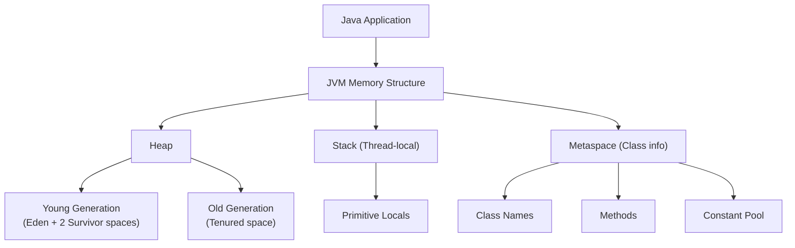
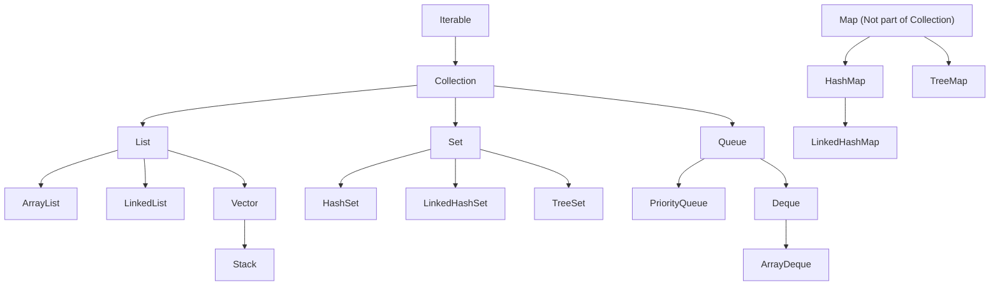
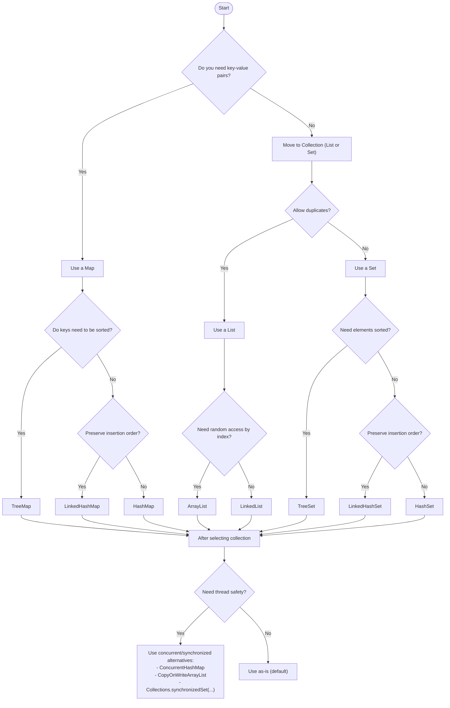
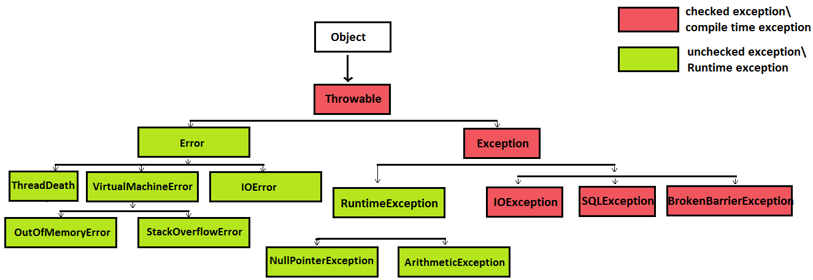
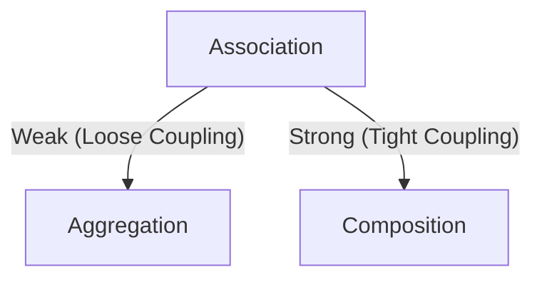

<!-- TOC  Alt + insrt in intellij-->

# Java Interview Question Bank

- [Java Interview Questions 1](https://www.java2novice.com/java-interview-questions/)
- [Java Interview Questions 2](https://www.java67.com/2015/03/top-40-core-java-interview-questions-answers-telephonic-round.html)
- [Java Go through Points](https://www.javamadesoeasy.com/)

---

## 🚀 Primary Main Features of Java

<details open>
<summary>Click to expand Java main features</summary>

1. Platform Independent  
2. Object Oriented Programming Language  
   - Abstraction  
   - Encapsulation  
   - Inheritance  
   - Polymorphism  
3. Simple  
4. Robust  
5. Secure  
6. Distributed  
7. Multithreading  
8. Portable  

### Java's Main Features (with Examples)

1. **Platform Independent**
   - Write once, run anywhere. Java code compiles to bytecode, which runs on any OS with a JVM.
   - _Example:_
     ```java
     // Compile on Windows, run on Linux
     javac Hello.java
     java Hello
     ```

2. **Object-Oriented**
   - Uses classes and objects. Supports Abstraction, Encapsulation, Inheritance, and Polymorphism.
   - _Example:_
     ```java
     class Dog { void bark() { System.out.println("Woof"); } }
     ```

3. **Simple**
   - Easy syntax, no pointers, automatic memory management.
   - _Example:_
     ```java
     int x = 5; // No pointer arithmetic
     ```

4. **Robust**
   - Strong memory management, exception handling, type checking.
   - _Example:_
     ```java
     try { int a = 5/0; } catch(Exception e) { System.out.println("Error"); }
     ```

5. **Secure**
   - No explicit pointer, runs in JVM sandbox, bytecode verification.
   - _Example:_
     // Applets run in restricted environment

6. **Distributed**
   - Supports networking, RMI, and web applications.
   - _Example:_
     ```java
     import java.net.*;
     Socket s = new Socket("localhost", 8080);
     ```

7. **Multithreaded**
   - Can run multiple threads (tasks) at once.
   - _Example:_
     ```java
     new Thread(() -> System.out.println("Hello from thread")).start();
     ```

8. **Portable**
   - Java programs run the same on any platform with JVM.
   - _Example:_
     // Bytecode runs on Windows, Mac, Linux

</details>

---

## 🧩 Class Loaders in Java

<details>
<summary>Click to expand Class Loaders explanation</summary>

### 1. Bootstrap Class Loader

### 2. Extension Class Loader

### 3. System/Application Class Loader


### Java Class Loaders (Simple & Clear)

Java uses class loaders to load classes into memory in a specific order:

1. **Bootstrap Class Loader**
   - Loads core Java classes (like `java.lang.*`).
   - Built into JVM, not accessible in Java code.
   - _Example:_ Loads `String.class` from the JDK.

2. **Extension (Platform) Class Loader**
   - Loads classes from extension directories (e.g., `JAVA_HOME/lib/ext`).
   - _Example:_ Loads optional Java libraries.

3. **System (Application) Class Loader**
   - Loads classes from your application's classpath.
   - _Example:_ Loads your own classes: `com.myapp.Main`.

**Hierarchy:**

```
Bootstrap
   ↓
Extension
   ↓
System (Application)
```

**Code Example:**
```java
ClassLoader cl = MyClass.class.getClassLoader();
System.out.println(cl); // Usually prints 'sun.misc.Launcher$AppClassLoader'
```

---
</details>

---

## 🆔 Identifiers in Java

<details>
<summary>Click to expand Java Identifiers and Keywords</summary>

- Identifiers start with alphabets, underscore `_`, or dollar `$`.
- Case sensitive.
- **Keywords cannot be used as identifiers**.

### Some Java Keywords

| Keyword    | Usage                                       |
|------------|---------------------------------------------|
| `class`    | Declare a class                             |
| `public`   | Accessibility modifier                      |
| `static`   | Belongs to class rather than instance      |
| `void`     | Method returns nothing                      |
| `main`     | Entry point of Java program                 |
| `new`      | Create new object                           |
| `if`, `else` | Conditional statements                     |
| `for`, `while`, `do` | Loop constructs                      |
| `return`   | Exit method and optionally return value    |
| `try`, `catch`, `finally` | Exception handling blocks          |
| `throw`, `throws` | Exception declaration and throwing     |


### Java Identifiers (Short & Simple)

**Identifiers** are names for variables, methods, classes, etc.

**Rules:**
* Must start with a letter (A-Z, a-z), underscore `_`, or dollar sign `$`.
* Can contain digits (0-9) after the first character.
* Case sensitive (`MyVar` ≠ `myvar`).
* Cannot use Java keywords (like `class`, `int`).

**Examples:**
```java
int age;
String _name;
double $salary;
// int 2ndValue; // Invalid: cannot start with digit
// int class;    // Invalid: 'class' is a keyword
```

**Common Java Keywords:**
`class`, `public`, `static`, `void`, `if`, `else`, `for`, `while`, `return`, `try`, `catch`, `throw`, `throws`

---

</details>

---

## 🏷️ What is a Class?

A **class** is a blueprint or template from which objects are created. It contains data (fields) and behaviors (methods).

---

## 🏗️ Common Types of Classes in Java

<details>
<summary>Click to expand Common Java Class Types</summary>

### 1. Regular (Concrete) Class
- Can be instantiated to create objects.
- Contains fields, methods, constructors.

```java
public class Car {
    // Fields, methods, constructors
}
````

### 2. Abstract Class

* Cannot be instantiated.
* May contain abstract methods to be implemented by subclasses.

```java
public abstract class Shape {
    // Abstract and regular methods
}
```

### 3. Interface

* Collection of abstract methods (before Java 8).
* From Java 8, can have default method implementations.

```java
public interface Drawable {
    void draw(); // implicitly public and abstract
}
```

### 4. Final Class

* Cannot be extended (subclassed).

```java
public final class UtilityClass {
    // Methods and fields
}
```

### 5. Inner Class

* Defined inside another class.
* Can be static or non-static.

```java
public class Outer {
    class Inner {
        // Inner class
    }
}
```

### 6. Static Nested Class

* Static class inside another class.
* Cannot access instance variables of outer class.

```java
public class Outer {
    static class Nested {
        // Static nested class
    }
}
```

### 7. Anonymous Class

* Local class without a name.
* Usually used to instantiate interfaces or extend classes once.

```java
Runnable myRunnable = new Runnable() {
    public void run() {
        // Implementation
    }
};
```

</details>

---

## 🧩 Example of Anonymous Class

```java
class Polygon {
    public void display() {
        System.out.println("Inside the Polygon class");
    }
}

class AnonymousDemo {
    public void createClass() {
        // Anonymous class extending Polygon
        Polygon p1 = new Polygon() {
            public void display() {
                System.out.println("Inside an anonymous class.");
            }
        };
        p1.display();
    }
}

class Main {
    public static void main(String[] args) {
        AnonymousDemo an = new AnonymousDemo();
        an.createClass();
    }
}
```

**Output:**
`Inside an anonymous class.`

---

## 📚 Common Java Terms

| Term                 | Explanation                                                      |
| -------------------- | ---------------------------------------------------------------- |
| `import java.io.*;`  | Import all classes from `java.io` package                        |
| `class`              | Defines a class containing data and methods                      |
| `static void main()` | `static` means method can be called without object instantiation |
| `void`               | Method returns no value                                          |
| `System.in`          | Standard input stream (keyboard input)                           |
| `System.out`         | Standard output stream (console output)                          |
| `println()`          | Prints text and moves to a new line                              |

---


# Java Constructors

In Java:

- You can create multiple constructors in a single class without limit.
- Constructors are special methods used to initialize objects.
- They are invoked when an object is created using the `new` keyword.

---

## 1. Default Constructor

- No parameters.
- Provided automatically by Java if no constructor is explicitly defined.

```java
public class MyClass {
    // Default constructor
    public MyClass() {
        // Initialization logic
    }
}
````

---

## 2. Parameterized Constructor

* Takes one or more parameters.
* Used to initialize object properties with given values.

```java
public class MyClass {
    public MyClass(int x, String str) {
        // Initialization using parameters
    }
}
```

---

## 3. Copy Constructor

* Creates a new object by copying an existing object's state.

```java
public class MyClass {
    private int x;
    private String str;

    // Copy constructor
    public MyClass(MyClass original) {
        this.x = original.x;
        this.str = original.str;
    }
}
```

---

## 4. Constructor Chaining

* One constructor calls another within the same class using `this()`.

```java
public class MyClass {
    private int x;
    private String str;

    public MyClass(int x, String str) {
        this.x = x;
        this.str = str;
    }

    public MyClass() {
        this(0, "default");
    }
}
```

---

## 5. Private Constructor

* Has private access modifier.
* Prevents instantiation from outside the class.
* Commonly used for utility classes or singleton patterns.

```java
public class UtilityClass {
    private UtilityClass() {
        // Prevent instantiation
    }
}
```

---

# Private Class vs Private Constructor

| Feature           | Private Class                                  | Private Constructor                                     |
| ----------------- | ---------------------------------------------- | ------------------------------------------------------- |
| **Scope**         | Accessible only within the enclosing class     | Accessible only within the class itself                 |
| **Purpose**       | Encapsulate helper functionality, inner logic  | Prevent external instantiation of the class             |
| **Instantiation** | Can be instantiated inside the enclosing class | Prevents instantiation except from within the class     |
| **Use Cases**     | Nested helper classes                          | Singleton pattern, utility classes, controlled creation |

---

## Example: Private Class

```java
public class OuterClass {

    private static class InnerClass {
        // Inner logic
    }

    public void doSomething() {
        InnerClass inner = new InnerClass();
        // Use inner instance
    }
}
```

---

## Example: Private Constructor (Singleton)

```java
public class Singleton {

    private static Singleton instance;

    private Singleton() {
        // Private constructor
    }

    public static Singleton getInstance() {
        if (instance == null) {
            instance = new Singleton();
        }
        return instance;
    }
}
```

---

**Summary:**

* **Private Class:** Controls access to the class itself (typically nested classes).
* **Private Constructor:** Controls instantiation of the class.

---

# Modifiers in Java

---

## 1. Access Modifiers

| Modifier  | Access within class | Access within package | Access outside package by subclass | Access outside package (non-subclass) |
| --------- | ------------------- | -------------------- | --------------------------------- | ------------------------------------ |
| **public**    | Yes                 | Yes                  | Yes                               | Yes                                  |
| **protected** | Yes                 | Yes                  | Yes                               | No                                   |
| **default**   | Yes                 | Yes                  | No                                | No                                   |
| **private**   | Yes                 | No                   | No                                | No                                   |

### Details

- **`public`**: Accessible from anywhere.
- **`protected`**: Accessible in the same package and subclasses (even outside package).
- **`default`** (no modifier): Accessible only within the same package.
- **`private`**: Accessible only within the defining class.

### Example of Private Modifier

```java
class Sarath {
    private String name = "sarath"; // accessible only within this class
}

class Friend {
    public void access() {
        Sarath sar = new Sarath();
        String var = sar.name; // Compilation error: name has private access in Sarath
    }
}
````

---

### Private Constructor

* A constructor declared `private` restricts instantiation **outside the class**.
* Commonly used in:

  * **Singleton Pattern** (single instance control)
  * **Utility classes** (only static members, no instances)

```java
public class UtilityClass {
    private UtilityClass() {
        // Prevent instantiation
    }
}
```

---

## 2. Non-Access Modifiers

| Modifier   | Applies To                        | Purpose                                                                              |
| ---------- | --------------------------------- | ------------------------------------------------------------------------------------ |
| `static`   | Variables, methods, inner classes | Makes members belong to the class rather than instances                              |
| `final`    | Variables, methods, classes       | Prevents reassignment, method overriding, or subclassing                             |
| `abstract` | Classes, methods                  | Defines classes or methods that cannot be instantiated or must be overridden         |
| `native`   | Methods                           | Declares a method implemented in platform-dependent code (e.g., C/C++)               |
| `strictfp` | Classes, methods                  | Ensures consistent floating-point calculations across platforms (Removed in Java 17) |

---

### `static` Modifier

* **Static Variables (Class Variables)**

  * Single copy shared across all instances.
  * Used for constants or shared data.

  ```java
  public class MyClass {
      static int staticCount = 0;
  }
  ```

* **Static Methods**

  * Called without creating an instance.
  * Cannot access instance members directly.

  ```java
  public class MyClass {
      static void display() {
          System.out.println("Static method");
      }
  }
  ```

* **Static Blocks**

  * Run once when the class is loaded.
  * Used for static variable initialization or setup.

  ```java
  public class MyClass {
      static {
          System.out.println("Static block executed");
      }
  }
  ```

In Java, a **static block** (also called a *static initializer block*) is used to initialize static variables 
or run some setup code when the class is first loaded into memory by the JVM.

---

### ✅ Key Points about Static Blocks:

1. **Executed Once**

  * Runs only once, when the class is loaded into the JVM (before `main()` runs and before any object is created).

2. **Initialization of Static Variables**

  * Useful for assigning complex values to `static` variables that cannot be set with a single statement.

3. **Runs Before Constructor**

  * Executes before any constructor or instance block runs.

4. **Multiple Static Blocks**

  * You can have more than one static block; they are executed in the order they appear in the class.

---

### 📌 Example:

```java
class Demo {
    static int value;

    // Static block
    static {
        System.out.println("Static block executed.");
        value = 42; // Initializing static variable
    }

    public static void main(String[] args) {
        System.out.println("Main method executed.");
        System.out.println("Value = " + value);
    }
}
```

**Output:**

```
Static block executed.
Main method executed.
Value = 42
```

---

### ⚡ Common Uses:

1. **Complex static variable initialization**

   ```java
   static Map<Integer, String> map;
   static {
       map = new HashMap<>();
       map.put(1, "One");
       map.put(2, "Two");
   }
   ```

2. **Loading native libraries**

   ```java
   static {
       System.loadLibrary("nativeLib");
   }
   ```

3. **Configuration setup** (e.g., reading from a file or environment variables at class load time).

---

---

### `final` Modifier

* **Final Variables**

  * Constants; value assigned once and cannot be changed.

  ```java
  final int MAX_USERS = 100;
  ```

* **Final Methods**

  * Cannot be overridden by subclasses.

  ```java
  public final void display() {
      System.out.println("Cannot override this method");
  }
  ```

* **Final Classes**

  * Cannot be subclassed.

  ```java
  public final class UtilityClass {
      // cannot be extended
  }
  ```

---

### `abstract` Modifier

* **Abstract Classes**

  * Cannot be instantiated directly.
  * May contain abstract methods (no implementation).

  ```java
  public abstract class Shape {
      abstract void draw();
  }
  ```

* **Abstract Methods**

  * Must be overridden by subclasses.

  ```java
  public abstract void draw();
  ```

---

### `native` Modifier

* Indicates that the method is implemented in platform-dependent code, typically in C or C++.

```java
public native void nativeMethod();
```

* Requires use of JNI (Java Native Interface).

---

### Summary Table

| Modifier    | Type       | Can apply to           | Effect / Use case                              |
| ----------- | ---------- | ---------------------- | ---------------------------------------------- |
| `public`    | Access     | Classes, methods, vars | Accessible everywhere                          |
| `protected` | Access     | Methods, vars          | Package + subclasses only                      |
| `default`   | Access     | Classes, methods, vars | Package only                                   |
| `private`   | Access     | Classes, methods, vars | Class only                                     |
| `static`    | Non-access | Vars, methods, classes | Belongs to class, shared                       |
| `final`     | Non-access | Vars, methods, classes | Constant, no override, no subclass             |
| `abstract`  | Non-access | Classes, methods       | Abstract behavior, must subclass/override      |
| `native`    | Non-access | Methods                | Implemented in native code                     |
| `strictfp`  | Non-access | Classes, methods       | Consistent floating-point (removed in Java 17) |

---


# Strings in Java

## String vs StringBuffer vs StringBuilder vs String Pool

### String vs StringBuffer vs StringBuilder

| Feature            | String                  | StringBuffer                       | StringBuilder                      |
|--------------------|-------------------------|----------------------------------|----------------------------------|
| Mutability         | Immutable               | Mutable                          | Mutable                          |
| Thread Safety      | Thread-safe by nature    | Thread-safe (synchronized)       | Not thread-safe                  |
| Performance        | Slow for concatenation   | Slower due to synchronization    | Faster (recommended for single-thread) |
| Introduced         | Java 1.0                | Java 1.0                         | Java 1.5                        |
| Use Case           | When immutability needed | Multi-threaded environment string manipulation | Single-threaded environment string manipulation |

- Since `String` is immutable, every manipulation creates a new object, which may cause performance overhead and memory churn.
- `StringBuffer` and `StringBuilder` are mutable and provide methods like `append()`, `insert()`, `delete()`, and `substring()` for efficient string manipulation.
- Internally, the `+` operator for string concatenation uses either `StringBuffer` or `StringBuilder`.

---

### String Pool

- A **String Pool** (or **String Intern Pool**) is a special memory area in the Java heap where JVM stores literal String values.
- When a String literal is created, JVM checks the pool first. If it exists, the reference is reused; else, a new String object is created in the pool.
- This saves memory and improves performance.

```java
String literal = "Sarath";           // Uses String Pool
String object = new String("Sarath"); // New object on heap, not in pool by default

// Comparisons:
literal == object;  // false (different references)
literal == "Sarath"; // true (both point to pool)
```

---

### Memory Areas Related to Strings

* **Eden Space:** Where new objects (including String objects) are allocated.
* **PermGen Space (Permanent Generation):** Used in older Java versions to store class metadata and interned Strings.
* **MetaSpace:** Replaced PermGen since Java 8 to store class metadata outside the heap.

---


<details>
<summary><strong>🧠 Java Memory Areas Related to Strings</strong></summary>

### Memory Areas Related to Strings

Strings are stored differently depending on how they are created and the Java version.

```mermaid
flowchart TD

    Start["String Creation"]

    Start --> IsLiteral{"Is it a Literal?"}

    %% new String path
    IsLiteral -- No --> NewString["new String(&quot;Hello&quot;) <br/>(Heap Object)"]
    NewString --> Eden["Eden Space (Young Gen)<br/>(in Heap)"]

    %% String literal path
    IsLiteral -- Yes --> Literal["&quot;Hello&quot; (String Literal)<br/>Goes to String Pool"]
    Literal --> Interned["Interned in:<br/>- PermGen (Java ≤ 7)<br/>- Metaspace (Java 8+)"]

```



---

### Memory Areas Explained


| Area          | Description                                              | Java Version     |
| ------------- | -------------------------------------------------------- | ---------------- |
| Eden Space    | New objects, including new Strings created with `new`    | All versions     |
| PermGen Space | Stores class metadata and interned strings               | Java 7 and below |
| MetaSpace     | Replaces PermGen for class metadata and interned strings | Java 8 and above |

---

### Interning and String Pool

* **String Pool** stores literals and interned strings.
* `String.intern()` adds strings explicitly to the pool.
* Pool was in PermGen (≤Java7), moved to MetaSpace (Java8+).

---

### Example

```java
String a = "Hello";              // Stored in String pool
String b = new String("Hello");  // New object in Eden Space (Heap)

System.out.println(a == b);          // false
System.out.println(a == b.intern()); // true
```

---

### Summary Table

| Java Version | Heap (Eden Space)      | PermGen / MetaSpace | String Pool Location |
| ------------ | ---------------------- | ------------------- | -------------------- |
| Java ≤ 7     | `new String()` objects | PermGen             | PermGen              |
| Java 8+      | `new String()` objects | MetaSpace           | MetaSpace            |

</details>

---

## 🧠 Java Memory Spaces (JVM Memory Structure)

Java Virtual Machine (JVM) memory is split into several **memory areas**, each with a **specific purpose** for managing objects, threads, and class-level data.

---

### 🔁 Flow Diagram (Markdown Text Format)



---

## 🧩 JVM Memory Areas Explained

### 1. **Heap**

* **Purpose**: Stores all **objects**, **class instances**, **arrays**
* **Managed by**: Garbage Collector (GC)
* **Subdivided into**:

  * **Young Generation**

    * **Eden Space**: New objects created here.
    * **Survivor Spaces (S0/S1)**: Surviving objects from minor GC.
  * **Old Generation**: Long-lived objects promoted here.

---

### 2. **Young Generation (YG)**

* Optimized for fast allocation and collection (minor GC).
* **Eden Space**:

  * Where all new objects are created.
  * If not garbage collected, moved to Survivor.
* **Survivor Space (S0 & S1)**:

  * Objects that survive GC cycles.
  * After a few cycles, moved to Old Gen.

---

### 3. **Old Generation (Tenured)**

* Stores **long-living objects** (e.g., strings in use, singletons).
* Collected less frequently via **major GC** (slower than minor GC).

---

### 4. **Stack**

* **Thread-local memory**
* Stores:

  * Method calls (stack frames)
  * Primitive local variables
  * Object references (not actual objects)
* Automatically **pushed/popped** during method calls
* Faster than heap memory
* Throws `StackOverflowError` if exceeded

---

### 5. **Metaspace** (Java 8+)

* Stores **class metadata**
* Replaced **PermGen** from Java 8 onwards
* Grows dynamically (unlike PermGen which had fixed size)
* Contains:

  * Class names
  * Method/field metadata
  * Constant pool (for that class)
* **Not part of the heap** — resides in **native memory**

---

### 6. **Program Counter (PC) Register**

* **Thread-specific**: Keeps track of current instruction address
* Helps resume execution in the correct place

---

### 7. **Native Method Stack**

* For executing **native (non-Java)** methods via JNI (Java Native Interface)

---

## ✅ Summary Table

| Memory Area       | Purpose                               | Collected by GC | Thread Scoped |
| ----------------- | ------------------------------------- | --------------- | ------------- |
| Heap (Eden + Old) | Stores objects, arrays                | ✅               | ❌             |
| Stack             | Stores local variables & method calls | ❌               | ✅             |
| Metaspace         | Class metadata                        | ✅ (limited)     | ❌             |
| PC Register       | Tracks next instruction               | ❌               | ✅             |
| Native Stack      | Native method handling                | ❌               | ✅             |


### JVM Memory Areas Explained

| Memory Area             | Purpose                                     | Notes                        |
| ----------------------- | ------------------------------------------- | ---------------------------- |
| **Heap**                | Stores objects and arrays                   | Managed by Garbage Collector |
| **Young Generation**    | New objects allocated here                  | Eden + Survivor spaces       |
| **Old Generation**      | Long-lived objects moved here               | Major GC occurs              |
| **Stack**               | Stores method calls, primitives, references | Thread-local, fast access    |
| **Metaspace**           | Stores class metadata and interned strings  | Outside heap, Java 8+        |
| **PC Register**         | Tracks current instruction address          | Thread-local                 |
| **Native Method Stack** | For native method execution                 | JNI calls                    |
---

### String Literal vs String Object

* **String Literal:** Stored in the String pool.
* **String Object:** Created via `new` keyword, stored in heap, separate from the pool.
* `.intern()` can be used to add a String object to the pool explicitly.

---

### String Manipulation: `concat()` vs `+` Operator

* `concat()` only creates a new String object if the length of the string being concatenated is greater than zero.
* The `+` operator always creates a new String object regardless.

```java
String str1 = "Rock";
String str2 = "Star";
String str3 = str1.concat(str2); // "RockStar"
```

---

### Deep Copy vs Shallow Copy

* **Shallow Copy:** Copies only the reference of an object; both objects point to the same data.
* **Deep Copy:** Copies the actual data and creates an independent clone.

---

### Why is String Immutable in Java?

* Multiple references can point to the same String in the String pool.
* If String were mutable, one reference changing the String would affect others unexpectedly.
* Immutability ensures thread safety, security, and consistency.
* Immutable Strings have stable hash codes, making them reliable as keys in hash-based collections.

---

### Creating an Immutable Class in Java

1. Declare the class as `final` so it can't be extended.
2. Declare all fields as `private` and `final`.
3. Do not provide setter methods.
4. Initialize all fields via constructor (defensive copies for mutable fields).
5. Provide only getters.
6. Ensure deep copy of mutable objects.

---

### Creating a Singleton Class in Java

```java
public class Database {

    private static Database dbInstance;

    private Database() {
        // private constructor to prevent instantiation
    }

    public static synchronized Database getInstance() {
        if (dbInstance == null) {
            dbInstance = new Database();
        }
        return dbInstance;
    }
}
```

---

# Wrapper Classes and Autoboxing

Java provides wrapper classes for primitives to allow objects to represent primitive types.

| Primitive Type | Wrapper Class |
| -------------- | ------------- |
| int            | Integer       |
| long           | Long          |
| short          | Short         |
| byte           | Byte          |
| char           | Character     |
| float          | Float         |
| double         | Double        |
| boolean        | Boolean       |

### Autoboxing

* Automatic conversion of primitive types to their corresponding wrapper classes.

### Example Custom Wrapper Class Demonstrating Autoboxing

```java
public class MyInteger {
    private int value;

    // Constructor
    public MyInteger(int value) {
        this.value = value;
    }

    // Getter
    public int getValue() {
        return value;
    }

    // Setter
    public void setValue(int value) {
        this.value = value;
    }

    // Method demonstrating autoboxing
    public void setIntegerValue(Integer integerValue) {
        this.value = integerValue;  // Autoboxing converts Integer to int automatically
    }

    public static void main(String[] args) {
        MyInteger myIntWrapper = new MyInteger(42);
        System.out.println("Wrapped Value: " + myIntWrapper.getValue());

        myIntWrapper.setValue(100);
        System.out.println("Modified Value: " + myIntWrapper.getValue());

        myIntWrapper.setIntegerValue(123); // Autoboxing occurs here
        System.out.println("Autoboxed Value: " + myIntWrapper.getValue());
    }
}
```

### StackOverflow - Due to out of memory

<details>
<summary>📦 <strong>Pass by Value vs Pass by Reference</strong></summary>

* Java is **always pass by value**.
* It does **not support pass by reference**.
* Object references are passed by value, but the reference still points to the same object.

</details>

---

# Object-Oriented Programming (OOP) in Java

OOP refers to programming using **objects**. The main concepts are:

- Polymorphism
- Encapsulation
- Inheritance
- Abstraction
- Class, Object, Method

---

## 1. Polymorphism

### Definition
Ability to differentiate entities with the same name efficiently. Achieved mainly by:

- **Compile-time Polymorphism** (Method Overloading)
- **Run-time Polymorphism** (Method Overriding)

### Inheritance vs Polymorphism
- **Inheritance**: New class inherits properties/methods of an existing class (code reuse).
- **Polymorphism**: Same method name behaves differently based on context (overloading/overriding).

### Types of Inheritance
1. Single
2. Multi-level
3. Multiple (Not supported in Java classes)
4. Hybrid
5. Hierarchical

---

### Method Overloading
Same method name with different parameters in the same class.

### Constructor Overloading
Multiple constructors with different parameter lists.

### Method Overriding
Subclass provides specific implementation of a superclass method.

#### Covariant Return Type
Overriding method can return subtype of the original method's return type.

---

### Overriding Restrictions on private, static, final methods

| Modifier | Overridable? | Explanation                                      |
|----------|--------------|-------------------------------------------------|
| private  | No           | Not visible to subclasses                        |
| static   | No           | Resolved at compile-time (static binding)       |
| final    | No           | Cannot be changed by subclasses                  |

#### Overloading allowed for private, static, final methods within same class

```java
public class Example {
    private static final void method() {
        System.out.println("Private static final no-arg");
    }
    private static final void method(int x) {
        System.out.println("Private static final with int: " + x);
    }
    public static void main(String[] args) {
        Example.method();
        Example.method(5);
    }
}
```

---

### Data Binding in Java


* **Static Binding (Early Binding)**: Method calls resolved at compile-time (static, private, final methods).
* **Dynamic Binding (Late Binding)**: Method calls resolved at runtime via overriding (non-static, non-final, non-private methods).

Example of dynamic binding:

```java
class Animal { void sound() { System.out.println("Animal sound"); } }
class Dog extends Animal { void sound() { System.out.println("Dog barks"); } }

Animal animal = new Dog();
animal.sound();  // Prints: Dog barks (dynamic binding)
```

---

## 2. Inheritance

* Mechanism where subclass inherits fields and methods of superclass.
* Java **does not support multiple inheritance** with classes due to ambiguity issues.
* Terminology:

  * **Superclass/Base/Parent**
  * **Subclass/Derived/Child**

---

## 3. Encapsulation

* Hiding internal state and requiring all interaction to be performed through an object's methods.
* Protects object integrity by preventing direct access to fields.
* Improves code maintainability.

---

## 4. Abstraction

* Abstract classes may have abstract methods (no body) and concrete methods.
* Declared using `abstract` keyword.
* Provides a base class that subclasses must extend and implement abstract methods.

---

## 5. Interface

* Defines **abstract methods** (Java 7 and before: only abstract methods).
* Since Java 8: supports `default` and `static` methods with bodies.
* Java 9: supports `private` methods for code reuse inside interfaces.

### Private methods in interface

* Used to avoid code duplication in default/static methods.
* Not accessible by implementing classes.

```java
public interface MyInterface {
    void publicAbstractMethod();
    default void defaultMethod() {
        privateHelper();
    }
    static void staticMethod() {
        privateHelper();
    }
    private void privateHelper() {
        System.out.println("Helper inside interface");
    }
}
```

---

### Variables in Interfaces

* Implicitly `public static final` (constants).

### Class inside Interface

* Allowed; nested class inside interface is implicitly `public static`.

```java
interface Outer {
    class Inner {
        void display() {
            System.out.println("Class inside interface");
        }
    }
}

public class Test {
    public static void main(String[] args) {
        Outer.Inner obj = new Outer.Inner();
        obj.display();
    }
}
```

### Interface inside Class

* Nested interfaces are implicitly `static`.

```java
class Outer {
    interface InnerInterface {
        void display();
    }
}

class Impl implements Outer.InnerInterface {
    public void display() {
        System.out.println("Interface inside class");
    }
}
```

---

### Marker Interface vs Functional Interface

| Interface Type       | Description                                                  | Example        |
| -------------------- | ------------------------------------------------------------ | -------------- |
| Marker Interface     | No methods; used to mark a class for special treatment       | `Serializable` |
| Functional Interface | Exactly one abstract method; can have default/static methods | `Runnable`     |

---

### Common Functional Interfaces and Marker Interfaces

| Interface  | Method Signature          | Notes                                         |
| ---------- | ------------------------- | --------------------------------------------- |
| Runnable   | `void run()`              | Used for threads, no return value             |
| Callable   | `V call()`                | Returns a value, can throw checked exceptions |
| Cloneable  | `Object clone()`          | Marker interface, enables object cloning      |
| Comparable | `int compareTo(T o)`      | Defines natural order                         |
| Comparator | `int compare(T o1, T o2)` | Custom ordering                               |

---

### Java 8+ Interface Enhancements

* `default` methods with implementation
* `static` methods
* `@FunctionalInterface` annotation to indicate single abstract method interface

Example:

```java
public interface DefaultStaticExampleInterface {
    default void show() {
        System.out.println("Default method in interface");
    }
    static void display() {
        System.out.println("Static method in interface");
    }
}

public class DefaultStaticExampleClass implements DefaultStaticExampleInterface {}

public class Main {
    public static void main(String[] args) {
        DefaultStaticExampleInterface.display();
        DefaultStaticExampleClass obj = new DefaultStaticExampleClass();
        obj.show();
    }
}
```

---

## 6. Functional Interfaces in Java (`java.util.function`)

| Interface        | Method         | Description                                                   | Example                                  |
|------------------|----------------|----------------------------------------------------------------|-------------------------------------------|
| `Supplier<T>`     | `get()`        | Supplies a result with no input                               | `Supplier<String> s = () -> "Hello";`     |
| `Consumer<T>`     | `accept(T)`    | Consumes an input without returning a result                  | `Consumer<String> c = s -> System.out.println(s);` |
| `Predicate<T>`    | `test(T)`      | Returns a boolean based on input condition                    | `Predicate<Integer> p = x -> x > 10;`     |
| `UnaryOperator<T>`| `apply(T)`     | Takes one argument, returns same type                         | `UnaryOperator<Integer> square = x -> x * x;` |
| `BinaryOperator<T>`| `apply(T, T)` | Takes two arguments of same type, returns same type           | `BinaryOperator<Integer> add = (a,b) -> a + b;` |

---

## 7. Comparable vs Comparator

| Comparable                                                                                 | Comparator                                                                                 |
|--------------------------------------------------------------------------------------------|---------------------------------------------------------------------------------------------|
| Single sort logic (`compareTo`)                                                            | Multiple sort logic (`compare`)                                                            |
| Affects the original class (must modify class)                                             | Doesn't modify original class                                                              |
| Used when default natural ordering is sufficient                                           | Used when custom sort logic is needed                                                      |

**Example:**
```java
// Comparable
class Student implements Comparable<Student> {
    int age;
    public int compareTo(Student s) {
        return this.age - s.age;
    }
}

// Comparator
Comparator<Student> nameComparator = (s1, s2) -> s1.name.compareTo(s2.name);
```

---

## 8. `implements` vs `extends`

| Keyword      | Used For                 | Supports Multiple Inheritance |
| ------------ | ------------------------ | ----------------------------- |
| `implements` | Interface implementation | ✅ Yes                         |
| `extends`    | Class inheritance        | ❌ No (only one class)         |

---

## 9. Interface vs Abstract Class

| Feature              | Interface                                        | Abstract Class                |
| -------------------- | ------------------------------------------------ | ----------------------------- |
| Methods              | Only abstract (Java 7), default/static (Java 8+) | Abstract and concrete methods |
| Multiple Inheritance | Yes                                              | No                            |
| Constructor          | Not allowed                                      | Can have constructors         |
| main() method        | ❌ Cannot have main                               | ✅ Can have main               |
| Access Modifiers     | All methods are `public`                         | Can have any access modifier  |

### Why use interface over abstract class?

* To define a contract for implementation across unrelated classes.
* Supports multiple inheritance for type polymorphism.

---

## 10. Cohesion vs Coupling

### Coupling

**Definition:** Degree of direct knowledge one class has of another.

| Type           | Description                                                              |
| -------------- | ------------------------------------------------------------------------ |
| Tight Coupling | Classes are highly dependent on each other. Difficult to test/modify.    |
| Loose Coupling | Classes communicate via interfaces or abstraction. Promotes flexibility. |

**Example:**

> Spring Framework uses **Dependency Injection (DI)** to reduce tight coupling via POJOs.


---

### Cohesion

**Definition:** Degree to which class members (methods/variables) are related to each other.

| Type          | Description                                                               |
| ------------- | ------------------------------------------------------------------------- |
| High Cohesion | Class has well-defined responsibility, easier to maintain & reuse.        |
| Low Cohesion  | Class handles many unrelated tasks. Difficult to understand and maintain. |


**Comparison:**

* **High Cohesion**: Specific, clear responsibilities. 👍
* **Low Cohesion**: General, unrelated logic. 👎

---

## Summary

| Concept            | Goal                                            |
| ------------------ | ----------------------------------------------- |
| **Polymorphism**   | Same interface, different behavior              |
| **Encapsulation**  | Hide internal details                           |
| **Inheritance**    | Code reuse, hierarchical logic                  |
| **Abstraction**    | Define contract via interfaces/abstract classes |
| **Loose Coupling** | Better modularity via DI/Interfaces             |
| **High Cohesion**  | Clear responsibility, easier maintenance        |


---

# 🧱 Java Collections Framework Guide

## 🔍 Why Collections Framework?

* Avoids writing boilerplate data structure logic (list, set, map, queue).
* Offers ready-to-use implementations and utility methods.
* Ensures standardization across all Java applications.

---


---

<details>
<summary>## 🌐 Collections Hierarchy Overview</summary>



</details>

---

<details>
<summary>## 🧭 Interactive Decision Flowchart: Pick the Right Collection</summary>



</details>

---

<details>
<summary>🧠 Example Scenarios</summary>

#### 1. You need to store data with keys and values and want to sort them by keys:

→ `TreeMap`

#### 2. You want to store a list of names with duplicates and access by index:

→ `ArrayList`

#### 3. You want to store a set of unique cities, and order doesn’t matter:

→ `HashSet`

#### 4. You want to store key-value pairs with insertion order preserved and need thread safety:

→ `LinkedHashMap` + `Collections.synchronizedMap(...)`

</details>

---

<details>
<summary>🧰 Summary Table</summary>

| Need                           | Collection                                                           |
| ------------------------------ | -------------------------------------------------------------------- |
| Key-value with sorted keys     | `TreeMap`                                                            |
| Key-value with insertion order | `LinkedHashMap`                                                      |
| Simple key-value (no order)    | `HashMap`                                                            |
| List with index access         | `ArrayList`                                                          |
| List without index priority    | `LinkedList`                                                         |
| Unique, sorted elements        | `TreeSet`                                                            |
| Unique, insertion order        | `LinkedHashSet`                                                      |
| Unique, no order               | `HashSet`                                                            |
| Thread safety                  | `ConcurrentHashMap`, `CopyOnWriteArrayList`, `synchronizedMap`, etc. |

</details>

---

<details>
<summary>🛠 Core Interfaces and Key Differences</summary>

### Iterable vs Collection

| Interface    | Role                                   |
| ------------ | -------------------------------------- |
| `Iterable`   | Root interface for iteration           |
| `Collection` | Base interface for Lists, Sets, Queues |

### Iterator vs Enumeration

| Feature        | Iterator                                      | Enumeration                                    |
| -------------- | --------------------------------------------- | ---------------------------------------------- |
| Remove Element | ✅ Allows remove() during traversal            | ❌ Read-only; cannot modify                     |
| Coverage       | Universal cursor (works with all collections) | Only for legacy classes like Vector, Hashtable |
| Method Support | hasNext(), next(), remove()                   | hasMoreElements(), nextElement()               |
| Direction      | Forward only                                  | Forward only                                   |
| Used For       | All modern collections                        | Legacy (Vector, Hashtable)                     |
| Thread Safety  | Not thread-safe by default                    | ❌ Not thread-safe                              |
| Fail-fast      | ✅                                             | ❌                                              |

</details>

---

<details>
<summary>📦 Utility Classes and Interfaces</summary>

### Collection Interface Methods

* `add(E e)`, `remove(Object o)`
* `addAll()`, `removeAll()`
* `size()`, `isEmpty()`
* `clear()`
* `stream()`

### Iterator Interface

* `hasNext()`, `next()`, `remove()`

### Iterable Interface

* `iterator()` — only method

</details>

---


## 🧩 List Implementations

<details>
<summary><strong>📋 List Implementations</strong></summary>

| Type       | Order Maintained | Sorted | Allows Duplicates | Thread Safe                   |
| ---------- | ---------------- | ------ | ----------------- | ----------------------------- |
| ArrayList  | ✅ Yes            | ❌ No   | ✅ Yes             | ❌ No                          |
| LinkedList | ✅ Yes            | ❌ No   | ✅ Yes             | ❌ No                          |
| Vector     | ✅ Yes            | ❌ No   | ✅ Yes             | ✅ Yes                         |
| Stack      | ✅ Yes            | ❌ No   | ✅ Yes             | ✅ Yes (inherited from Vector) |

### ArrayList

* Backed by **resizable array**
* Random access supported (O(1))
* Not synchronized

### LinkedList

* Doubly linked list
* Insertion/deletion faster (O(1) at ends)
* Slower random access (O(n))


### Vector (Legacy)

* Synchronized version of ArrayList
* Avoid unless thread-safe list is needed

### Stack (Legacy)

* LIFO structure
* Prefer `Deque` (like `ArrayDeque`) over `Stack`

</details>

---

## 🌀 Queue Implementations

<details>
<summary><strong>🔄 Queue & Deque</strong></summary>

| Interface       | Implementations                             | Notes                                    |
| --------------- | ------------------------------------------- | ---------------------------------------- |
| `Queue`         | `LinkedList`, `PriorityQueue`               | FIFO, priority-based                     |
| `Deque`         | `ArrayDeque`, `LinkedList`                  | Double-ended (add/remove from both ends) |
| `BlockingQueue` | `LinkedBlockingQueue`, `ArrayBlockingQueue` | Thread-safe queues                       |

| Type                                         | Order Maintained | Sorted | Allows Duplicates | Thread Safe               | Nulls Allowed             |
| -------------------------------------------- | ---------------- | ------ | ----------------- | ------------------------- | ------------------------- |
| **Queue (Interface)**                        | ✅ FIFO           | ❌ No   | ✅ Yes             | Depends on implementation | Depends on implementation |
| **Deque (Interface)**                        | ✅ Ends           | ❌ No   | ✅ Yes             | Depends on implementation | Depends on implementation |
| **ArrayDeque**                               | ✅ Yes            | ❌ No   | ✅ Yes             | ❌ No                      | **No nulls**              |
| **LinkedList (as Queue)**                    | ✅ Yes            | ❌ No   | ✅ Yes             | ❌ No                      | **Multiple nulls**        |
| **PriorityQueue**                            | ✅ Partial (Heap) | ✅ Yes  | ✅ Yes             | ❌ No                      | **No nulls**              |
| **ConcurrentLinkedQueue**                    | ✅ Yes            | ❌ No   | ✅ Yes             | ✅ Yes                     | **No nulls**              |
| **BlockingQueue (e.g. LinkedBlockingQueue)** | ✅ Yes            | ❌ No   | ✅ Yes             | ✅ Yes                     | **No nulls**              |

---

📌 **Key Notes**:

* Most **concurrent queue implementations** in Java **do not allow nulls** (they throw `NullPointerException` if you try to insert).
* Only **LinkedList (when used as Queue/Deque)** permits **multiple null elements**.

---

</details>

---

## 🎯 Set Implementations

<details>
<summary><strong>🚫 Set Implementations</strong></summary>

### HashSet

* Unordered, unique elements
* Backed by HashMap
* Average time: O(1)

### LinkedHashSet

* Ordered by insertion
* Slightly more memory than HashSet

### TreeSet

* Sorted order (natural or custom Comparator)
* Backed by Red-Black Tree
* Time complexity: O(log n)

| Type              | Order Maintained | Sorted | Allows Duplicates | Thread Safe | Nulls Allowed                                                                                        |
| ----------------- | ---------------- | ------ | ----------------- | ----------- | ---------------------------------------------------------------------------------------------------- |
| **HashSet**       | ❌                | ❌      | ❌                 | ❌           | **One null**                                                                                         |
| **LinkedHashSet** | ✅                | ❌      | ❌                 | ❌           | **One null**                                                                                         |
| **TreeSet**       | ✅ (Sorted)       | ✅      | ❌                 | ❌           | **None** (throws `NullPointerException` if you add null, since it uses `Comparable` or `Comparator`) |

</details>

---

## 🧮 Map Implementations

| Type                  | Ordered?   | Thread Safe | Notes                               | Nulls Allowed                                                                        |
| --------------------- | ---------- | ----------- | ----------------------------------- | ------------------------------------------------------------------------------------ |
| **HashMap**           | ❌          | ❌           | Most used, allows one null key      | **1 null key, multiple null values**                                                 |
| **LinkedHashMap**     | ✅          | ❌           | Preserves insertion order           | **1 null key, multiple null values**                                                 |
| **TreeMap**           | ✅ (Sorted) | ❌           | Sorted by natural/comparator key    | **No null keys, multiple null values** (unless comparator supports nulls explicitly) |
| **Hashtable**         | ❌          | ✅ (legacy)  | Slower, use only for legacy support | **No null keys, no null values**                                                     |
| **ConcurrentHashMap** | ❌          | ✅ (modern)  | Thread-safe, no null keys allowed   | **No null keys, no null values**                                                     |

---

### 🔑 **Key Differences Between `HashMap` and `Hashtable`**

| Feature              | `HashMap`                                                                                          | `Hashtable`                                                                        |
| -------------------- | -------------------------------------------------------------------------------------------------- | ---------------------------------------------------------------------------------- |
| **Thread-safety**    | Not synchronized (not thread-safe). Must be synchronized externally if used in multithreaded code. | Synchronized (thread-safe for concurrent access).                                  |
| **Performance**      | Faster, since no synchronization overhead.                                                         | Slower, due to synchronized methods.                                               |
| **Null Keys/Values** | Allows **one `null` key** and multiple `null` values.                                              | **Does not allow** `null` keys or `null` values.                                   |
| **Legacy vs Modern** | Introduced in **Java 1.2** as part of the Collections Framework.                                   | Legacy class from **Java 1.0**, prior to Collections Framework.                    |
| **Iteration**        | Iterators are **fail-fast** (throw `ConcurrentModificationException` if modified while iterating). | Enumerators are **not fail-fast**.                                                 |
| **Use in new code**  | Recommended for most cases (unless thread-safety is needed).                                       | Considered obsolete; replaced by `ConcurrentHashMap` for thread-safe alternatives. |

---

### ✅ **When to Use**

* **Use `HashMap`** → When you don’t need synchronization and want better performance.
* **Use `ConcurrentHashMap`** → Instead of `Hashtable` if you need thread safety in modern Java.
* **Avoid `Hashtable`** → Kept mostly for backward compatibility with older codebases.

---

### 📌 Example

```java
import java.util.*;

public class MapExample {
    public static void main(String[] args) {
        // HashMap
        Map<Integer, String> hashMap = new HashMap<>();
        hashMap.put(1, "Apple");
        hashMap.put(2, "Banana");
        hashMap.put(null, "Cherry"); // null key allowed
        hashMap.put(3, null);        // null value allowed
        System.out.println("HashMap: " + hashMap);

        // Hashtable
        Map<Integer, String> hashtable = new Hashtable<>();
        hashtable.put(1, "Dog");
        hashtable.put(2, "Cat");
        // hashtable.put(null, "Fish"); // ❌ NullPointerException
        // hashtable.put(3, null);      // ❌ NullPointerException
        System.out.println("Hashtable: " + hashtable);
    }
}
```

---

## 🧠 Thread Safety Comparison

| Collection | Thread Safe? | Alternative                                  |
| ---------- | ------------ | -------------------------------------------- |
| ArrayList  | ❌            | `CopyOnWriteArrayList`                       |
| HashMap    | ❌            | `ConcurrentHashMap`                          |
| HashSet    | ❌            | `Collections.synchronizedSet()`              |
| TreeSet    | ❌            | `ConcurrentSkipListSet` (via concurrent pkg) |
| Stack      | ✅ (legacy)   | Prefer `ArrayDeque`                          |
| Vector     | ✅            | Use cautiously (legacy)                      |

---

## 🧠 `hashCode()` and `equals()` in Hash-Based Collections

<details>
<summary><strong>🧠 equals() vs == vs hashCode()</strong></summary>


* When used as keys in `HashMap` or elements in `HashSet`, override both.
* **Contract:**

  * If `a.equals(b)` is true → `a.hashCode() == b.hashCode()` must be true
  * But the reverse isn't mandatory.

* `==` → compares **reference** (memory address)
* `equals()` → compares **value/content**
* `hashCode()` → used in hashing collections (`HashMap`, `HashSet`, etc.)

Example:

```java
String a = "hello";
String b = new String("hello");

System.out.println(a == b);        // false
System.out.println(a.equals(b));   // true
```

---

### **When to override `hashCode()` and `equals()`**

1. **Objects are logically equal based on fields**
  - If two objects should be considered “equal” based on their content, not memory reference.
  - Example: two `Person` objects with the same `id` should be considered equal, even if they are different instances.

```java
class Person {
    private int id;
    private String name;

    @Override
    public boolean equals(Object o) {
        if (this == o) return true;
        if (!(o instanceof Person)) return false;
        Person person = (Person) o;
        return id == person.id;
    }

    @Override
    public int hashCode() {
        return Objects.hash(id);
    }
}
```

---

2. **When using objects in hash-based collections**
  - **`HashSet`**, **`HashMap`**, **`HashTable`** rely on `hashCode()` to locate objects.
  - If you override `equals()` but **not** `hashCode()`, hash-based collections may behave incorrectly (duplicate entries may appear).

---

3. **When objects are keys in maps or elements in sets**
  - Example: using a `Person` as a key in `HashMap`:

```java
Map<Person, String> map = new HashMap<>();
map.put(new Person(1, "Alice"), "Engineer");
map.put(new Person(1, "Alice"), "Manager"); // Without proper equals & hashCode, both entries may exist
```

- Correct `equals` + `hashCode` ensures that the second `put` **replaces the first entry**.

---

### **Rules**
1. If two objects are equal (`equals()`), they **must have the same hash code**.
2. If two objects have the same hash code, they **may or may not be equal**.
3. If you override **one**, you almost always override the **other**.

---

### **When you don’t need them**
- For classes that are **never used in hash-based collections** or where **reference equality (`==`) is sufficient**, you don’t need to override them.

---

Alright 👍 let’s visualize how **`hashCode()`** and **`equals()`** work together inside a **HashMap / HashSet**.

---

### **Step-by-Step Flow (HashMap/HashSet lookup & insert)**

```
              +---------------------------+
              |   Object to be inserted   |
              +---------------------------+
                           |
                           v
                 1. Compute hashCode()
                           |
                           v
                 +-------------------+
                 | Hash bucket index |
                 +-------------------+
                           |
                           v
          --------------------------------------
          |            Bucket[] array          |
          --------------------------------------
            |        |        |        |       
            v        v        v        v       
          Bucket0  Bucket1  Bucket2  Bucket3 ...
                     |
                     v
         [Existing entries with same hash]
                     |
          +-------------------------+
          |   Compare equals() ?    |
          +-------------------------+
                     |
          Yes ---------------------> Replace/Return
          No  ---------------------> Insert new
```

---

### **How it works**
1. When you insert or lookup an object:
  - `hashCode()` determines **which bucket** to look in.
  - `equals()` checks if an **equal object already exists** in that bucket.

2. **HashSet** → Only stores unique objects.
  - Uses both `hashCode()` + `equals()` to ensure uniqueness.

3. **HashMap** → Key uniqueness works the same way.
  - If `equals()` returns true for an existing key, the value is replaced.

---

### **Example**

```java
Set<Person> set = new HashSet<>();
set.add(new Person(1, "Alice"));
set.add(new Person(1, "Alice")); // Same ID, same equals/hashCode

System.out.println(set.size()); // 1
```

If `equals()` and `hashCode()` are **not overridden**, the two objects are treated as different → size = 2.

---

✅ **Interview takeaway**:
- `hashCode()` → *which bucket*
- `equals()` → *is it the same object logically?*
- Together they prevent duplicates and ensure correct behavior.

</details>

---

<details>
<summary><strong>🧵 Synchronized & Concurrent Collections</strong></summary>

* Legacy synchronized: `Vector`, `Hashtable`
* Wrapper methods:

  * `Collections.synchronizedList(list)`
* Modern concurrent collections:

  * `ConcurrentHashMap`
  * `CopyOnWriteArrayList`
  * `BlockingQueue`
  * `ConcurrentLinkedQueue`

</details>

---

## 🛡️ Summary: When to Use What?

| Need                          | Use                                 |
| ----------------------------- | ----------------------------------- |
| Random access                 | `ArrayList`                         |
| Frequent insert/delete (ends) | `LinkedList`                        |
| Thread-safe list              | `CopyOnWriteArrayList`              |
| No duplicates                 | `Set`, `HashSet`                    |
| Sorted no duplicates          | `TreeSet`                           |
| Ordered no duplicates         | `LinkedHashSet`                     |
| FIFO                          | `Queue`, `LinkedList`, `ArrayDeque` |
| LIFO (stack)                  | `ArrayDeque`                        |
| Key-value, no order           | `HashMap`                           |
| Key-value, insertion order    | `LinkedHashMap`                     |
| Key-value, sorted keys        | `TreeMap`                           |
| Thread-safe key-value         | `ConcurrentHashMap`                 |

---

# **Java Collections Framework Overview (Java 1.0 - Java 21)**

<details>
<summary>Java Collections Timeline & Features</summary>

| **Java Version** | **New Collections & Features (null, Sync)**                                                                                                  | **Description & Key Features**                                            |
|------------------|---------------------------------------------------------------------------------------------------------------------------------------------|---------------------------------------------------------------------------|
| **JDK 1.0**      | - `Vector (many, Y)`<br>- `Stack (many, Y)`<br>- `Hashtable ((0, 0), Y)`<br>- `Properties ((0, many), Y)`<br>- `Enumeration`                 | Initial synchronized collections. `Hashtable` and `Properties` store key-value pairs. |
| **JDK 1.2**      | - `ArrayList (many, N)`<br>- `LinkedList (many, N)`<br>- `HashSet (N/A, N)`<br>- `TreeSet (N/A, N)`<br>- `HashMap ((1, many), N)`<br>- `TreeMap ((0, many), N)`<br>- `Iterator`<br>- `ListIterator` | Core interfaces introduced (`Collection`, `Set`, `List`, `Map`). `TreeMap` disallows `null` keys. |
| **JDK 1.4**      | - `LinkedHashSet (N/A, N)`<br>- `LinkedHashMap ((1, many), N)`                                                                             | Maintains insertion order. `LinkedHashMap` allows one `null` key.          |
| **JDK 1.5**      | - `Queue (varies, N)`<br>- `CopyOnWriteArrayList (many, Y)`<br>- `CopyOnWriteArraySet (N/A, Y)`<br>- Enhanced for-each loop                  | `Queue` implementations vary in null handling (`PriorityQueue` disallows `null`). Thread-safe `CopyOnWriteArrayList`. |
| **JDK 1.6**      | - `NavigableSet (N/A, N)`<br>- `NavigableMap ((0, many), N)`<br>- `Deque (varies, N)`<br>- `ArrayDeque (N/A, N)`<br>- `ConcurrentSkipListSet (N/A, Y)`<br>- `ConcurrentSkipListMap ((0, many), Y)` | Sorted and double-ended queue structures added. `ConcurrentSkipListMap` disallows `null` keys. |
| **JDK 1.8**      | - `stream()`<br>- `parallelStream()`<br>- `spliterator()`<br>- `removeIf()`<br>- `HashMap` performance improvements                          | Functional programming (Streams API, lambdas). `HashMap` optimized internally with red-black trees. |
| **JDK 9**        | - `List.of() (0, N)`<br>- `Set.of() (0, N)`<br>- `Map.of() ((0, 0), N)`<br>- `Map.ofEntries() ((0, 0), N)`                                  | Factory methods for **immutable** collections. Nulls not allowed.          |
| **JDK 10**       | - `List.copyOf() (varies, N)`<br>- `Set.copyOf() (varies, N)`<br>- `Map.copyOf() ((varies, varies), N)`                                      | Unmodifiable copies creation methods. Null behavior depends on original collection. |
| **JDK 11**       | - `Collection.toArray(IntFunction)`                                                                                                       | Converts collections to arrays of desired runtime type.                    |
| **JDK 21**       | - `SequencedCollection (varies, N)`<br>- `SequencedSet (varies, N)`<br>- `SequencedMap ((varies, varies), N)`                              | Interfaces for collections with **defined order** and reversed views.      |

</details>

<details>
<summary>Legend & Key Takeaways</summary>

### Legend:

- **(null keys, null values)** — For key-value collections (`Map`)
- **(null values only)** — For non-key-value collections (`List`, `Set`, `Queue`, etc.)
- **Thread Safety:**
  - **Y** — Synchronized
  - **N** — Not synchronized

---

### Key Takeaways:

- **Thread-Safe Collections:**  
  Legacy classes like `Vector` and `Hashtable` are synchronized but modern alternatives such as `ConcurrentHashMap` and `CopyOnWriteArrayList` provide better concurrency.

- **Null Handling:**  
  - `HashMap` allows one `null` key.  
  - `TreeMap` and `ConcurrentSkipListMap` disallow `null` keys.  
  - Most lists and sets allow `null` values except immutable collections (`List.of()`, `Set.of()`) and `ConcurrentSkipListSet`.

- **Performance & Optimizations:**  
  Java 8+ optimized `HashMap` internals and introduced streams API for functional-style operations.

- **Immutable Collections (Java 9+):**  
  Factory methods create unmodifiable collections that do not accept `null` elements.

- **Ordered Collections (Java 21):**  
  New `SequencedCollection`, `SequencedSet`, and `SequencedMap` interfaces provide consistent iteration order with additional operations.

</details>

---

<details>
<summary>Applet Lifecycle Methods</summary>

- `public void init()`: Called once to initialize the applet.
- `public void start()`: Called after `init()` or when browser is maximized; starts the applet.
- `public void stop()`: Called when applet is stopped or browser minimized; stops the applet.
- `public void destroy()`: Called once to destroy the applet.

</details>

---

<details>
<summary>Serialization and Deserialization</summary>

- Serialization converts an object into a byte stream for storage or transmission.
- Deserialization reconstructs the object from the byte stream.
- Use `writeObject()` and `ObjectOutputStream` for serialization.
- Use `readObject()` and `ObjectInputStream` for deserialization.
- Only classes implementing `java.io.Serializable` can be serialized.

---

### **1. What is Serialization?**

* **Serialization** is the process of converting an **in-memory Java object** into a **byte stream** (or some other transferable format like JSON, XML, etc.).
* The reverse process is **deserialization** — converting the byte stream back into an object.

---

### **2. Why do we need to serialize if an object is already in memory (which is bytes anyway)?**

Good question. Yes, technically objects in memory are stored as **bytes** in the JVM heap. But:

* That representation is **JVM-specific**, tied to memory layout, references, garbage collector, etc.
* You **cannot take those raw JVM bytes** and write them to a file or send them over a network — another JVM (or another language) won’t know how to interpret them.
* Serialization converts the object into a **standardized format** that can be:

  * Saved to disk
  * Sent over a network
  * Reconstructed later

---

### **3. Why Serialization is Needed (Use Cases)**

1. **Persistence**

  * Save an object’s state to a file/database and restore it later.
  * Example: storing user sessions.

2. **Communication (Distributed Systems)**

  * Send objects over the network (e.g., between microservices).
  * Example: Spring Boot → JSON serialization for REST APIs.

3. **Caching**

  * Objects are serialized to store in Redis, Hazelcast, or another distributed cache.

4. **Deep Copying**

  * Serialize → Deserialize to create a true deep copy of an object.

---

### **4. Analogy**

Think of an object in memory like **a house**:

* Inside, things are structured in a very specific way (JVM internal representation).
* If you want to **move the house elsewhere** (send object to another system), you can’t just “copy the ground and bricks” — that won’t make sense.
* Instead, you **serialize it into blueprints (bytes in standard format)**, send/store them, and then **rebuild the house (deserialize)** elsewhere.

---

✅ **Summary**:

* Objects in memory are *already bytes*, but only meaningful to the **current JVM**.
* **Serialization** makes those objects **portable and reconstructible**, independent of the JVM’s internal representation.

---

<details>
<summary>Transient Keyword</summary>

- Fields marked `transient` are **not serialized**.

</details>

</details>

---

<details>
<summary>Autoboxing and Auto-Unboxing</summary>

### Boxing & Autoboxing (Primitive → Wrapper Object)

```java
Integer boxedValue = Integer.valueOf(10);  // Boxing
Integer autoBoxedValue = 10;                // Autoboxing
````

### Unboxing & Auto-unboxing (Wrapper Object → Primitive)

```java
int unboxedValue = boxedValue.intValue();  // Unboxing
int autoUnboxedValue = boxedValue;         // Auto-unboxing
```

</details>

---

<details>
<summary>Variables in Java</summary>

* **Local:** Inside method body; cannot be `static`.
* **Instance:** Inside class body; each object has its own copy.
* **Static:** Shared across all instances; memory allocated once when class loads.

</details>

---

<details>
<summary>Initialization vs Instantiation</summary>

* **Initialization:** Assigning initial values to variables.
* **Instantiation:** Creating new objects from classes to access properties and methods.

</details>

---

<details>
<summary>Float vs Double</summary>

| Type   | Size (bytes) | Precision (digits) | Notes                     |
| ------ | ------------ | ------------------ | ------------------------- |
| float  | 4            | 6-7                | Approximate, less precise |
| double | 8            | 15-16              | More precise than float   |

</details>

---

<details>
<summary>int vs Integer</summary>

* `int` is a primitive data type.
* `Integer` is an object wrapper class.

See [StackOverflow: int vs Integer](https://stackoverflow.com/questions/8660691/what-is-the-difference-between-integer-and-int-in-java).

</details>

---

<details>
<summary>size() vs length</summary>

| Usage             | Applies To  | Returns                            | Example            |
| ----------------- | ----------- | ---------------------------------- | ------------------ |
| `size()` method   | Collections | Number of elements in a collection | `list.size()`      |
| `length` property | Arrays      | Number of elements in an array     | `array.length`     |
| `length()` method | Strings     | Number of characters in a string   | `"hello".length()` |

### Why?

* Arrays: `.length` is a **property** (field), accessed without parentheses.
* Strings: `.length()` is a **method**, called with parentheses.

</details>

---

<details>
<summary>Final, Finally, and Finalize</summary>

### `final` keyword


* Used to declare constants, prevent method overriding or inheritance.

### `finally` block

* Used after try-catch blocks for cleanup code that always executes.
* Can be skipped if `System.exit()` is called before it.

### `finalize()` method

* Called by Garbage Collector before object destruction (deprecated and discouraged).

</details>

---

<details>
<summary>Garbage Collection in Java</summary>

* Automatically frees memory occupied by unreachable objects.
* Operates on the Java Heap.
* Several algorithms exist: Serial, Parallel, CMS, G1.
* `finalize()` is unreliable for cleanup; prefer `AutoCloseable`.
* Use profiling tools for monitoring.
* Nullify references and clear collections to aid GC.

### Example:

```java
MyClass obj = new MyClass();
// use obj
obj = null; // eligible for GC
```

</details>

---

<details>
<summary>Manually Invoking Garbage Collection</summary>

* Use `System.gc()` or `Runtime.getRuntime().gc()` to *suggest* GC run.

```java
System.gc();
Runtime.getRuntime().gc();
```

* JVM may ignore these calls.
* Manual GC calls are discouraged; trust JVM automatic GC.

</details>

---


## Caching in java

- Caching is a technique wherein objects in your application are stored in a temporary storage area known as cache.


---

# Two types of error:-

# Two types of error

<details>
<summary>🛑 1. Syntax Error or Compile Time Error</summary>

- A syntax error occurs when the structure of your code violates the rules of the programming language.
- It's related to the grammar or syntax of the language, and these errors are detected by the compiler or interpreter during the compilation or interpretation process.
- Syntax errors prevent the program from being executed successfully.

</details>

---

<details>
<summary>⚠️ 2. Semantic Error or Run Time Error</summary>

- A semantic error is a logical error in the program that does not violate the syntax of the programming language but leads to incorrect behavior.

</details>

---
# Exception Handling

<details>
<summary>📌 Overview of Exception Hierarchy</summary>

- In Java, an exception is an event that disrupts the normal flow of the program. It is an object which is thrown at runtime.

```

Throwable
|
|__ Exception
    |
    |__ (IOException, SQLException, ClassNotFoundException, RuntimeException) Checked Exceptions
        |
        |__ (ArithmeticException, NullPointerException, NumberFormatException, IndexOutOfBoundException
            |
            |__ ArrayOutOfBoundException, StringIndexOutOfBoundException)Unchecked Exceptions

> Detailed tree structure

java.lang.Throwable (class)
│
├── java.lang.Error (class)
│   ├── AssertionError (class)
│   ├── OutOfMemoryError (class)
│   ├── StackOverflowError (class)
│   ├── VirtualMachineError (class)
│   │   ├── InternalError (class)
│   │   └── OutOfMemoryError (class)
│   └── LinkageError (class)
│       ├── ClassNotFoundError (class)
│       └── NoClassDefFoundError (class)
│
└── java.lang.Exception(Checked exceptions) (class)
├── IOException (class)
│   ├── FileNotFoundException (class)
│   ├── EOFException (class)
│   ├── SocketException (class)
│   ├── IOException
│   └── SQLException (class)
├── RuntimeException(Unchecked exception) (class)
│   ├── NullPointerException (class)
│   ├── ArithmeticException (class)
│   ├── ArrayIndexOutOfBoundsException (class)
│   ├── ClassCastException (class)
│   ├── IllegalArgumentException (class)
│   ├── IllegalStateException (class)
│   └── UnsupportedOperationException (class)
├── SQLException (class)
├── ParseException (class)
└── InterruptedException (class)

```

</details>

---

## throw new and throws

<details>
<summary>🎯 throw vs throws</summary>

### `throw`

- Used to **explicitly throw** an exception from code.
- Followed by an exception instance (usually `new`).

```java
throw new CustomException("This is a custom exception message");
````

---

### `throws`

* Used in **method signature** to declare that the method may throw exceptions.

```java
public void myMethod() throws IOException {
    // may throw IOException
}
```

> 🔁 `throw` is **used inside** the method body to raise exception,
> `throws` is **declared on** the method signature.

</details>

---

## [Checked and Unchecked Exceptions](https://www.javamadesoeasy.com/2015/05/exception-handling-exception-hierarchy.html)

<details>
<summary>✅ Checked vs Unchecked Exceptions</summary>



### 1. **Checked Exceptions**

* Must be handled with try-catch or declared with `throws`.
* Examples: `IOException`, `SQLException`, `ClassNotFoundException`.

```java
try {
    // risky operation
} catch (IOException | SQLException e) {
    // handle checked exceptions
}
```

or

```java
public void method() throws IOException {
    // may throw IOException
}
```

---

### 2. **Unchecked Exceptions**

* Subclass of `RuntimeException`.
* Not mandatory to handle, but can be caught.

Examples: `NullPointerException`, `ArithmeticException`, `IndexOutOfBoundsException`.

```java
try {
    String value = null;
    value.length(); // throws NPE
} catch (NullPointerException e) {
    System.out.println("Handled NPE");
}
```

✅ **Best practice**: Prevent them through defensive programming rather than relying on exception handling.

</details>

---

<details>
<summary>🛠 Best Practices for Exception Handling</summary>

* Use **specific** exception types (avoid `Exception e` unless necessary).
* Avoid empty `catch` blocks.
* Log exceptions with stack trace for debugging.
* Never use exceptions for flow control.
* Use `finally` or `try-with-resources` for cleanup.
* Use **custom exceptions** for domain-specific cases.
* Consider **rethrowing** after logging if needed.

</details>

---

<details>
<summary>🧪 Exiting finally block early</summary>

* Normally, the `finally` block always executes.
* It can be **skipped** using `System.exit()`:

```java
try {
    System.exit(0); // skips finally
} finally {
    System.out.println("This will not print");
}
```

</details>

---


## Try with Resource [(Java 7 and Java 9 Improvements)](https://www.tutorialspoint.com/java9/java9_try_with_resources_improvement.htm)

<details>
<summary>🧱 Traditional try-catch-finally Block</summary>

```java
Scanner scanner = null;
try {
  scanner = new Scanner(new File("test.txt"));
  while (scanner.hasNext()) {
    System.out.println(scanner.nextLine());
  }
} catch (FileNotFoundException e) {
  e.printStackTrace();
} finally {
  if (scanner != null) {
    scanner.close();
  }
}
````

</details>

---

<details>
<summary>✨ try-with-resources (Java 7+)</summary>

* Automatically closes resources that implement `AutoCloseable` or `Closeable`.
* Eliminates the need for a `finally` block to close resources.

```java
try (Scanner scanner = new Scanner(new File("test.txt"))) {
  while (scanner.hasNext()) {
    System.out.println(scanner.nextLine());
  }
} catch (FileNotFoundException fnfe) {
  fnfe.printStackTrace();
}
```

</details>

---

<details>
<summary>📚 try-with-resources with Multiple Resources</summary>

* You can declare **multiple resources**, separated by semicolons `;`.

```java
try (
  Scanner scanner = new Scanner(new File("testRead.txt"));
  PrintWriter writer = new PrintWriter(new File("testWrite.txt"))
) {
  while (scanner.hasNext()) {
    writer.print(scanner.nextLine());
  }
}
```

</details>

---

<details>
<summary>🧩 Custom Resource with AutoCloseable</summary>

* Any class that implements `AutoCloseable` or `Closeable` can be used with try-with-resources.

```java
public class MyResource implements AutoCloseable {
  @Override
  public void close() throws Exception {
    System.out.println("Closed MyResource");
  }
}
```

</details>

---

<details>
<summary>🧯 Multi-Catch (Java 7+)</summary>

* You can catch **multiple exceptions in a single block** if they are **unrelated by inheritance**.
* This avoids code duplication for similar exception-handling logic.

```java
try {
  // Code that may throw multiple exceptions
} catch (IOException | SQLException e) {
  e.printStackTrace();
}
```

❗ You **cannot** do this if one exception is a subclass of another:

```java
// ❌ This will cause a compile-time error
catch (Exception | IOException e) { ... }
```

</details>

---

<details>
<summary>🤔 Can We Have a try Block Without a catch Block?</summary>

✅ Yes, Java allows a `try` block without a `catch` block **if a `finally` block is present**.

```java
try {
  // risky code
} finally {
  // cleanup code
}
```

🚫 The `finally` block will always run **unless `System.exit()` is called** in the try block.

</details>
---


# [Multithreading](https://codegym.cc/groups/multithreading-in-java)

<details>
<summary>🧮 Volatile Keyword</summary>

- `volatile` ensures visibility of changes to variables across threads.
- It's used for lightweight synchronization, often for flags.
- Does **not** guarantee atomicity.

Alright 👍 let’s ground the `volatile` keyword with a **real-world example**.

---

### **Scenario: Stopping a background thread**

Imagine you have a worker thread running in the background, and you want to **signal it to stop** when the user clicks a “Stop” button.

Without `volatile`, the worker thread **may not see** the updated flag immediately, because of **CPU caching or compiler optimizations**.

---

### **Example**

```java
public class Worker extends Thread {
    private volatile boolean running = true; // shared flag

    @Override
    public void run() {
        while (running) {
            System.out.println("Working...");
            try {
                Thread.sleep(1000);
            } catch (InterruptedException e) {
                Thread.currentThread().interrupt();
            }
        }
        System.out.println("Worker stopped.");
    }

    public void stopWorker() {
        running = false; // update visible to other threads immediately
    }
}
```

**Main program:**

```java
public static void main(String[] args) throws InterruptedException {
    Worker worker = new Worker();
    worker.start();

    Thread.sleep(5000); // let it run for 5 seconds
    worker.stopWorker(); // signal to stop
}
```

---

### **Why `volatile` matters here**

* Without `volatile`, the worker thread **might never see `running = false`**, because it could keep reading a cached value of `running = true`.
* With `volatile`, the write in `stopWorker()` is **immediately visible** to the worker thread’s `while (running)` loop.

---

### **Key Points**

* ✅ `volatile` ensures **visibility** of changes between threads.
* ❌ It does **not ensure atomicity** — if you had `running++` instead of a simple boolean flag, you’d still need synchronization or `AtomicInteger`.

---

</details>

---

<details>
<summary>🔒 Deadlock</summary>

- Occurs when two or more threads wait indefinitely for each other’s resources.
- Thread A holds resource X and waits for resource Y, while Thread B holds Y and waits for X.

### 🔹 (threads & resources)

* **Thread A** has *Resource X* and wants *Resource Y*.
* **Thread B** has *Resource Y* and wants *Resource X*.
* Neither will release what they already hold → both are stuck → **deadlock**.

---

### 🔹 Key characteristics of Deadlock

1. **Mutual exclusion** → resources can’t be shared.
2. **Hold and wait** → thread holds one resource while waiting for another.
3. **No preemption** → resources can’t be forcibly taken away.
4. **Circular wait** → A waits for B, B waits for A (or longer cycle).

---

### 🔹 Simple Java Example

```java
class DeadlockDemo {
    private final Object lock1 = new Object();
    private final Object lock2 = new Object();

    public void methodA() {
        synchronized (lock1) {
            System.out.println("Thread A got lock1");
            try { Thread.sleep(100); } catch (InterruptedException e) {}
            synchronized (lock2) {
                System.out.println("Thread A got lock2");
            }
        }
    }

    public void methodB() {
        synchronized (lock2) {
            System.out.println("Thread B got lock2");
            try { Thread.sleep(100); } catch (InterruptedException e) {}
            synchronized (lock1) {
                System.out.println("Thread B got lock1");
            }
        }
    }
}
```

* If **Thread A** runs `methodA()` and **Thread B** runs `methodB()` → both can get stuck forever.

</details>

---

<details>
<summary>⚡ Race Condition</summary>

- Happens when two or more threads access shared data and try to change it at the same time.
- Example: one thread reads from a list while another deletes from it.

</details>

---

<details>
<summary>🔁 [Fail-Fast vs Fail-Safe Iterators](https://www.geeksforgeeks.org/fail-fast-fail-safe-iterators-java/)</summary>

### ✅ Fail-Safe:
- Uses **copy of the collection**.
- No `ConcurrentModificationException`.
- Ex: `ConcurrentHashMap`, `CopyOnWriteArrayList`.

```java
Map<String, String> map = new ConcurrentHashMap<>();
map.put("key1", "value1");
Iterator<String> it = map.keySet().iterator();
map.put("key2", "value2"); // No exception
````

### ❌ Fail-Fast:

* Throws `ConcurrentModificationException` on structural changes.
* Ex: `ArrayList`, `HashMap`.

```java
List<String> list = new ArrayList<>();
list.add("item1");
Iterator<String> it = list.iterator();
list.add("item2"); // Throws exception
```

</details>

---

<details>
<summary>📞 Callable vs Runnable</summary>

| Feature             | Runnable         | Callable         |
| ------------------- | ---------------- | ---------------- |
| Return Value        | No               | Yes (`V call()`) |
| Can throw Exception | No               | Yes              |
| Submission          | Thread, Executor | Executor only    |

```java
Callable<String> task = () -> "Result";
Future<String> future = executor.submit(task);
String result = future.get(); // blocks until done
```


</details>

---

<details>
<summary>🚦 Future - Asynchronous Computation</summary>

* `Future` allows retrieving results from async tasks.
* Use `ExecutorService` to submit tasks and receive a `Future`.

```java
ExecutorService executor = Executors.newFixedThreadPool(2);
Future<String> future = executor.submit(() -> "Hello");
System.out.println(future.get()); // Waits for result
```

</details>

---

<details>
<summary>🏗️ Guidelines: How to Handle Multithreading in Projects</summary>

1. Understand threads, synchronization, locks.
2. Use `java.util.concurrent` collections.
3. Use `synchronized`, `ReentrantLock`, or atomic classes.
4. Prefer `ExecutorService` for thread pooling.
5. Use `Callable`, `Future` for async results.
6. Use tools like `CountDownLatch`, `Semaphore`, `ThreadLocal`.
7. Avoid deadlocks by lock ordering.
8. Handle thread interruption properly.
9. Use modern features like `CompletableFuture`, `@Async`.
10. Document your concurrency design!

</details>

---

<details>
<summary>🛡️ Synchronization Mechanisms</summary>

### 🔸 Method-Level

```java
public synchronized void method() { }
```

### 🔸 Block-Level

```java
synchronized(lockObj) {
    // critical section
}
```

### 🔸 Class-Level

```java
public static synchronized void staticMethod() { }
```

### 🔸 wait/notify/notifyAll

```java
synchronized (sharedObject) {
    while (!condition) sharedObject.wait();
    sharedObject.notify();
}
```

### 🔸 Explicit Lock (ReentrantLock)

```java
ReentrantLock lock = new ReentrantLock();
lock.lock();
try {
    // critical code
} finally {
    lock.unlock();
}
```

### 🔸 volatile

```java
private volatile boolean running = true;
```

</details>

---

<details>
<summary>🚀 Asynchronous Techniques</summary>

### 1. Threads

```java
new Thread(() -> { /* async task */ }).start();
```

### 2. ExecutorService

```java
ExecutorService executor = Executors.newCachedThreadPool();
executor.submit(() -> { /* async task */ });
executor.shutdown();
```

### 3. CompletableFuture (Java 8+)

```java
CompletableFuture.runAsync(() -> { /* async task */ });
```

### 4. CompletableFuture with Callback

```java
CompletableFuture.supplyAsync(() -> "result")
                 .thenAccept(result -> System.out.println(result));
```

### 5. Spring @Async

```java
@Async
public void asyncMethod() { /* async task */ }
```

</details>

---

<details>
<summary>🔄 Synchronized Collections vs Non-Synchronized</summary>

### ✅ Synchronized

* Thread-safe
* Slower due to locking
* Examples: `Vector`, `Hashtable`, `Collections.synchronizedList()`

```java
List<String> syncList = Collections.synchronizedList(new ArrayList<>());
```

### ❌ Non-Synchronized

* Not thread-safe
* Fast in single-threaded environments
* Examples: `ArrayList`, `HashMap`, `HashSet`

```java
List<String> list = new ArrayList<>();
```

</details>

---

# 🧵 Multithreading Concepts: Advanced

<details>
<summary>🔁 Process vs Thread Synchronization</summary>

### 🧩 **Process Synchronization**

- Controls access across **multiple independent processes**.
- Used in **multi-process systems** to avoid data conflicts.

#### 🔐 Common IPC Mechanisms:

1. **Semaphore** – Allows limited access to shared resources.
2. **Mutex** – Ensures only one process accesses a resource at a time.
3. **Condition Variables** – Coordination based on specific conditions.
4. **Message Passing** – Communicate via queues or sockets.
5. **Critical Section** – Protected section of code using the above.

---

### 🧵 **Thread Synchronization**

- Coordinates threads **within the same process**.
- Java provides many built-in tools:

#### ☑️ Techniques:

- `synchronized` methods/blocks
- `wait()`, `notify()`, `notifyAll()`
- `volatile` keyword
- Explicit locks (`ReentrantLock`)
- Thread-safe collections: `ConcurrentHashMap`, `CopyOnWriteArrayList`

🔑 Thread sync ensures **safe access to shared memory** and avoids race conditions.

</details>

---

<details>
<summary>⚙️ Parallel Method Execution in Java</summary>

### 1️⃣ **Using `Thread` Class (Basic)**

```java
class Task1 extends Thread {
    public void run() {
        for (int i = 1; i <= 5; i++) System.out.println("Task1 - Count: " + i);
    }
}

class Task2 extends Thread {
    public void run() {
        for (int i = 1; i <= 5; i++) System.out.println("Task2 - Count: " + i);
    }
}
````

🟡 **`start()` runs them in parallel**, but order is not guaranteed.

---

### 2️⃣ **Using `Runnable` Interface**

```java
class Task implements Runnable {
    private String name;
    public Task(String name) { this.name = name; }

    public void run() {
        for (int i = 1; i <= 5; i++) System.out.println(name + " - Count: " + i);
    }
}
```

✅ Better than extending `Thread` → separates logic from threading.

---

### 3️⃣ **Using `ExecutorService` (Thread Pool)**

```java
ExecutorService executor = Executors.newFixedThreadPool(2);
executor.execute(() -> { /* Task1 */ });
executor.execute(() -> { /* Task2 */ });
executor.shutdown();
```

✅ Scalable, reusable, **production-level** approach.

---

### 4️⃣ **Using `CompletableFuture` (Java 8+)**

```java
CompletableFuture<Void> task1 = CompletableFuture.runAsync(() -> { /* Task1 */ });
CompletableFuture<Void> task2 = CompletableFuture.runAsync(() -> { /* Task2 */ });

CompletableFuture.allOf(task1, task2).join();
```

✅ Best for **non-blocking**, modern async tasks.

---

### 📊 Which One Should You Use?

| Approach            | Best When                                        |
| ------------------- | ------------------------------------------------ |
| `Thread`            | Simple and quick demos/tests                     |
| `Runnable`          | Cleaner logic, reusable, better practice         |
| `ExecutorService`   | Managing **many tasks**, scalability and control |
| `CompletableFuture` | Asynchronous, reactive programming, modern Java  |

</details>

---

<details>
<summary>🔁 <strong>Collections.synchronizedMap() vs ConcurrentHashMap</strong></summary>

### 1. Collections.synchronizedMap(Map\<K, V>)

* Wraps a regular map with synchronized methods.
* Synchronizes on the entire map for every operation.
* Slower under high concurrency due to full-map lock.
* Manual synchronization needed during iteration.

```java
Map<String, String> map = Collections.synchronizedMap(new HashMap<>());
synchronized (map) {
    for (Map.Entry<String, String> entry : map.entrySet()) {
        System.out.println(entry.getKey() + " -> " + entry.getValue());
    }
}
```

---

### 2. ConcurrentHashMap\<K, V>

* Fine-grained locking or lock-free (Java 8+).
* Allows concurrent access without blocking readers.
* Weakly consistent iterator (no ConcurrentModificationException).
* Best for high-concurrency scenarios.

```java
Map<String, String> map = new ConcurrentHashMap<>();
map.put("A", "Apple");
map.put("B", "Banana");

for (Map.Entry<String, String> entry : map.entrySet()) {
    System.out.println(entry.getKey() + " -> " + entry.getValue());
}
```

---

### ⚖️ Key Differences

| Feature           | `Collections.synchronizedMap()` | `ConcurrentHashMap`  |
| ----------------- | ------------------------------- | -------------------- |
| Locking Mechanism | Entire map                      | Fine-grained locking |
| Concurrency       | Low                             | High                 |
| Read Operations   | Blocking                        | Lock-free (Java 8+)  |
| Write Operations  | Full lock                       | Partial locking      |
| Iteration Safety  | Must synchronize manually       | Weakly consistent    |
| Null Keys/Values  | ✅ Yes                           | ❌ No (NPE thrown)    |
| Performance       | Lower under contention          | High scalability     |

---

### 🧭 When to Use What?

* ✅ Use `Collections.synchronizedMap()` when:

  * Few concurrent threads
  * You need `null` keys/values
  * Simplicity is more important than performance

* ✅ Use `ConcurrentHashMap` when:

  * High concurrency & performance is required
  * Safe iteration without locking is needed
  * `null` keys/values are not needed

---

### ❗ Why ConcurrentHashMap Disallows Nulls?

* Prevents ambiguity in `map.get(key)`:

  * `null` might mean missing key or `null` value.
* Avoids needing extra synchronization for `null` checks.
* Ensures safe concurrent computation.

</details>

---

# 🧩 Design Patterns in Java

<details>
<summary>🧩 <strong>Design Patterns in Java</strong></summary>

## 🔒 Singleton Pattern
<details>
<summary>🔒 <strong>1. Singleton Pattern</strong></summary>

Ensures a class has only one instance and provides a global access point.

```java
public class Singleton {
  private static Singleton instance;
  private Singleton() {}
  public static Singleton getInstance() {
    if (instance == null) {
      instance = new Singleton();
    }
    return instance;
  }
}
```

✅ Used for: Shared resources like DB connections, logging, configuration

</details>

---

## 🏭 Factory Pattern

<details>
<summary>🏭 <strong>2. Factory Pattern</strong></summary>

Creates objects without specifying the exact class.

```java
interface Product { void create(); }

class ConcreteProduct implements Product {
  public void create() { System.out.println("Concrete product."); }
}

class ProductFactory {
  public static Product createProduct() {
    return new ConcreteProduct();
  }
}
```

✅ Used for: Abstracting complex object creation

</details>

---

## 🏭🏢 Abstract Factory Pattern

<details>
<summary>🏭🏢 <strong>3. Abstract Factory Pattern</strong></summary>

Creates families of related objects without specifying concrete classes.

```java
interface AbstractFactory {
  Product createProduct();
  AnotherProduct createAnotherProduct();
}
```

✅ Used when: Different families of related objects are needed.

</details>

---

## 🏗️ Builder Pattern

<details>
<summary>🏗️ <strong>4. Builder Pattern</strong></summary>

Separates object construction from representation.

```java
class ProductBuilder {
  private Product product = new Product();

  public ProductBuilder withPart1(String part1) {
    product.setPart1(part1);
    return this;
  }

  public Product build() {
    return product;
  }
}
```

✅ Used when: Many optional fields/configs are involved.

</details>

---

## 🔌 Adapter Pattern

<details>
<summary>🔌 <strong>5. Adapter Pattern</strong></summary>

Makes incompatible interfaces compatible.

```java
class Adapter implements Target {
  private Adaptee adaptee;
  public void request() {
    adaptee.specificRequest();
  }
}
```

✅ Used for: Legacy systems or 3rd-party libraries.

</details>

---

## 🎨 Decorator Pattern

<details>
<summary>🎨 <strong>6. Decorator Pattern</strong></summary>

Dynamically adds responsibilities to objects.

```java
class Decorator implements Component {
  private Component component;
  public void operation() {
    component.operation();
  }
}
```

✅ Used for: Extending functionality without altering core logic.

</details>

---

## 👀 Observer Pattern

<details>
<summary>👀 <strong>7. Observer Pattern</strong></summary>

One-to-many dependency; observers update when subject changes.

```java
interface Observer { void update(String message); }

class Subject {
  List<Observer> observers = new ArrayList<>();
  void notifyObservers(String msg) {
    for (Observer o : observers) o.update(msg);
  }
}
```

✅ Used for: Event listeners, pub/sub systems.

</details>

---

## 🧠 Strategy Pattern

<details>
<summary>🧠 <strong>8. Strategy Pattern</strong></summary>

Encapsulates algorithms and makes them interchangeable at runtime.

```java
interface Strategy { void execute(); }

class Context {
  private Strategy strategy;
  public void executeStrategy() { strategy.execute(); }
}
```

✅ Used for: Pluggable algorithms.

</details>

---

## 🕹️ Command Pattern

<details>
<summary>🕹️ <strong>9. Command Pattern</strong></summary>

Encapsulates a request as an object.

```java
interface Command { void execute(); }

class Invoker {
  Command command;
  void executeCommand() { command.execute(); }
}
```

✅ Used for: Queued tasks, undo/redo.

</details>

---

## 📐 MVC Pattern

<details>
<summary>📐 <strong>10. MVC Pattern (Model-View-Controller)</strong></summary>

* **Model**: Business logic/data
* **View**: UI
* **Controller**: Handles input and routes to model/view

✅ Used for: Separating concerns in UI applications

</details>

</details>

---

<details>
<summary>🌐 <strong>URL vs URI</strong></summary>

### Summary

* All **URLs are URIs**, but not all **URIs are URLs**.
* URI syntax:
  `scheme:[//authority]path[?query][#fragment]`


### Tabular Comparison

| URL                                                         | URI                                                       |
| ----------------------------------------------------------- | --------------------------------------------------------- |
| Uniform Resource Locator: Contains info to fetch a resource | Uniform Resource Identifier: Identifies a resource        |
| `<Protocol><domain><path>`                                  | `<protocol>://<service-name>/<ResourceType>/<ResourceID>` |
|                            |                          |

</details>

---

<details>
<summary>🧠 <strong>Authentication vs Authorization</strong></summary>

* **Authentication**: Verifies *who* the user is.
* **Authorization**: Determines *what* a user is allowed to access.
* Both are often used together in secure systems.

</details>

---

<details>
<summary>🗂️ <strong>Session Management Techniques</strong></summary>

* [Session Handling in Spring Boot](https://www.javainuse.com/spring/springboot_session)
* Methods of session tracking:

  * Cookies
  * Hidden form fields
  * URL rewriting
  * `HttpSession`

</details>

---

<details>
<summary>📋 <strong>Loggers Overview</strong></summary>


* Commonly used loggers: SLF4J, Log4j2, java.util.logging, Logback.
* Helps in decoupling code from the logging implementation.

</details>

---

<details>
<summary>🔗 <strong>Association, Aggregation, and Composition</strong></summary>

* **Association**: General relationship between classes.
* **Aggregation**: "Has-a" relationship, loosely coupled.
* **Composition**: Strong ownership, tightly coupled.




* Spring Boot MongoDB Join Example: [Link](https://www.javaprogramto.com/2020/05/spring-boot-data-mongodb-projections-aggregations.html)

</details>

---

<details>
<summary>📥 <strong>Varargs and @SafeVarargs</strong></summary>

* Varargs allow a method to accept an arbitrary number of parameters.
* Syntax: `method(Type... args)`
* Compiler gives **unchecked warning** with generics.

### Example with warning:

```java
private void print(List... topics) {
  for (List<String> topic : topics) {
    System.out.println(topic);
  }
}
```

### Suppressing warnings:

```java
@SafeVarargs
private void print(List... topics) {
  for (List<String> topic : topics) {
    System.out.println(topic);
  }
}
```

### Notes:

* `@SafeVarargs` only allowed on:

  * Final methods
  * Static methods
  * Constructors (Java 9+)
* Not allowed on private methods before Java 9.

</details>

---

<details>
<summary>📐 <strong>Java Math Functions</strong></summary>

### 1. Trigonometric:

* `Math.sin()`, `Math.cos()`, `Math.tan()`
* `Math.atan()`, `Math.atan2()`

### 2. Exponential / Logarithmic:

* `Math.exp()`, `Math.log()`, `Math.log10()`

### 3. Power / Root:

* `Math.pow()`, `Math.sqrt()`, `Math.cbrt()`

### 4. Rounding:

* `Math.ceil()`, `Math.floor()`, `Math.round()`

### 5. Misc:

* `Math.abs()`, `Math.max()`, `Math.min()`

---

<details>
<summary>🔻 <strong>Math.floor() Explained</strong></summary>

Rounds **down** to the nearest integer (toward negative infinity).

```java
System.out.println(Math.floor(10.5));   // 10.0
System.out.println(Math.floor(-10.5));  // -11.0
```

</details>

<details>
<summary>📊 <strong>Math.max() and Math.min()</strong></summary>

### Math.max():

Returns the greater of two values.

```java
int max = Math.max(5, 10);  // 10
```

### Math.min():

Returns the smaller of two values.

```java
int min = Math.min(5, 10);  // 5
```

Supports: `int`, `long`, `float`, `double`

</details>

</details>

---

# Java Principles & Best Practices

<details>
<summary>1. Single Responsibility Principle (SRP)</summary>

A class should have **only one reason to change**.

**Bad Example:**

```java
class User {
    void saveToDatabase() {}
    void printUserDetails() {}
}
```

**Good Example:**

```java
class User {}
class UserRepository {
    void save(User user) {}
}
class UserPrinter {
    void print(User user) {}
}
```

</details>

---

<details>
<summary>2. Open/Closed Principle (OCP)</summary>

Classes should be **open for extension, but closed for modification**.

**Bad Example:**

```java
class Discount {
    double getDiscount(String type) {
        if (type.equals("STUDENT")) return 0.2;
        if (type.equals("SENIOR")) return 0.3;
        return 0;
    }
}
```

**Good Example (using polymorphism):**

```java
interface Discount {
    double getDiscount();
}

class StudentDiscount implements Discount {
    public double getDiscount() { return 0.2; }
}

class SeniorDiscount implements Discount {
    public double getDiscount() { return 0.3; }
}
```

</details>

---

<details>
<summary>3. Liskov Substitution Principle (LSP)</summary>

Subtypes must be **replaceable** with their base types without breaking the program.

**Bad Example:**

```java
class Bird {
    void fly() {}
}
class Ostrich extends Bird {  // Ostrich can't fly
    void fly() { throw new UnsupportedOperationException(); }
}
```

**Good Example:**

```java
interface Bird {}
interface Flyable extends Bird { void fly(); }

class Sparrow implements Flyable {
    public void fly() { System.out.println("Flying"); }
}

class Ostrich implements Bird {}
```

</details>

---

<details>
<summary>4. Interface Segregation Principle (ISP)</summary>

Clients should not be forced to implement **unnecessary methods**.

**Bad Example:**

```java
interface Worker {
    void work();
    void eat();
}

class Robot implements Worker {
    public void work() {}
    public void eat() {} // Not applicable
}
```

**Good Example:**

```java
interface Workable { void work(); }
interface Eatable { void eat(); }

class Robot implements Workable {
    public void work() {}
}
```

</details>

---

<details>
<summary>5. Dependency Inversion Principle (DIP)</summary>

Depend on **abstractions**, not on concrete implementations.

**Bad Example:**

```java
class MySQLDatabase {
    void connect() {}
}

class App {
    MySQLDatabase db = new MySQLDatabase();
}
```

**Good Example:**

```java
interface Database { void connect(); }

class MySQLDatabase implements Database {
    public void connect() {}
}

class App {
    private Database db;
    App(Database db) { this.db = db; }
}
```

</details>

---

<details>
<summary>6. DRY (Don’t Repeat Yourself)</summary>

Avoid duplicating logic. Extract common behavior into methods/classes.

**Bad Example:**

```java
int areaSquare(int side) { return side * side; }
int areaRectangle(int length, int width) { return length * width; }
```

**Good Example:**

```java
class ShapeUtils {
    static int area(int a, int b) { return a * b; }
}
```

</details>

---

<details>
<summary>7. KISS (Keep It Simple, Stupid)</summary>

Prefer **simple and clear solutions** over clever but complex ones.

**Bad Example:**

```java
int add(int a, int b) {
    return (a | b) + (a & b); // Bitwise trick
}
```

**Good Example:**

```java
int add(int a, int b) {
    return a + b;
}
```

</details>

---

<details>
<summary>8. YAGNI (You Aren’t Gonna Need It)</summary>

Don’t write code for future needs that may never come.

**Bad Example:**

```java
class Car {
    void fly() {}  // Not needed now
}
```

**Good Example:**

```java
class Car {
    void drive() {}
}
```

</details>

---

<details>
<summary>9. Validate Before Use</summary>

Always **validate inputs** before using them to avoid crashes and bugs.

**Bad Example:**

```java
int divide(int a, int b) {
    return a / b;  // Risk of divide by zero
}
```

**Good Example:**

```java
int divide(int a, int b) {
    if (b == 0) throw new IllegalArgumentException("Divider cannot be zero");
    return a / b;
}
```

</details>

---

<details>
<summary>10. Favor Composition Over Inheritance</summary>

Use **composition** instead of inheritance when possible.

**Bad Example:**

```java
class Engine {}
class Car extends Engine {}  // Wrong: Car is not an Engine
```

**Good Example:**

```java
class Engine {}
class Car {
    private Engine engine;
    Car(Engine engine) { this.engine = engine; }
}
```

</details>

---

<details>
<summary>11. Law of Demeter (LoD)</summary>

An object should only talk to its **direct friends**, not strangers.

**Bad Example:**

```java
order.getCustomer().getAddress().getCity();
```

**Good Example:**

```java
class Order {
    Customer customer;
    String getCustomerCity() {
        return customer.getCity();
    }
}
order.getCustomerCity();
```

</details>

---

<details>
<summary>12. Fail Fast Principle</summary>

Detect and report errors **early**, instead of failing silently.

**Usage Example:**

```java
if (list == null) throw new IllegalArgumentException("List cannot be null");
```

</details>

---

# Java Memory Management Principles

<details>
<summary>1. Avoid Creating Unnecessary Objects</summary>

Unnecessary objects increase memory usage and GC pressure.

**Bad Example:**

```java
String s1 = new String("Hello"); // Creates unnecessary object
```

**Good Example:**

```java
String s1 = "Hello"; // Uses string pool
```

</details>

---

<details>
<summary>2. Prefer Immutability</summary>

Immutable objects are thread-safe and reduce errors.

**Usage Example:**

```java
final class Person {
    private final String name;
    Person(String name) { this.name = name; }
    String getName() { return name; }
}
```

Immutable objects also reduce chances of memory leaks caused by unintended modifications.

</details>

---

<details>
<summary>3. Use Primitive Types Instead of Wrappers (when possible)</summary>

Wrappers (`Integer`, `Double`) consume more memory than primitives (`int`, `double`).

**Bad Example:**

```java
Integer sum = 0;
for (Integer i = 0; i < 1000; i++) {
    sum += i;
}
```

**Good Example:**

```java
int sum = 0;
for (int i = 0; i < 1000; i++) {
    sum += i;
}
```

</details>

---

<details>
<summary>4. Reuse Objects When Possible</summary>

For heavy objects, reuse instances instead of creating new ones repeatedly.

**Usage Example:**

```java
// Reuse Random instead of creating in every method call
private static final Random random = new Random();
```

</details>

---

<details>
<summary>5. Be Careful with Static References</summary>

Static references live until the class is unloaded and may cause **memory leaks**.

**Bad Example:**

```java
static List<String> cache = new ArrayList<>();
```

**Good Example:**

* Use weak references (`WeakHashMap`) if cache entries can be discarded.
* Clean up static fields when not needed.

</details>

---

<details>
<summary>6. Close Resources Properly</summary>

Unclosed resources (files, sockets, DB connections) leak memory.

**Bad Example:**

```java
FileInputStream fis = new FileInputStream("data.txt");
```

**Good Example (try-with-resources):**

```java
try (FileInputStream fis = new FileInputStream("data.txt")) {
    // use fis
}
```

</details>

---

<details>
<summary>7. Use StringBuilder/StringBuffer for Concatenation in Loops</summary>

String concatenation in loops creates multiple intermediate objects.

**Bad Example:**

```java
String result = "";
for (int i = 0; i < 100; i++) {
    result += i;
}
```

**Good Example:**

```java
StringBuilder sb = new StringBuilder();
for (int i = 0; i < 100; i++) {
    sb.append(i);
}
String result = sb.toString();
```

</details>

---

<details>
<summary>8. Avoid Memory Leaks with Collections</summary>

Collections can hold references long after they are needed.

**Bad Example:**

```java
List<byte[]> list = new ArrayList<>();
while (true) {
    list.add(new byte[1024]); // OutOfMemoryError
}
```

**Good Example:**

```java
list.clear(); // Release references when no longer needed
```

Or use `WeakHashMap` when keys should be garbage collected.

</details>

---

<details>
<summary>9. Use Object Pooling Carefully</summary>

* For lightweight objects, let GC handle them.
* For expensive resources (DB connections, threads), use pooling (`ExecutorService`, connection pools).

**Usage Example:**

```java
ExecutorService executor = Executors.newFixedThreadPool(5);
```

</details>

---

<details>
<summary>10. Monitor and Tune Garbage Collection</summary>

* Use JVM options to optimize GC (`-Xms`, `-Xmx`, `-XX:+UseG1GC`).
* Monitor memory with tools like **VisualVM, JConsole, Flight Recorder**.

**Usage:**

```bash
java -Xms512m -Xmx1024m -XX:+UseG1GC MyApp
```

</details>

---

<details>
<summary>11. Weak References for Caching</summary>

Use `WeakReference` or `WeakHashMap` for objects that can be garbage collected.

**Usage Example:**

```java
Map<Object, String> cache = new WeakHashMap<>();
```

</details>

---

<details>
<summary>12. Prefer Local Variables Over Instance Variables</summary>

Local variables are eligible for GC as soon as the method exits, while instance variables may remain longer.

**Usage Example:**

```java
public int compute() {
    int temp = 100;  // released quickly
    return temp * 2;
}
```

</details>

---

## 26. What is the difference between install and deploy

- Running an installer executable to install a software application on a computer.
- Deploying a web application to a web server or a cloud service.

---

Yet to do

<https://www.geeksforgeeks.org/serialversionuid-in-java/>

---

<https://wiki.sei.cmu.edu/confluence/display/java/OBJ58-J.+Limit+the+extensibility+of+classes+and+methods+with+invariants>

---

---

# Junit

> <https://www.java2novice.com/junit-examples/junit-annotations/>

## Junit mockito

> <https://programmingtechie.com/2020/10/16/spring-boot-testing-tutorial-unit-testing-with-junit-5-and-mockito/>

---

7. **Conciseness:**

- Lambda expressions allow you to express instances of single-method interfaces (functional interfaces) more concisely compared to using anonymous classes. This leads to cleaner and more readable code.

  **Example:**

  ```java
  // Without lambda expression
  Runnable runnable = new Runnable() {
      public void run() {
          System.out.println("Hello, World!");
      }
  };

  // With lambda expression
  Runnable runnableLambda = () -> System.out.println("Hello, World!");
  ```

2. **Functional Interfaces:**

- Lambda expressions are primarily used with functional interfaces, which are interfaces with a single abstract method. They allow you to treat functionality as a method argument, enabling a more functional programming style.

  **Example:**

  ```java
  // Functional interface
  interface MyFunctionalInterface {
      void myMethod();
  }

  // Using lambda expression with functional interface
  MyFunctionalInterface myFunction = () -> System.out.println("My Method");
  ```

3. **Readability:**

- Lambda expressions improve the readability of code, especially when dealing with functional programming constructs like streams and predicates. They allow you to express the logic more directly.

  **Example:**

  ```java
  // Without lambda expression
  List<Integer> numbers = Arrays.asList(1, 2, 3, 4, 5);
  numbers.forEach(new Consumer<Integer>() {
      public void accept(Integer n) {
          System.out.println(n);
      }
  });

  // With lambda expression
  numbers.forEach(n -> System.out.println(n));
  ```

4. **Functional Programming:**

- Lambda expressions facilitate functional programming concepts, such as passing behavior as an argument, which makes it easier to write more modular and reusable code.

  **Example:**

  ```java
  List<String> names = Arrays.asList("Alice", "Bob", "Charlie");

  // Without lambda expression
  Collections.sort(names, new Comparator<String>() {
      public int compare(String s1, String s2) {
          return s1.compareTo(s2);
      }
  });

  // With lambda expression
  Collections.sort(names, (s1, s2) -> s1.compareTo(s2));
  ```

5. **Parallelism:**

- Lambda expressions play a crucial role in enabling parallelism and concurrency through the use of the Streams API. They make it easier to write parallelizable code by expressing operations that can be executed concurrently.

  **Example:**

  ```java
  List<Integer> numbers = Arrays.asList(1, 2, 3, 4, 5);

  // Without lambda expression
  int sum = 0;
  for (int number : numbers) {
      sum += number;
  }

  // With lambda expression and parallel stream
  int sumParallel = numbers.parallelStream().reduce(0, (x, y) -> x + y);
  ```

Lambda expressions, along with functional interfaces, contribute to making Java code more expressive, readable, and suitable for functional programming paradigms. 
They are particularly valuable in scenarios where concise, single-purpose behavior is required, such as in the case of functional interfaces or functional programming constructs like streams and parallel processing. 

---

| Communication      | Check                                                                                           |
| ------------------ | ----------------------------------------------------------------------------------------------- |
| Coding Skill       | Should be ready for write pseudo code                                                           |
| Java Concept       | Java Concept, Spring, collections, Threads , Java 8                                             |
| Database knowledge | Schema, data model…etc                                                                          |
| Unix               | Basic commands , cp, grep, mv, cd, pwd, ls, ftp, ssh, find. Ps,                                 |
| SQL/PLSQL          | Joining of the two table ( one to many, may to One mapping scenario), inter join, Outerjoin etc |
| CI/CD              | Deployments..                                                                                   |

---

## Java Questions

1. Sort employee Array using java 7 and 8
2. Difference/similarities between Arraylist vs Linkedlist
3. Explain ConcurrentModification Exception
4. Explain abstract and interface
5. What is functional interface
6. Why we use lambda expression
   Lambda expressions in Java provide a concise and expressive way to represent anonymous functions. They were introduced in Java 8 as part of the Java SE 8 release, along with the functional programming features. Here are some reasons why lambda expressions are used in Java:
7. How will you maintain code standards
8. Deployment in GCP
9. How to check application health
10. Explain Polymorphism and encapsulation
11. Major Issues in the project.
12. Singleton design pattern
14. How to deploy in jenkins
15. Thumb rule of Junit testing 16. Why String is immutable?
17. What is try catch finally
18. Stream api 
19. Parallel stream 
20. Inbuilt methods in stream. 
21. Find duplicates using the stream. 
22. Sort the numbers using comparator/comparable. 
23. Collections in java 
24. Predicate in java 8 
25. Optional in java 8 
26. Uses of map in stream function 
27. Multithreading 
28. Synchronisation in java 
29. Difference between runtime and checked exceptions. 
30. Explain the try with resources 
31. Serialization 
32. Explain Some of the features in Java 8 
33. Java streams API methods and its uses with example. 
34. In filter streams, what is the return type? 
35. What is method reference. 
36. How many class you can create inside try with resources? 
37. Given an employee array and asked to list it in code by filtering it's name and age using streams. 
38. an employee array and asked to list employees with particular employee name and age and asked to return true using stream. 
39. how will you group the employeeList by age alone. 
40. how do you list sum of ages in an employeeList? 
41. Given an employee array and asked to list it in code by filtering it's name. 
42. types of string declaration and how it stores internally 
43. How to create a immutable class? 
44. Brief run() method. 
45. Difference between Fail fast and fail safe. 
46. Explain Hashmap and hash set. 
47. Integer[20,10,25,9,7] find max 3 numbers using streamAPI. 
48. What is purpose of default method in interface 
49. How will you simplify the boiler plate code for the above program? return a+b should not be used again and again but it should be compatible for all the three return types?

```java
    public class Calculator {
        public int add(int a, int b) {
        return a + b;
        }

        public float add(float a, float b) {
            return a + b;
        }

        public double add(double a, double b) {
            return a + b;
        }

    }
```
50. Static Keyword in method, class and variable with example. 
51. Throw and Throws explain with example. 
52. Default vs Static Methods in functionalInterface in Java8
53. How to compile simple applications
15. What are required to run simple Java applications
16. What is the difference between JDK and JRE
17. Is it possible run the application with JRE
18. What is JVM
19. What are collection, how collections are used
20. Hashmap, what is the complexity of traversing
25. What build tool used

