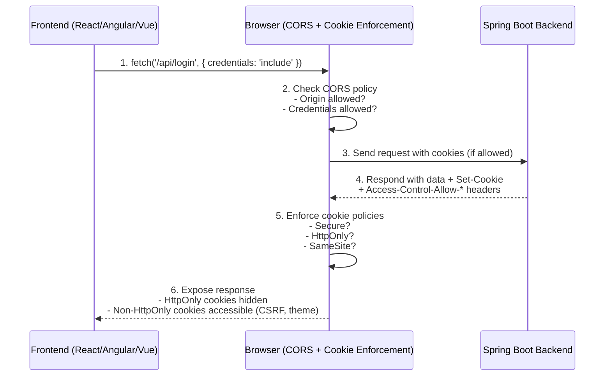
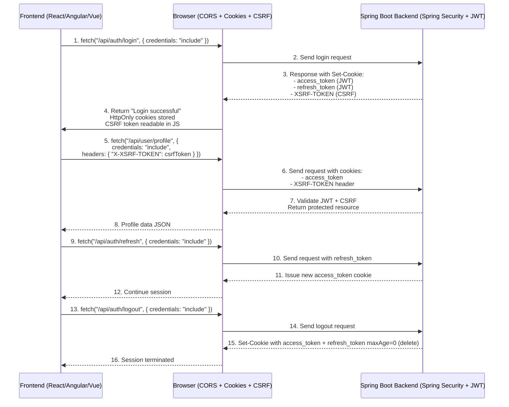
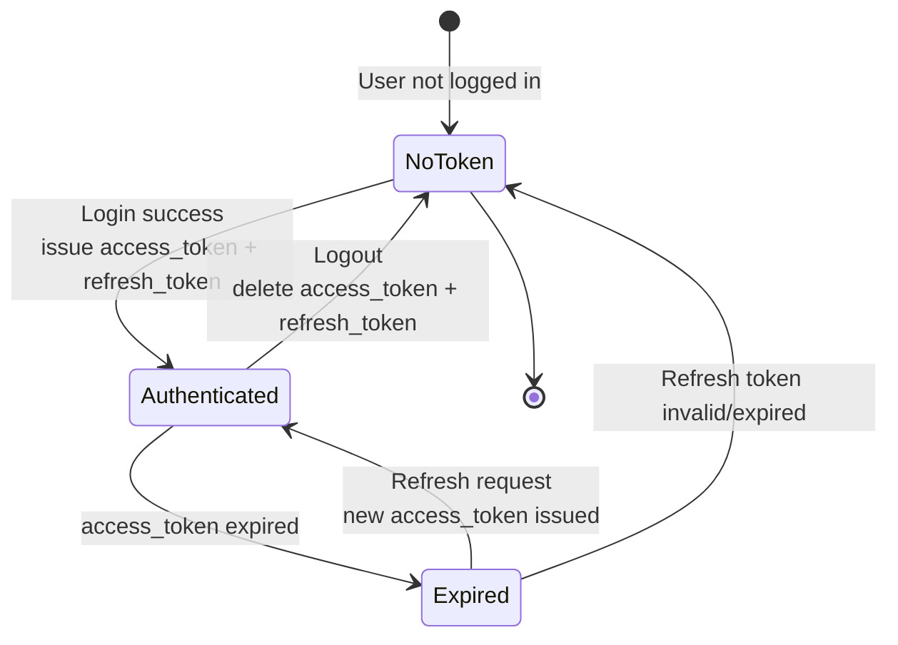
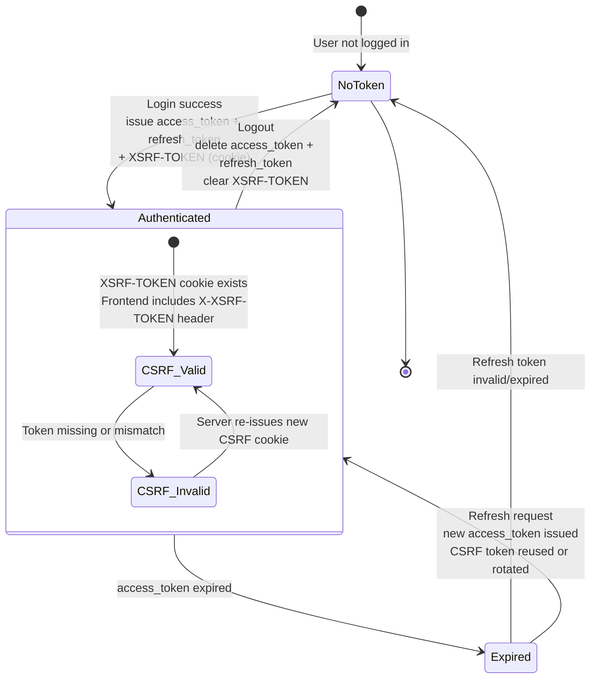

# Default configuration

- SpringBootWebSecurityConfiguration.java

- withDefaultPasswordEncoder - should not be used in production. Can be only used in sample development.


- There are two ways to configure username and password for security.
  - application.properties
  - InMemoryUserDetailsManager

---

<details open>
<summary><strong>ADFS, OAuth 1 & 2, JWT</strong></summary>


## **1. ADFS (Active Directory Federation Services)**

* **What it is:**
  A Microsoft product/service that provides **Single Sign-On (SSO)** and **federated identity** across systems and organizations.
* **How it works:**
  Uses **claims-based authentication** and supports standards like SAML, OAuth, and OpenID Connect.
* **Use Case:**
  Enterprises using Active Directory who want employees to log in once and access multiple systems securely (e.g., Office 365, internal apps).
* **Analogy:** Think of it as the *identity broker* from Microsoft, mostly used in corporate IT.

---

## **2. OAuth (OAuth 1.0 & OAuth 2.0)**

* **What it is:**
  An **authorization framework** — it lets apps access resources on behalf of a user without sharing passwords.
* **Key point:** OAuth itself does not define how the user authenticates, only how **access is delegated**.
* **Example:**
  When you “Sign in with Google” and an app can access your calendar or contacts without knowing your Gmail password.

---

## **3. OAuth 2.0 (Modern Version of OAuth)**

* **What it is:**
  The **current and most widely used version of OAuth**.
* **What it adds:**

  * Different **grant types** (authorization code, client credentials, password, implicit, refresh tokens).
  * Clear separation of **Authorization Server** and **Resource Server**.
  * Easier for mobile and web apps.
* **Use Case:**
  Delegating access (e.g., mobile app getting an access token from Google to fetch user’s calendar data).
* **Important:** OAuth 2.0 by itself doesn’t define *how users authenticate* — it just handles *access delegation*. Authentication is usually layered on top using **OpenID Connect (OIDC)**.

---

## **4. JWT (JSON Web Token)**

* **What it is:**
  A **token format** (JSON object, signed & optionally encrypted) that can be used in OAuth2.0, OIDC, or custom auth systems.
* **Structure:** Header + Payload + Signature (Base64 encoded).
* **Use Case:**
  Representing user identity or access rights in a secure, compact, and stateless way.
* **Example:**
  When you log into an app, it gives you a JWT (like `eyJhbGciOiJIUzI1NiIsInR5cCI6IkpXVCJ9...`) which you send with each API request as proof you’re authenticated.

---

## **How They Relate**

* **ADFS** = A service from Microsoft that can issue tokens using standards like OAuth2.0, SAML, and often produces **JWTs**.
* **OAuth (2.0)** = A protocol for **authorization** (who can access what).
* **JWT** = A **token format** often used inside OAuth 2.0 for carrying claims about the user.
* **OpenID Connect (OIDC)** (not in your list, but important) = An **authentication layer** built on top of OAuth 2.0 that uses **JWTs** to say *who the user is*.

---

## **Quick Cheat Sheet**

* **ADFS:** Microsoft’s implementation for SSO/federation.
* **OAuth 2.0:** Framework for *delegated authorization* (access rights).
* **OIDC:** Extension of OAuth 2.0 for *authentication* (user identity).
* **JWT:** Compact token format often used in OAuth2.0 and OIDC.

---

👉 If you’re thinking from a **Java Full Stack project perspective**:

* Use **OAuth 2.0 + OIDC** (via Keycloak, Auth0, or Azure AD) for modern apps.
* Use **JWTs** for stateless authentication across microservices.
* Use **ADFS** if you’re integrating with a Microsoft/Enterprise environment.

---

# **1. OAuth2.0 + JWT Flow in Spring Boot**

```text
+-------------+         +------------------+        +------------------+
|   Browser   |  --->   | Authorization    |        | Resource Server  |
|   / Client  |         |  Server (Auth0,  |        | (Spring Boot App)|
| (Angular UI)|         |  Keycloak, etc.) |        |   + Spring Sec.  |
+-------------+         +------------------+        +------------------+
       |                         |                          |
       |---- (1) Login Request ->|                          |
       |                         |                          |
       |<--- (2) Redirect to Login Page (OAuth2.0) --------|
       |                         |                          |
       |--- (3) User enters credentials ------------------>|
       |                         |                          |
       |<-- (4) Auth Server validates user + issues JWT ---|
       |                         |                          |
       |---- (5) JWT Access Token ------------------------>|
       |                         |                          |
       |---- (6) API call with JWT in Authorization Header->|
       |                         |        +-----------------+
       |                         |        | Spring Security|
       |                         |        | - Validates JWT|
       |                         |        | - Extracts roles|
       |                         |        +-----------------+
       |                         |                          |
       |<--- (7) Secured Resource/Response ----------------|
```

**Details:**

* *(1-3)* User requests a secured page → redirected to OAuth2 login page.
* *(4)* Auth server validates credentials (maybe via DB/LDAP).
* *(5)* Issues **JWT access token** (and refresh token if configured).
* *(6)* Each API request sends JWT in `Authorization: Bearer <token>`.
* *(7)* Spring Boot validates JWT (via `spring-boot-starter-oauth2-resource-server`) and authorizes access.

---

# **2. ADFS + Spring Boot Flow (OAuth2.0 or SAML)**

```text
+-------------+         +------------------+        +------------------+
|   Browser   |  --->   |   ADFS Server    |        | Resource Server  |
|   / Client  |         |  (Microsoft AD + |        | (Spring Boot App)|
| (Angular UI)|         |  Federation)     |        |   + Spring Sec.  |
+-------------+         +------------------+        +------------------+
       |                         |                          |
       |---- (1) Access App ---->|                          |
       |                         |                          |
       |<--- (2) Redirect to ADFS Login -------------------|
       |                         |                          |
       |--- (3) User enters AD credentials ----------------|
       |                         |                          |
       |<-- (4) ADFS validates user against Active Directory|
       |                         |                          |
       |<-- (5) ADFS issues token (JWT / SAML / OAuth2.0) -|
       |                         |                          |
       |---- (6) Token sent to Spring Boot App ------------>|
       |                         |        +-----------------+
       |                         |        | Spring Security|
       |                         |        | - Validates ADFS|
       |                         |        |   token (JWT/SAML)|
       |                         |        +-----------------+
       |                         |                          |
       |<--- (7) Secured Resource/Response ----------------|
```

**Details:**

* *(1-3)* User tries to log in → redirected to **ADFS login** page.
* *(4)* ADFS checks user credentials against **Active Directory** (corporate accounts).
* *(5)* ADFS issues a **token** (can be **JWT** if configured for OAuth2/OpenID Connect, or **SAML** if legacy).
* *(6)* Spring Boot app validates the token (via `spring-security-saml2-service-provider` or `spring-security-oauth2`).
* *(7)* If valid, access is granted.

---

# **3. Key Differences (OAuth2.0+JWT vs ADFS)**

```text
OAuth2.0 + JWT                        ADFS
-----------------------------          -------------------------------
- Works with many IdPs (Auth0,         - Microsoft-specific, tied to
  Keycloak, Okta, Google, etc.)          Active Directory ecosystem
- Stateless, token-based (JWT)         - Can issue SAML, JWT, OAuth2
- Popular in microservices             - Enterprise use: SSO + legacy apps
- Easier for cloud-native apps         - Strong Windows integration
- Standard Spring Boot support         - Needs special Spring configs
```

---

✅ For your **Spring Boot Full Stack app**, the modern recommendation is:

* Use **OAuth2.0 + OIDC + JWT** (with Spring Security’s `spring-boot-starter-oauth2-client` + `spring-boot-starter-oauth2-resource-server`).
* Integrate with **ADFS** only if the enterprise infrastructure demands it (usually corporate setups).

---

This is an excellent set of questions 👌. Let’s go step by step and clear up the confusion:

---

## 🔹 **How Spring Security Works Here**

Spring Security is **a framework**, not an identity provider. It:

1. **Receives requests** coming to your Spring Boot app.
2. **Intercepts authentication tokens** (e.g., JWT in headers, SAML responses, OAuth2 access tokens).
3. **Validates them** (checks signature, expiration, issuer, audience, etc.).
4. **Builds a SecurityContext** with user details (roles, authorities).
5. **Enforces authorization** on endpoints (`@PreAuthorize`, `@Secured`, `http.authorizeRequests()` etc.).

👉 In other words:

* **Spring Security does not issue tokens** — it just **validates tokens** issued by something else (OAuth server, ADFS, Keycloak, etc.).

---

## 🔹 **JWT and Spring Security – Are They the Same?**

No ❌.

* **JWT (JSON Web Token):** A **token format** (compact, signed JSON string).
* **Spring Security:** A **framework** that can be configured to **validate JWTs** and enforce security rules.

✅ Example:

* Auth server (Keycloak, Auth0, ADFS, Azure AD, etc.) issues a **JWT access token**.
* Spring Boot app with **Spring Security + `spring-boot-starter-oauth2-resource-server`** validates that JWT on every request.

---

## 🔹 **What Should You Choose for a New Application?**

It depends on **where your app will live** and **who your users are**. Let’s map it:

| Option               | What it is                                                                                             | When to Choose                                                                                                 |
| -------------------- | ------------------------------------------------------------------------------------------------------ | -------------------------------------------------------------------------------------------------------------- |
| **JWT only**         | Just a token format, often used for stateless auth. You’d need to build your own login/token issuance. | If you’re building a **very simple app** and don’t want an external IdP (not recommended for enterprise apps). |
| **OAuth (1.0)**      | Old protocol, rarely used today.                                                                       | ❌ Don’t pick it (legacy).                                                                                      |
| **OAuth 2.0**        | Framework for delegated **authorization**. Often used with JWT.                                        | ✅ Standard for modern apps. Best for APIs & microservices.                                                     |
| **OAuth 2.0 + OIDC** | OAuth2 + OpenID Connect = authentication + authorization.                                              | ✅ Recommended for **new apps** that need login + API security.                                                 |
| **ADFS**             | Microsoft’s federation service (supports OAuth2, OIDC, SAML).                                          | Pick if you’re in an **enterprise with on-prem Active Directory** and corporate SSO is mandatory.              |

---

## 🔹 **Concrete Example: New Spring Boot App**

Let’s say you’re building a **Java Full Stack app (Angular + Spring Boot APIs)**.
Here’s what you can take:

1. **Authentication & Authorization:**

  * Use **OAuth 2.0 + OIDC** with **JWT tokens**.
  * Identity Provider can be **Keycloak** (open source), **Auth0**, **Okta**, or **Azure AD**.

2. **Spring Boot Dependencies:**

   ```xml
   <dependency>
       <groupId>org.springframework.boot</groupId>
       <artifactId>spring-boot-starter-oauth2-resource-server</artifactId>
   </dependency>
   <dependency>
       <groupId>org.springframework.boot</groupId>
       <artifactId>spring-boot-starter-oauth2-client</artifactId>
   </dependency>
   ```

3. **Spring Boot Config (JWT validation):**

   ```yaml
   spring:
     security:
       oauth2:
         resourceserver:
           jwt:
             issuer-uri: https://auth.example.com/realms/myrealm
   ```

4. **Frontend (Angular):**

  * Use **OAuth2 Implicit Flow** or **Authorization Code Flow with PKCE**.
  * Store JWT in memory (not localStorage, to avoid XSS).
  * Send JWT with every API call:

    ```http
    Authorization: Bearer <jwt_token>
    ```

5. **If in Enterprise (ADFS environment):**

  * Configure Spring Boot to use **ADFS as OAuth2/OIDC provider**.
  * Same Spring Security setup, but issuer will be `https://adfs.company.com/adfs/.well-known/openid-configuration`.

---

## 🔹 **Final Recommendation**

* ✅ Use **OAuth2.0 + OIDC + JWT** for new apps.
* ✅ Use **Spring Security** to validate tokens and enforce authorization.
* ⚠️ Use **ADFS** only if your company mandates Microsoft AD integration.
* ❌ Don’t build your own auth with raw JWTs — too risky and hard to maintain.

---

# 🔹 **1. Spring Boot with Keycloak/Auth0 (OIDC + JWT)**

### `pom.xml` dependencies

```xml
<dependency>
    <groupId>org.springframework.boot</groupId>
    <artifactId>spring-boot-starter-oauth2-resource-server</artifactId>
</dependency>
<dependency>
    <groupId>org.springframework.boot</groupId>
    <artifactId>spring-boot-starter-oauth2-client</artifactId>
</dependency>
```

### `application.yml`

```yaml
spring:
  security:
    oauth2:
      client:
        registration:
          keycloak:
            client-id: my-spring-client
            client-secret: my-secret
            scope: openid,profile,email
            authorization-grant-type: authorization_code
            redirect-uri: "{baseUrl}/login/oauth2/code/{registrationId}"
        provider:
          keycloak:
            issuer-uri: https://auth.example.com/realms/myrealm
      resourceserver:
        jwt:
          issuer-uri: https://auth.example.com/realms/myrealm
```

### Security Config (if you need role-based rules)

```java
@EnableWebSecurity
public class SecurityConfig {

    @Bean
    public SecurityFilterChain filterChain(HttpSecurity http) throws Exception {
        http
            .authorizeHttpRequests(auth -> auth
                .requestMatchers("/public/**").permitAll()
                .requestMatchers("/admin/**").hasRole("admin")
                .anyRequest().authenticated()
            )
            .oauth2Login()   // handles browser login (OIDC)
            .and()
            .oauth2ResourceServer()
            .jwt();          // validates JWT access tokens
        return http.build();
    }
}
```

👉 Here:

* **Auth server (Keycloak/Auth0)** issues JWT access tokens.
* **Spring Security** validates the JWT automatically using the `issuer-uri`.
* Roles/claims inside the JWT are mapped to Spring authorities.

---

# 🔹 **2. Spring Boot with ADFS (Enterprise OIDC/OAuth2)**

### `pom.xml` dependencies

Same as above (Spring Security OAuth2).

```xml
<dependency>
    <groupId>org.springframework.boot</groupId>
    <artifactId>spring-boot-starter-oauth2-client</artifactId>
</dependency>
<dependency>
    <groupId>org.springframework.boot</groupId>
    <artifactId>spring-boot-starter-oauth2-resource-server</artifactId>
</dependency>
```

### `application.yml`

```yaml
spring:
  security:
    oauth2:
      client:
        registration:
          adfs:
            client-id: my-adfs-client
            client-secret: my-secret
            scope: openid,profile,email
            authorization-grant-type: authorization_code
            redirect-uri: "{baseUrl}/login/oauth2/code/{registrationId}"
        provider:
          adfs:
            # ADFS exposes OIDC metadata here:
            issuer-uri: https://adfs.mycompany.com/adfs/.well-known/openid-configuration
      resourceserver:
        jwt:
          issuer-uri: https://adfs.mycompany.com/adfs
```

### Security Config

```java
@EnableWebSecurity
public class AdfsSecurityConfig {

    @Bean
    public SecurityFilterChain filterChain(HttpSecurity http) throws Exception {
        http
            .authorizeHttpRequests(auth -> auth
                .requestMatchers("/public/**").permitAll()
                .anyRequest().authenticated()
            )
            .oauth2Login()   // login handled via ADFS login page
            .and()
            .oauth2ResourceServer()
            .jwt();          // validates JWT tokens issued by ADFS
        return http.build();
    }
}
```

👉 Here:

* ADFS acts as the **OIDC provider**.
* Spring Boot redirects users to ADFS login.
* ADFS issues a JWT (or SAML if legacy, but JWT is better).
* Spring Security validates the JWT against the ADFS issuer.

---

# 🔹 **Which One Should You Pick?**

* ✅ If you control the environment → **OIDC (Keycloak/Auth0/Okta)** with **JWT** is the best, cloud-native, and future-proof.
* ✅ If your company enforces AD/Windows logins → integrate with **ADFS**.
* ❌ Avoid raw JWT-only solutions (too risky to manage tokens manually).
* ❌ Avoid OAuth 1.0 (deprecated).

---

⚡ My tip: For **new greenfield apps**, start with **OAuth2.0 + OIDC + JWT** (Keycloak is great for dev/test, Auth0/Okta for production). Then, if your enterprise requires it, swap provider configs to **ADFS** — Spring Security makes it pluggable.

---

Perfect 👍 — let’s create a **big ASCII flow diagram** that shows how authentication/authorization can work in a **Spring Boot app**, depending on the choice you make:

* **Raw JWT (custom)**
* **OAuth2.0**
* **OAuth2.0 + OIDC + JWT (modern standard)**
* **ADFS (enterprise)**

---

# 🔹 **Spring Boot Security Auth Flows (All Possibilities)**

```text
                      +-----------------------+
                      |   Browser / Angular   |
                      |  (User tries to log)  |
                      +-----------+-----------+
                                  |
                                  v
        ----------------------------------------------------------------
        |                                                              |
        |                 Possible Authentication Flows                |
        |                                                              |
        ----------------------------------------------------------------

  [1] Raw JWT (Custom)                    [2] OAuth2.0 (Authorization Only)
  ----------------------                  -------------------------------
  +------------------+                    +------------------+
  |  Spring Boot App |                    | Authorization    |
  | (issues JWTs     |<--(Login Req)----->| Server (OAuth2)  |
  |  & validates)    |                    +------------------+
  +--------+---------+                               |
           |                                        (2) Issues Access Token
   (1) User posts creds                               |
   (username/pwd)                                     v
           |                                 +------------------+
   (2) App generates JWT ------------------->| Resource Server  |
           |                                 | (Spring Boot App)|
   (3) Client stores token                   +------------------+
   (4) Sends JWT in `Authorization: Bearer` header for APIs
   ❌ Problem: You own login, token mgmt, refresh, revocation, etc.

  --------------------------------------------------------------------------

  [3] OAuth2.0 + OIDC + JWT (Recommended)   [4] ADFS (Enterprise Integration)
  --------------------------------------    --------------------------------
  +------------------+                      +------------------+
  | Authorization    |                      |   ADFS Server    |
  | Server (IdP:     |<-(Login Redirect)----| (Active Directory|
  | Keycloak/Auth0/  |                      | Federation Svc)  |
  | Okta/Azure AD)   |                      +------------------+
  +--------+---------+                               |
           | (3) Authenticates user                  | (3) Authenticates user
           | (4) Issues ID Token (JWT w/ identity)   | (4) Validates creds w/ AD
           | (5) Issues Access Token (JWT for APIs)  | (5) Issues Token
           v                                         |     - JWT (modern)
  +------------------+                               |     - or SAML (legacy)
  | Resource Server  |<------ (6) Access Token ------+
  | (Spring Boot App)|         in Authorization Header
  +------------------+
           |
           v
   Spring Security:
   - Validates JWT (signature, issuer, exp)
   - Extracts roles/claims
   - Applies authorization rules

```

---

# 🔹 **Key Takeaways from the Flows**

* **Raw JWT (custom):**

  * Simple, but you become your own Identity Provider.
  * Hard to rotate keys, revoke tokens, support MFA, etc.
  * ❌ Avoid for production.

* **OAuth2.0 only (authorization):**

  * Good for API delegation (e.g., service-to-service).
  * Doesn’t solve login/user identity (needs OIDC).

* **OAuth2.0 + OIDC + JWT (recommended modern standard):**

  * ✅ Handles both **authentication (who are you)** and **authorization (what can you do)**.
  * ✅ Works seamlessly with Spring Security.
  * ✅ Perfect for Angular + Spring Boot microservices.

* **ADFS (enterprise):**

  * ✅ Needed if corporate login/Active Directory SSO is required.
  * ✅ Issues JWT or SAML depending on setup.
  * ⚠️ More enterprise-heavy, Microsoft ecosystem.

---

👉 So, for your **new app**, the decision tree is:

```text
Are you in a corporate MS/AD environment?
   └── Yes → Use ADFS (OIDC/JWT if possible, else SAML)
   └── No → Use OAuth2.0 + OIDC + JWT (Keycloak/Auth0/Okta/Azure AD)
```

---

👉 **OAuth2.0 + OIDC + JWT** with **Spring Boot (backend)** and **Angular (frontend)**.
This is the most common and future-proof pattern for **new applications**.

---

# 🔹 **Detailed OAuth2 + OIDC + JWT Flow (Angular + Spring Boot)**

```text
+------------------+              +-------------------+             +--------------------+
|   Angular App    |              |  Authorization    |             |   Spring Boot API  |
|  (Frontend UI)   |              |  Server (IdP)     |             | (Resource Server + |
|                  |              | Keycloak/Auth0/   |             |   Spring Security) |
+------------------+              | Okta/Azure AD     |             +--------------------+
        |                          +-------------------+                        |
        |                                                                           |
        | (1) User clicks "Login"                                                   |
        |--------------------------------------> Redirect to IdP ------------------>|
        |                                                                           |
        | (2) User enters credentials (username/pwd, MFA, etc.)                     |
        |<------------------------------------- Login Page -------------------------|
        |                                                                           |
        | (3) IdP authenticates user against DB/LDAP/AD                             |
        |                                                                           |
        | (4) IdP issues:                                                           |
        |     - ID Token (JWT: who the user is)                                     |
        |     - Access Token (JWT: what they can access)                            |
        |     - Refresh Token (optional)                                            |
        |<-------------------------------------- Tokens ---------------------------|
        |                                                                           |
        | (5) Angular stores Access Token (in memory/session, NOT localStorage)     |
        |                                                                           |
        | (6) Angular calls Spring Boot API with JWT                                |
        |    HTTP GET /api/data                                                     |
        |    Authorization: Bearer <access_token>                                   |
        |--------------------------------------------------------------------------->
        |                                                                           |
        | (7) Spring Security intercepts request:                                   |
        |     - Validates signature (against IdP's public keys via issuer-uri)       |
        |     - Checks expiration, audience, issuer                                |
        |     - Extracts user roles/claims                                         |
        |                                                                           |
        | (8) If valid, Spring Boot processes request                               |
        |     and applies authorization rules (e.g. @PreAuthorize("hasRole('ADMIN')))|
        |                                                                           |
        | (9) Spring Boot returns secured resource                                  |
        |<--------------------------------------------------------------------------|
        |                                                                           |
        | (10) If token expired → Angular uses Refresh Token to get new Access Token |
        |      via IdP                                                              |
        |                                                                           |
```

---

# 🔹 **Tokens in Play**

* **ID Token (JWT)**

  * Contains user profile info (`sub`, `email`, `name`, etc.).
  * Meant for the client (Angular) to know who is logged in.
* **Access Token (JWT)**

  * Contains authorization claims (`roles`, `scope`).
  * Used by Angular to call Spring Boot APIs.
* **Refresh Token**

  * Used silently by Angular (or backend-for-frontend) to get new Access Tokens without forcing re-login.

---

# 🔹 **Spring Boot Config**

```yaml
spring:
  security:
    oauth2:
      resourceserver:
        jwt:
          issuer-uri: https://auth.example.com/realms/myrealm
```

👉 With this, Spring Security will:

* Fetch public keys (JWKS) from the IdP.
* Validate every incoming `Authorization: Bearer <token>` automatically.
* Map claims to `Authentication` and `GrantedAuthority`.

---

✅ This setup gives you:

* Centralized login/logout (via IdP).
* Stateless API security with JWT.
* Role/claim-based authorization in Spring Security.
* Angular stays frontend-only (no secrets, no password handling).

</details>
---

<details open>
<summary><strong>LDAP</strong></summary>

# 🔹 **What is LDAP?**

* **Full Form:** **L**ightweight **D**irectory **A**ccess **P**rotocol.
* **What it is:**

  * An **open protocol** for accessing and managing **directory services** (structured hierarchical databases).
  * Commonly used for **storing user accounts, groups, roles, and organizational hierarchies**.
* **Analogy:** Think of LDAP like a **phone book** for your company’s digital identities — fast to search, optimized for reads, structured like a tree.

---

# 🔹 **LDAP Structure**

LDAP stores data in a **hierarchical tree structure**:

```text
dc=example,dc=com                  (Domain Component)
├── ou=People                      (Organizational Unit)
│   ├── uid=john,ou=People,dc=example,dc=com
│   │     cn: John Doe
│   │     mail: john@example.com
│   │     memberOf: cn=admins,ou=Groups,dc=example,dc=com
│   └── uid=jane,ou=People,dc=example,dc=com
│         cn: Jane Smith
│         mail: jane@example.com
│         memberOf: cn=users,ou=Groups,dc=example,dc=com
└── ou=Groups
    ├── cn=admins,ou=Groups,dc=example,dc=com
    └── cn=users,ou=Groups,dc=example,dc=com
```

* **dn (Distinguished Name):** Full path of an entry (like file path).
* **uid:** User ID.
* **cn:** Common Name.
* **ou:** Organizational Unit.
* **dc:** Domain Component.

---

# 🔹 **Where LDAP is Used**

1. **Centralized Authentication**

  * Corporate environments use **LDAP servers** like **Active Directory (AD)** or **OpenLDAP**.
  * Users log in once, credentials are checked against LDAP.

2. **Authorization (Groups/Roles)**

  * LDAP stores group memberships → used for **role-based access control (RBAC)**.

3. **Integration with SSO & OAuth2**

  * **ADFS, Keycloak, Auth0, Okta, Azure AD** can integrate with LDAP/AD as a backend.
  * These IdPs expose OAuth2.0/OIDC **tokens** to your apps, but internally they still authenticate users against LDAP/AD.

---

# 🔹 **LDAP in Your Spring Boot + OAuth2 + JWT Flow**

Here’s where LDAP fits in:

```text
User (Angular) → Spring Boot (API) → IdP (Keycloak/Auth0/ADFS) → LDAP/AD
```

1. **Angular App:**

  * Redirects user to Identity Provider (IdP).

2. **Identity Provider (e.g., Keycloak, ADFS):**

  * Receives login request.
  * Connects to **LDAP/Active Directory** (via LDAP protocol).
  * Validates username/password.
  * Fetches user attributes (email, groups, roles).

3. **IdP Issues Tokens:**

  * **ID Token (JWT):** Includes user profile.
  * **Access Token (JWT):** Includes roles/permissions.
  * These claims often come **directly from LDAP attributes**.

4. **Spring Boot App:**

  * Validates JWT via Spring Security.
  * Enforces authorization based on LDAP-driven claims (e.g., `roles=["admin"]`).

---

# 🔹 **Example: Keycloak + LDAP**

* Keycloak can be configured to use **LDAP (Active Directory, OpenLDAP)** as its **User Federation provider**.
* Flow:

```text
Angular → Keycloak → LDAP/AD
                 ↘ issues JWT → Spring Boot
```

* JWT might look like (decoded):

```json
{
  "sub": "uid=john,ou=People,dc=example,dc=com",
  "preferred_username": "john",
  "email": "john@example.com",
  "realm_access": {
    "roles": ["admin", "user"]
  }
}
```

* Here, roles `"admin", "user"` came from **LDAP groups**.

---

# 🔹 **Spring Boot Direct LDAP Authentication (without OAuth2)**

Spring Boot can also authenticate directly against LDAP (no IdP), but this is less flexible. Example config:

```yaml
spring:
  ldap:
    urls: ldap://ldap.example.com:389
    base: dc=example,dc=com
    username: cn=admin,dc=example,dc=com
    password: secret

spring:
  security:
    ldap:
      user-dn-patterns: uid={0},ou=People
      group-search-base: ou=Groups
```

⚠️ Problem: This only authenticates; you lose the benefits of **tokens, SSO, MFA, social login**. That’s why most modern systems put **OAuth2/OIDC in front of LDAP**.

---

# 🔹 **Best Practice for Your New App**

* ✅ Use **OAuth2.0 + OIDC + JWT** with an IdP (Keycloak/Auth0/ADFS).
* ✅ Let the IdP connect to LDAP/AD (so you don’t manage credentials directly).
* ✅ Spring Boot only validates JWTs, doesn’t need LDAP connection.

---

⚡ **Quick Summary**

* **LDAP** = directory database + protocol for authentication & authorization.
* **ADFS/Keycloak/Auth0** = OAuth2/OIDC providers that often **use LDAP underneath**.
* **Spring Boot** = never queries LDAP directly (in modern design), only validates JWT tokens from IdP.

---

Great question 👍 — this is exactly the kind of decision architects face when starting a new application. Let’s break it down carefully:

---

# 🔹 **LDAP vs ADFS: Core Difference**

* **LDAP** = a **directory database + protocol** for storing & querying users, groups, org structure.

  * Example: OpenLDAP, Active Directory Domain Services (AD DS).
  * Think of it as the **raw user store**.

* **ADFS (Active Directory Federation Services)** = a **federation and identity provider (IdP)** that sits **on top of LDAP/AD**.

  * Provides **SSO, OAuth2.0, OIDC, SAML** support.
  * Issues **tokens** (JWT, SAML assertions) instead of just usernames/passwords.
  * Think of it as the **modern access gateway** to LDAP/AD.

---

# 🔹 **When to Choose LDAP (Direct Integration)**

✅ Use LDAP if:

* You’re building an **internal-only app** (no external users).
* Your company already has **Active Directory / OpenLDAP** and you want simple **username-password auth**.
* You don’t need advanced features like **SSO, social login, MFA, OAuth2.0/OIDC integration**.
* Example:

  * Legacy Spring Boot app with `spring-ldap` authentication.
  * Users log in with company credentials.

⚠️ Drawback:

* No **tokens**, so it doesn’t scale well across microservices.
* No **SSO** → users log in separately into each app.
* Harder to integrate with cloud & APIs.

---

# 🔹 **When to Choose ADFS (or any IdP: Keycloak, Auth0, Okta, Azure AD)**

✅ Use ADFS/IdP if:

* You want to build **modern applications** (Angular frontend + Spring Boot microservices).
* You need **OAuth2.0 + OIDC + JWT** for stateless APIs.
* You want **Single Sign-On (SSO)** across apps.
* You want **MFA (Multi-Factor Auth)** or conditional access policies.
* You want **federation** (integrating multiple identity sources, including LDAP, social login, Google/Microsoft login, etc.).
* Example:

  * Angular → Spring Boot → ADFS/Keycloak/Auth0 → AD (LDAP backend).
  * Your app never touches LDAP directly.

⚠️ Drawback:

* Slightly more setup overhead (IdP infrastructure).
* More moving parts (IdP must stay highly available).

---

# 🔹 **ASCII Flow Comparison**

### **Direct LDAP (Legacy Style)**

```text
Angular → Spring Boot → LDAP (AD)
```

* Spring Security queries LDAP directly.
* No JWT, just session-based auth.

---

### **ADFS (Modern Style, Recommended)**

```text
Angular → ADFS (uses LDAP/AD internally) → Issues JWT → Spring Boot
```

* Angular redirects to ADFS login.
* ADFS validates user against LDAP.
* ADFS issues **Access Token (JWT)**.
* Spring Boot validates JWT (never touches LDAP).

---

# 🔹 **Recommendation for Your Case (New Angular + Spring Boot App)**

👉 **Do NOT integrate directly with LDAP.**
Instead:

1. Use **ADFS** (if your org is Microsoft-heavy).
2. Or **Keycloak/Auth0/Okta/Azure AD** if you want more flexibility/cloud support.
3. Let IdP talk to LDAP/Active Directory → you only consume JWTs in Spring Boot.

✅ This gives you:

* Modern **OAuth2.0 + OIDC + JWT** flow.
* Stateless Spring Boot APIs.
* SSO + MFA out-of-the-box.
* Easier integration with external systems.

---

⚡ Final Rule of Thumb:

* **LDAP alone** → Legacy, simple internal-only apps.
* **ADFS/Keycloak/Auth0 with LDAP backend** → Modern, secure, scalable apps.

</details>

---

<details open>
<summary><strong> JWT </strong></summary>

# 🔹 **JWT (JSON Web Token)**

* **What it is:**

  * A **token format** (a compact JSON object, digitally signed).
  * Used to securely transmit claims (like `sub`, `roles`, `exp`).
* **Purpose:**

  * A container that carries identity & authorization information.
* **Example (decoded JWT):**

```json
{
  "sub": "john.doe",
  "email": "john@example.com",
  "roles": ["ADMIN"],
  "exp": 1699999999
}
```

* **Key Points:**

  * It’s just a **standardized data format**.
  * Can be used with **OAuth2.0, OpenID Connect, custom auth, or standalone**.
  * Can be signed (JWS) or encrypted (JWE).

---

# 🔹 **OAuth2.0**

* **What it is:**

  * An **authorization framework** (a set of rules & flows).
  * Defines **how apps get access tokens** and how those tokens are used.

* **Purpose:**

  * Grant **secure delegated access** (e.g., "Allow this app to access your Google Drive").

* **It doesn’t care what the token looks like** — it could be:

  * A **random opaque string**: `XYZ123ABC`
  * A **JWT**: structured, self-contained token

* **Key Flows:**

  * **Authorization Code Flow** (used by Angular + Spring Boot).
  * **Client Credentials Flow** (machine-to-machine).
  * **Password Flow** (deprecated, but legacy apps use it).

---

# 🔹 **How They Work Together**

👉 **OAuth2.0 defines the process, JWT is often the format.**

Example:

1. User logs into Angular → IdP (OAuth2.0 flow).
2. IdP authenticates user.
3. IdP issues an **Access Token** (usually a JWT).
4. Angular sends JWT → Spring Boot.
5. Spring Boot validates JWT with Spring Security.

---

# 🔹 **Analogy**

* **OAuth2.0** = airline **boarding process** (rules for how you check in, verify ID, board the plane).
* **JWT** = the **boarding pass** (contains your name, seat, flight info).
* You need both: the **process** + the **token**.

---

# 🔹 **Quick Answer**

* ❌ JWT and OAuth are **not the same**.
* ✅ **JWT = token format.**
* ✅ **OAuth2.0 = authorization framework (how tokens are issued and used).**
* ✅ In modern apps → **OAuth2.0 issues JWTs** (so they go hand-in-hand).

---

Perfect 👍 — let’s build a **detailed ASCII flow** that ties **everything together**:

- **OAuth2.0 (the process)**
- **OIDC (for identity / login)**
- **JWT (the token format)**
- **LDAP/AD (the user store)**
- **Spring Boot + Angular (your app stack)**

---

# 🔹 **Complete Flow: Angular + Spring Boot + OAuth2.0 + OIDC + JWT + LDAP**

```text
+------------------+         +-------------------+        +--------------------+        +-------------------+
|  Angular Client  |         |  Identity Provider|        |   User Directory   |        | Spring Boot API   |
|  (Frontend UI)   |         |  (Keycloak/ADFS/  |        |  LDAP / AD DS      |        | (Resource Server  |
|                  |         |  Auth0/Okta/AAD)  |        |  (user accounts,   |        |  + Spring Security)|
+---------+--------+         +---------+---------+        |  groups/roles)     |        +---------+---------+
          |                            |                  +---------+----------+                  |
          |                            |                            |                             |
          | (1) User clicks "Login"    |                            |                             |
          |--------------------------->|                            |                             |
          |                            |                            |                             |
          | (2) Redirect to IdP Login  |                            |                             |
          |<---------------------------|                            |                             |
          |                            |                            |                             |
          | (3) User enters creds       |                            |                             |
          | (username/password/MFA)    |                            |                             |
          |--------------------------->|                            |                             |
          |                            | (4) Validate credentials   |                             |
          |                            |--------------------------->|                             |
          |                            |                            |                             |
          |                            | (5) LDAP confirms user     |                             |
          |                            |<---------------------------|                             |
          |                            |                            |                             |
          | (6) IdP builds tokens:      |                            |                             |
          |     - ID Token (JWT: who)  |                            |                             |
          |     - Access Token (JWT:   |                            |                             |
          |       permissions/roles)   |                            |                             |
          |     - Refresh Token        |                            |                             |
          |<---------------------------|                            |                             |
          |                            |                            |                             |
          | (7) Angular stores token    |                            |                             |
          |     securely (session/mem) |                            |                             |
          |                            |                            |                             |
          | (8) Angular calls API       |                            |                             |
          |     GET /api/data           |                            |                             |
          |     Authorization: Bearer   |                            |                             |
          |     <access_token_jwt>     |                            |                             |
          |-------------------------------------------------------->|                             |
          |                            |                            |                             |
          |                            | (9) Spring Security        |                             |
          |                            |     validates JWT:         |                             |
          |                            |     - Signature (via JWKS) |                             |
          |                            |     - Expiry (exp)         |                             |
          |                            |     - Audience/Issuer      |                             |
          |                            |     - Roles from claims    |                             |
          |                            |                            |                             |
          |                            | (10) Apply RBAC policies   |                             |
          |                            |     (@PreAuthorize,        |                             |
          |                            |      SecurityFilterChain)  |                             |
          |                            |                            |                             |
          | (11) Response returned      |                            |                             |
          |<--------------------------------------------------------|                             |
```

---

# 🔹 **Roles of Each Piece**

- **LDAP / Active Directory (AD DS)**
  - Stores users, passwords, groups.
  - IdP queries LDAP to check credentials & roles.

- **Identity Provider (Keycloak / ADFS / Auth0 / Okta / Azure AD)**
  - Implements **OAuth2.0 + OIDC flows**.
  - Talks to LDAP behind the scenes.
  - Issues **JWT tokens** (ID Token, Access Token, Refresh Token).

- **JWT (JSON Web Token)**
  - The **container format** for tokens.
  - Passed between Angular → Spring Boot.
  - Self-contained (signed, includes claims like `roles`, `sub`, `exp`).

- **OAuth2.0**
  - Defines **how Angular obtains the token** (e.g., Authorization Code Flow).
  - Ensures secure delegation & SSO.

- **OIDC (OpenID Connect)**
  - Extends OAuth2.0 with **ID Token** for authentication.
  - That’s how Angular knows “who” the user is.

- **Spring Boot (Resource Server + Spring Security)**
  - Never talks to LDAP.
  - Only validates JWT (via IdP public keys).
  - Enforces RBAC/ABAC with roles from JWT.

---

# 🔹 **Decoded JWT Example (Access Token)**

```json
{
  "iss": "https://idp.example.com/realms/myrealm",
  "sub": "uid=john,ou=People,dc=example,dc=com",
  "aud": "spring-boot-api",
  "exp": 1700000000,
  "iat": 1699990000,
  "email": "john@example.com",
  "realm_access": {
    "roles": ["ADMIN", "USER"]
  }
}
```

👉 Here:
- `sub` = mapped from LDAP user.
- `roles` = mapped from LDAP groups.
- `iss` = Identity Provider.
- `aud` = API audience.

---

✅ With this setup:
- LDAP remains your **source of truth**.
- IdP (ADFS/Keycloak/Auth0/Okta) handles **auth + token issuance**.
- Angular gets **tokens** (never LDAP passwords).
- Spring Boot uses **Spring Security JWT validation** — no direct LDAP call.

</details>

---

# 🍪 Cookies in Spring Boot

<details open>
<summary><strong>1. What Cookies Should Be Sent from a Spring Boot Application to the Frontend?</strong></summary>

Cookies are commonly used for **authentication**, **security**, **session management**, and **user preferences**.

### 1.1 Authentication Cookies

* `JSESSIONID`: Session-based authentication.

* `SESSION`: From Spring Session (e.g., Redis, JDBC).
* JWT Cookies:
  * `access_token`: Stores JWT access token.
  * `refresh_token`: Stores JWT refresh token.

```java
ResponseCookie jwtCookie = ResponseCookie.from("access_token", jwtToken)
    .httpOnly(true)
    .secure(true)
    .path("/")
    .maxAge(Duration.ofMinutes(30))
    .sameSite("Strict")
    .build();
response.addHeader(HttpHeaders.SET_COOKIE, jwtCookie.toString());
````

---

### 1.2 CSRF Protection Cookies

* `XSRF-TOKEN`: Used by frontend in state-changing requests.

```java
ResponseCookie csrfCookie = ResponseCookie.from("XSRF-TOKEN", csrfToken)
    .httpOnly(false)
    .secure(true)
    .path("/")
    .sameSite("Strict")
    .build();
response.addHeader(HttpHeaders.SET_COOKIE, csrfCookie.toString());
```

---

### 1.3 User Preference / Custom Cookies

* `theme`: e.g., "dark" or "light".
* `language`: e.g., "en", "fr".

```java
ResponseCookie themeCookie = ResponseCookie.from("theme", "dark")
    .httpOnly(false)
    .secure(false)
    .path("/")
    .maxAge(Duration.ofDays(30))
    .sameSite("Lax")
    .build();
response.addHeader(HttpHeaders.SET_COOKIE, themeCookie.toString());
```

</details>

---

<details open>
<summary><strong>2. How to Delete a Frontend Cookie from a Spring Boot Application?</strong></summary>

To delete a cookie:

* Set the **same name** with `""` as value.
* Set `maxAge = 0`.

### 2.1 Using `ResponseCookie`

```java
ResponseCookie deleteCookie = ResponseCookie.from("cookieName", "")
    .path("/")
    .httpOnly(true)
    .secure(true)
    .sameSite("Strict")
    .maxAge(0)
    .build();
response.addHeader(HttpHeaders.SET_COOKIE, deleteCookie.toString());
```

### 2.2 Using `HttpServletResponse`

```java
Cookie cookie = new Cookie("cookieName", "");
cookie.setPath("/");
cookie.setHttpOnly(true);
cookie.setSecure(true);
cookie.setMaxAge(0);
response.addCookie(cookie);
```

### 2.3 JavaScript (only if not HttpOnly)

```js
document.cookie = "cookieName=; path=/; expires=Thu, 01 Jan 1970 00:00:00 UTC;";
```

</details>

---

<details open>
<summary><strong>3. Summary Table of Important Cookies</strong></summary>

| Cookie Name     | Purpose             | HttpOnly | Secure | SameSite | Frontend Readable |
| --------------- | ------------------- | -------- | ------ | -------- | ----------------- |
| `JSESSIONID`    | Session ID          | ✅        | ✅      | Lax      | ❌                 |
| `access_token`  | JWT access token    | ✅        | ✅      | Strict   | ❌                 |
| `refresh_token` | JWT refresh token   | ✅        | ✅      | Strict   | ❌                 |
| `XSRF-TOKEN`    | CSRF token          | ❌        | ✅      | Lax      | ✅                 |
| `theme`         | UI preference       | ❌        | ❌      | Lax      | ✅                 |
| `language`      | Language preference | ❌        | ❌      | Lax      | ✅                 |

</details>

---

<details open>
<summary><strong>4. Abbreviations and Their Meanings</strong></summary>

| Abbreviation | Meaning                      |
| ------------ | ---------------------------- |
| CSRF         | Cross-Site Request Forgery   |
| JWT          | JSON Web Token               |
| XSRF         | Spring Security’s CSRF token |
| HTTP         | HyperText Transfer Protocol  |
| HTTPS        | Secure HTTP                  |
| XSS          | Cross-Site Scripting         |

</details>

---

<details open>
<summary><strong>5. Conclusion (Cookie Handling)</strong></summary>

* Use **HttpOnly, Secure, and SameSite Strict** for auth cookies.
* **CSRF tokens** should be readable by the frontend.
* **User preferences** don’t require HttpOnly or Secure.
* Deleting cookies = send back with `maxAge=0`.

</details>

---

# 🌐 CORS and COR

<details open>
<summary><strong>1. What is CORS?</strong></summary>

**Cross-Origin Resource Sharing (CORS)** is a browser security feature controlling cross-domain requests.

### Does CORS affect cookies?

✅ Yes. To send cookies:

* `Access-Control-Allow-Credentials: true`
* Avoid `*` in `Access-Control-Allow-Origin`.

### Spring Boot CORS Example

```java
@Configuration
public class CorsConfig {
    @Bean
    public CorsFilter corsFilter() {
        UrlBasedCorsConfigurationSource source = new UrlBasedCorsConfigurationSource();
        CorsConfiguration config = new CorsConfiguration();
        config.setAllowedOrigins(List.of("https://frontend.com"));
        config.setAllowedMethods(List.of("GET", "POST", "PUT", "DELETE"));
        config.setAllowedHeaders(List.of("Authorization", "Content-Type"));
        config.setAllowCredentials(true);
        source.registerCorsConfiguration("/**", config);
        return new CorsFilter(source);
    }
}
```

</details>

---

<details open>
<summary><strong>2. What is COR (Cross-Origin Requests)?</strong></summary>

COR refers to requests from a frontend on one domain to a backend on another.

* Browsers block COR cookies **without CORS**.
* You need:

  * `Access-Control-Allow-Credentials: true`
  * No wildcard `*` in allowed origins.

</details>

---

<details open>
<summary><strong>3. How to Send Cookies in COR Requests?</strong></summary>

### JavaScript (Frontend)

```js
fetch("https://api.backend.com/data", {
  method: "GET",
  credentials: "include",
  headers: {
    "Content-Type": "application/json"
  }
});
```

### Spring Boot (Backend)

Ensure:

* `setAllowCredentials(true)`
* No `*` in allowed origins
* Proper cookie flags (`Secure`, `SameSite`)

</details>

---

<details open>
<summary><strong>4. Do Cookies Themselves Include CORS?</strong></summary>

No — **CORS is not part of a cookie**. But browsers **enforce CORS** to decide if cookies should be sent.

### When CORS is needed

* ✅ Yes: Frontend and backend on **different domains**.
* ❌ No: Same domain/subdomain.

</details>

---

<details open>
<summary><strong>5. Summary Table: CORS vs Cookies</strong></summary>

| Feature                          | Affects Cookies? | Is It Necessary?                       |
| -------------------------------- | ---------------- | -------------------------------------- |
| CORS                             | ✅ Yes            | ✅ If frontend/backend differ in origin |
| COR                              | ✅ Yes            | ✅ If cookies are used                  |
| Access-Control-Allow-Credentials | ✅ Yes            | ✅ For cookie transmission              |
| SameSite Cookie Attribute        | ✅ Yes            | ✅ For security                         |

</details>

---

<details open>
<summary><strong>6. Final Thoughts</strong></summary>

* CORS must be correctly configured to allow cookies in cross-origin requests.
* Use `credentials: 'include'` on frontend requests.
* Avoid `*` origin wildcards if sending cookies.
* Same domain? You likely don’t need CORS!

</details>

---

<details open>
<summary><strong>🍪 Cookies in Spring Boot</strong></summary>

# 🍪 Cookies in Spring Boot (Extended)



- **Frontend** → sends request with `credentials: 'include'`.
- **Browser** → checks **CORS rules** before allowing cookies.
- **Backend** → responds with data + `Set-Cookie` + `CORS headers`.
- **Browser** → enforces cookie policies (`HttpOnly`, `Secure`, `SameSite`).
- **Frontend JS** → can only read non-HttpOnly cookies (e.g., CSRF token, preferences).

Would you like me to also make a **sequence diagram style version** (step-by-step timeline of request/response with cookies + CORS checks)?

<details open>
<summary><strong>6. Where and How Cookies Can Be Used</strong></summary>

### 6.1 Authentication & Authorization

* **Session Cookies** (`JSESSIONID`, `SESSION`)

  * Managed by Spring Boot / Spring Security.
  * Used in **traditional login-based web apps**.

* **JWT in Cookies**

  * Store `access_token` and `refresh_token` in `HttpOnly` cookies.
  * Safer than `localStorage` against XSS attacks.
  * Useful for **SPAs (React, Angular, Vue)** consuming Spring Boot APIs.

---

### 6.2 CSRF Protection

* Spring Security generates a CSRF token.
* Token is sent to frontend in a **readable cookie** (`XSRF-TOKEN`).
* Frontend reads it and includes it in request headers.
* Protects from malicious requests in logged-in sessions.

---

### 6.3 Tracking and Personalization

* Store **user preferences**:

  * `theme=dark`
  * `language=en`
* Useful in **multi-language** or **multi-theme** applications.
* Cookies persist across browser sessions for better UX.

---

### 6.4 Shopping Carts / E-commerce

* Store temporary **cart IDs** or **session IDs**.
* Example: `cart_id=12345`
* Useful when a user browses before logging in.

---

### 6.5 Rate Limiting & Security

* Cookies can be used to **track anonymous users** for:

  * Preventing **abuse** (e.g., too many API requests).
  * Detecting **suspicious behavior**.

---

### 6.6 SSO (Single Sign-On)

* Cookies often carry **SSO tokens** across multiple apps under the same domain.
* Example: `auth_sso_token`.

---

### 6.7 Cookie Lifetime Strategies

* **Short-lived cookies** → JWT access tokens.
* **Long-lived cookies** → Refresh tokens or user preferences.
* Use `maxAge` and `SameSite` wisely depending on risk level.

</details>

---

# 🌐 CORS and COR (Extended)

<details open>
<summary><strong>7. Where and How CORS Can Be Used</strong></summary>

### 7.1 Frontend-Backend Separation

* **Frontend** (React/Angular/Vue) on `http://localhost:3000`
* **Backend** (Spring Boot) on `http://localhost:8080`
* Without CORS, requests will fail.
* CORS enables **development and microservices setups**.

---

### 7.2 Mobile & Desktop Clients

* Native apps (Android, iOS, Electron) often consume Spring Boot APIs.
* If the client uses an embedded browser/webview → CORS rules apply.

---

### 7.3 Third-Party Integrations

* Allow trusted domains to call your API:

  * `https://partner1.com`
  * `https://partner2.com`
* With **CORS config**, you decide **which external clients** can use your backend.

---

### 7.4 Microservices / API Gateway

* If you use **API Gateway** (e.g., Zuul, Spring Cloud Gateway, Nginx),
  CORS must be set at the **gateway** or **individual services** depending on architecture.

---

### 7.5 Security Considerations

* Never allow `*` when cookies or auth are involved.
* Always restrict to **known trusted origins**.
* Set `Access-Control-Allow-Credentials: true` only if cookies/sessions are needed.
* Combine with `SameSite=None` + `Secure` for third-party cookie usage.

---

### 7.6 Debugging CORS Issues

* Common causes of failure:

  * Missing `Access-Control-Allow-Origin` header.
  * Wildcard `*` used with `Allow-Credentials=true`.
  * Preflight `OPTIONS` request not handled properly.
* Use browser DevTools → "Network" tab to inspect blocked requests.

---

### 7.7 CORS + Cookies in Real Use Case

**Scenario**: React frontend (`https://app.client.com`) + Spring Boot backend (`https://api.server.com`)

* Backend CORS config:

  ```java
  config.setAllowedOrigins(List.of("https://app.client.com"));
  config.setAllowCredentials(true);
  config.setAllowedMethods(List.of("GET", "POST", "PUT", "DELETE"));
  ```

* Frontend fetch:

  ```js
  fetch("https://api.server.com/user", {
    method: "GET",
    credentials: "include"
  });
  ```

✅ Cookies (`access_token`, `refresh_token`, `XSRF-TOKEN`) will now flow between client and server.

</details>

---

# 🚀 Final Enriched Takeaways

* **Cookies in Spring Boot**

  * Best for **auth (session/JWT)**, **security (CSRF)**, **preferences (theme, language)**.
  * Delete by setting `maxAge=0`.
  * Always use `HttpOnly + Secure` for sensitive data.

* **CORS**

  * Required when frontend & backend are on **different origins**.
  * Must be configured correctly to allow cookies with `credentials: 'include'`.
  * Avoid wildcards with credentials.
  * Needed in **SPAs, microservices, API gateways, third-party integrations**.

Perfect 👍 You want to see how **Cookies + CORS** come together inside a **Spring Boot application**.
Let’s build a **practical setup** that demonstrates:

1. **Authentication cookies (JWT or session)**
2. **CSRF token cookie**
3. **User preference cookies**
4. **CORS configured for cross-origin requests with credentials**

---

# 🏗️ Spring Boot Application Example (Cookies + CORS)

```java
@SpringBootApplication
public class CookieCorsApp {
    public static void main(String[] args) {
        SpringApplication.run(CookieCorsApp.class, args);
    }
}
```

---

## 1️⃣ CORS Configuration (Backend Allowing Cookies)

```java
@Configuration
public class CorsConfig {
    @Bean
    public CorsFilter corsFilter() {
        UrlBasedCorsConfigurationSource source = new UrlBasedCorsConfigurationSource();
        CorsConfiguration config = new CorsConfiguration();
        config.setAllowedOrigins(List.of("https://frontend.com")); // ✅ No "*"
        config.setAllowedMethods(List.of("GET", "POST", "PUT", "DELETE"));
        config.setAllowedHeaders(List.of("Authorization", "Content-Type", "X-XSRF-TOKEN"));
        config.setAllowCredentials(true); // ✅ Required for cookies
        source.registerCorsConfiguration("/**", config);
        return new CorsFilter(source);
    }
}
```

---

## 2️⃣ Controller Handling Cookies

```java
@RestController
@RequestMapping("/api/auth")
public class AuthController {

    @PostMapping("/login")
    public ResponseEntity<String> login(HttpServletResponse response) {
        // Simulate user login & generate tokens
        String jwtToken = "dummy.jwt.token";
        String refreshToken = "dummy.refresh.token";
        String csrfToken = UUID.randomUUID().toString();

        // Authentication cookie (JWT)
        ResponseCookie accessTokenCookie = ResponseCookie.from("access_token", jwtToken)
                .httpOnly(true)
                .secure(true)
                .path("/")
                .maxAge(Duration.ofMinutes(30))
                .sameSite("Strict")
                .build();

        // Refresh token cookie
        ResponseCookie refreshTokenCookie = ResponseCookie.from("refresh_token", refreshToken)
                .httpOnly(true)
                .secure(true)
                .path("/")
                .maxAge(Duration.ofDays(7))
                .sameSite("Strict")
                .build();

        // CSRF token cookie (frontend must read this)
        ResponseCookie csrfCookie = ResponseCookie.from("XSRF-TOKEN", csrfToken)
                .httpOnly(false)
                .secure(true)
                .path("/")
                .sameSite("Lax")
                .build();

        response.addHeader(HttpHeaders.SET_COOKIE, accessTokenCookie.toString());
        response.addHeader(HttpHeaders.SET_COOKIE, refreshTokenCookie.toString());
        response.addHeader(HttpHeaders.SET_COOKIE, csrfCookie.toString());

        return ResponseEntity.ok("Login successful");
    }

    @PostMapping("/logout")
    public ResponseEntity<String> logout(HttpServletResponse response) {
        // Delete cookies
        ResponseCookie deleteAccess = ResponseCookie.from("access_token", "")
                .httpOnly(true).secure(true).path("/").maxAge(0).build();
        ResponseCookie deleteRefresh = ResponseCookie.from("refresh_token", "")
                .httpOnly(true).secure(true).path("/").maxAge(0).build();

        response.addHeader(HttpHeaders.SET_COOKIE, deleteAccess.toString());
        response.addHeader(HttpHeaders.SET_COOKIE, deleteRefresh.toString());

        return ResponseEntity.ok("Logged out");
    }
}
```

---

## 3️⃣ User Preferences (Theme / Language Cookie)

```java
@RestController
@RequestMapping("/api/user")
public class UserPreferencesController {

    @PostMapping("/theme/{theme}")
    public ResponseEntity<String> setTheme(@PathVariable String theme, HttpServletResponse response) {
        ResponseCookie themeCookie = ResponseCookie.from("theme", theme)
                .httpOnly(false) // frontend can read
                .secure(false)   // can be false in dev, true in prod
                .path("/")
                .maxAge(Duration.ofDays(30))
                .sameSite("Lax")
                .build();

        response.addHeader(HttpHeaders.SET_COOKIE, themeCookie.toString());
        return ResponseEntity.ok("Theme set to " + theme);
    }

    @GetMapping("/theme")
    public ResponseEntity<String> getTheme(@CookieValue(value = "theme", defaultValue = "light") String theme) {
        return ResponseEntity.ok("Current theme: " + theme);
    }
}
```

---

## 4️⃣ Frontend (React / Angular / Vue) Fetch Example

```js
// Login request with credentials (cookies)
fetch("https://api.backend.com/api/auth/login", {
  method: "POST",
  credentials: "include", // ✅ needed for cookies
  headers: {
    "Content-Type": "application/json"
  },
  body: JSON.stringify({ username: "john", password: "secret" })
});

// Example of sending CSRF token (read from cookie)
const csrfToken = document.cookie
  .split("; ")
  .find(row => row.startsWith("XSRF-TOKEN="))
  ?.split("=")[1];

fetch("https://api.backend.com/api/user/theme/dark", {
  method: "POST",
  credentials: "include",
  headers: {
    "X-XSRF-TOKEN": csrfToken
  }
});
```

---

# 🔑 How This Application Uses Cookies + CORS Together

1. **Authentication**

* Backend sets `access_token` + `refresh_token` as `HttpOnly` cookies.
* Sent automatically with every request (`credentials: 'include'`).

2. **CSRF Protection**

* `XSRF-TOKEN` cookie is readable by frontend → sent back in headers.

3. **Preferences**

* `theme` or `language` stored as simple readable cookies.

4. **CORS**

* Configured to **allow frontend domain**.
* `setAllowCredentials(true)` ensures cookies are included.

---

Perfect 👍
Now let’s move from the **lightweight demo** into a **Spring Security–enabled application** that uses:

* ✅ **JWT authentication** (access + refresh tokens in HttpOnly cookies)
* ✅ **CSRF protection** (with a readable `XSRF-TOKEN` cookie)
* ✅ **CORS setup** (for cross-origin frontend → backend requests with cookies)

---

# 🛡️ Spring Boot + Spring Security with JWT + CSRF

## 1️⃣ Security Configuration

```java
@Configuration
@EnableWebSecurity
public class SecurityConfig {

    private final JwtAuthenticationFilter jwtAuthenticationFilter;

    public SecurityConfig(JwtAuthenticationFilter jwtAuthenticationFilter) {
        this.jwtAuthenticationFilter = jwtAuthenticationFilter;
    }

    @Bean
    public SecurityFilterChain securityFilterChain(HttpSecurity http) throws Exception {
        http
            // Enable CORS
            .cors(Customizer.withDefaults())

            // Disable default session-based auth (stateless)
            .sessionManagement(session -> session.sessionCreationPolicy(SessionCreationPolicy.STATELESS))

            // CSRF protection with cookie
            .csrf(csrf -> csrf
                .csrfTokenRepository(CookieCsrfTokenRepository.withHttpOnlyFalse())
            )

            // Permit login and refresh without authentication
            .authorizeHttpRequests(auth -> auth
                .requestMatchers("/api/auth/**").permitAll()
                .anyRequest().authenticated()
            )

            // Add JWT filter
            .addFilterBefore(jwtAuthenticationFilter, UsernamePasswordAuthenticationFilter.class);

        return http.build();
    }

    // CORS setup for frontend domain
    @Bean
    public CorsConfigurationSource corsConfigurationSource() {
        CorsConfiguration config = new CorsConfiguration();
        config.setAllowedOrigins(List.of("https://frontend.com"));
        config.setAllowedMethods(List.of("GET", "POST", "PUT", "DELETE"));
        config.setAllowedHeaders(List.of("Authorization", "Content-Type", "X-XSRF-TOKEN"));
        config.setAllowCredentials(true);

        UrlBasedCorsConfigurationSource source = new UrlBasedCorsConfigurationSource();
        source.registerCorsConfiguration("/**", config);
        return source;
    }
}
```

---

## 2️⃣ JWT Authentication Filter

```java
@Component
public class JwtAuthenticationFilter extends OncePerRequestFilter {

    private final JwtService jwtService;

    public JwtAuthenticationFilter(JwtService jwtService) {
        this.jwtService = jwtService;
    }

    @Override
    protected void doFilterInternal(HttpServletRequest request,
                                    HttpServletResponse response,
                                    FilterChain filterChain) throws ServletException, IOException {

        Cookie[] cookies = request.getCookies();
        if (cookies != null) {
            String token = Arrays.stream(cookies)
                    .filter(c -> "access_token".equals(c.getName()))
                    .map(Cookie::getValue)
                    .findFirst()
                    .orElse(null);

            if (token != null && jwtService.validateToken(token)) {
                UsernamePasswordAuthenticationToken auth =
                        new UsernamePasswordAuthenticationToken(jwtService.extractUsername(token), null, List.of());
                SecurityContextHolder.getContext().setAuthentication(auth);
            }
        }

        filterChain.doFilter(request, response);
    }
}
```

---

## 3️⃣ JWT Service

```java
@Service
public class JwtService {

    private static final String SECRET_KEY = "supersecretkey";

    public String generateToken(String username, long expirationMillis) {
        return Jwts.builder()
                .setSubject(username)
                .setIssuedAt(new Date())
                .setExpiration(new Date(System.currentTimeMillis() + expirationMillis))
                .signWith(SignatureAlgorithm.HS256, SECRET_KEY)
                .compact();
    }

    public boolean validateToken(String token) {
        try {
            Jwts.parser().setSigningKey(SECRET_KEY).parseClaimsJws(token);
            return true;
        } catch (JwtException e) {
            return false;
        }
    }

    public String extractUsername(String token) {
        return Jwts.parser().setSigningKey(SECRET_KEY)
                .parseClaimsJws(token).getBody().getSubject();
    }
}
```

---

## 4️⃣ Auth Controller (Login + Refresh + Logout)

```java
@RestController
@RequestMapping("/api/auth")
public class AuthController {

    private final JwtService jwtService;

    public AuthController(JwtService jwtService) {
        this.jwtService = jwtService;
    }

    @PostMapping("/login")
    public ResponseEntity<String> login(@RequestBody Map<String, String> body,
                                        HttpServletResponse response) {
        String username = body.get("username");
        String password = body.get("password");

        // Normally you'd check credentials here

        // Generate tokens
        String accessToken = jwtService.generateToken(username, 1000 * 60 * 15); // 15 min
        String refreshToken = jwtService.generateToken(username, 1000L * 60 * 60 * 24 * 7); // 7 days

        // Store in HttpOnly cookies
        ResponseCookie accessCookie = ResponseCookie.from("access_token", accessToken)
                .httpOnly(true).secure(true).sameSite("Strict").path("/").maxAge(Duration.ofMinutes(15)).build();

        ResponseCookie refreshCookie = ResponseCookie.from("refresh_token", refreshToken)
                .httpOnly(true).secure(true).sameSite("Strict").path("/").maxAge(Duration.ofDays(7)).build();

        response.addHeader(HttpHeaders.SET_COOKIE, accessCookie.toString());
        response.addHeader(HttpHeaders.SET_COOKIE, refreshCookie.toString());

        return ResponseEntity.ok("Login successful");
    }

    @PostMapping("/logout")
    public ResponseEntity<String> logout(HttpServletResponse response) {
        ResponseCookie deleteAccess = ResponseCookie.from("access_token", "")
                .httpOnly(true).secure(true).path("/").maxAge(0).build();
        ResponseCookie deleteRefresh = ResponseCookie.from("refresh_token", "")
                .httpOnly(true).secure(true).path("/").maxAge(0).build();

        response.addHeader(HttpHeaders.SET_COOKIE, deleteAccess.toString());
        response.addHeader(HttpHeaders.SET_COOKIE, deleteRefresh.toString());

        return ResponseEntity.ok("Logged out");
    }
}
```

---

## 5️⃣ CSRF Handling

* Spring Security automatically generates a **CSRF token**.
* It sets `XSRF-TOKEN` in a **readable cookie** (not HttpOnly).
* Frontend must read it and send it back in the `X-XSRF-TOKEN` header.

**Example frontend code:**

```js
// Get CSRF token from cookie
const csrfToken = document.cookie
  .split("; ")
  .find(row => row.startsWith("XSRF-TOKEN="))
  ?.split("=")[1];

// Send with request
fetch("https://api.backend.com/api/user/theme/dark", {
  method: "POST",
  credentials: "include",
  headers: {
    "X-XSRF-TOKEN": csrfToken,
    "Content-Type": "application/json"
  }
});
```

---

# 🔑 How It All Works Together

1. **Login** → Backend issues JWTs in **HttpOnly cookies**.
2. **CSRF Protection** → `XSRF-TOKEN` cookie issued, frontend sends it back in headers.
3. **CORS** → Allows `credentials: 'include'` so cookies can flow between frontend + backend.
4. **JWT Filter** → Reads `access_token` from cookie, validates, sets user auth.
5. **Logout** → Deletes cookies by sending them with `maxAge=0`.

---

Here’s a **Mermaid sequence diagram** showing the **Spring Security + JWT + CSRF flow** step by step 🚀



---

✅ This shows the **full lifecycle**:

* **Login** → Issue cookies (`access_token`, `refresh_token`, `XSRF-TOKEN`).
* **Protected Request** → Send `access_token` (HttpOnly) + CSRF token (header).
* **Refresh** → Use `refresh_token` to get new `access_token`.
* **Logout** → Server deletes cookies by sending them back with `maxAge=0`.

---

Perfect 👍 A **state diagram** is a great way to visualize the **JWT lifecycle** in Spring Security. Here’s the **Mermaid state diagram** for JWT authentication with refresh + logout:



---

✅ **Explanation of states:**

* **NoToken** → User has no JWTs (before login, after logout, or invalid session).
* **Authenticated** → User has a valid `access_token` (short-lived).
* **Expired** → `access_token` expired, but `refresh_token` may still be valid.
* **Refresh** → If `refresh_token` valid → new `access_token` issued, user returns to **Authenticated**.
* **Logout / Refresh token expired** → User goes back to **NoToken**.

---

Got it ✅ — let’s extend the **JWT lifecycle state diagram** with the **CSRF token lifecycle**, since in Spring Security both interact for secure requests.

Here’s the **Mermaid state diagram**:



---

### 🔑 Explanation:

* **JWT lifecycle**

  * `access_token` short-lived → expires → refreshed via `refresh_token`.
  * Both cleared on logout.

* **CSRF lifecycle**

  * Issued as `XSRF-TOKEN` cookie on login.
  * Frontend must send it back as a header (`X-XSRF-TOKEN`).
  * If mismatch/missing → request rejected → server may re-issue a new CSRF cookie.
  * Cleared on logout as well.


👉 This shows that **JWT = identity/authentication** while **CSRF token = request integrity**.
They work **together**: JWT proves *who you are*, CSRF token proves *it’s really you making the request from your client*.

---

Here’s the **enhanced complete Mermaid sequence diagram** with both **valid ✅ and invalid ❌ flows**:

```mermaid
sequenceDiagram
    participant FE as Frontend (React/Angular/Vue)
    participant BR as Browser (CORS + Cookies + CSRF)
    participant BE as Spring Boot Backend (Spring Security + JWT)

    %% --- LOGIN FLOW ---
    FE->>BR: 1. POST /api/auth/login {username, password}
    BR->>BE: 2. Send login request
    alt ✅ Valid credentials
        BE-->>BR: 3a. Set-Cookie:<br/>- access_token (JWT)<br/>- refresh_token (JWT)<br/>- XSRF-TOKEN (CSRF)
        BR-->>FE: 4a. Login successful
    else ❌ Invalid credentials
        BE-->>BR: 3b. 401 Unauthorized
        BR-->>FE: 4b. Show login error
    end

    %% --- PROTECTED REQUEST ---
    FE->>BR: 5. fetch("/api/user/profile", {credentials: "include", headers: {"X-XSRF-TOKEN": csrfToken}})
    BR->>BE: 6. Send request with cookies + CSRF header
    alt ✅ Valid JWT + Valid CSRF
        BE-->>BR: 7a. Return protected data (profile JSON)
        BR-->>FE: 8a. Show profile
    else ❌ Invalid JWT or CSRF
        BE-->>BR: 7b. 401/403 Unauthorized
        BR-->>FE: 8b. Redirect to login or show error
    end

    %% --- TOKEN REFRESH ---
    FE->>BR: 9. POST /api/auth/refresh {credentials: "include"}
    BR->>BE: 10. Send refresh request with refresh_token cookie
    alt ✅ Valid refresh_token
        BE-->>BR: 11a. New access_token cookie issued<br/>(optionally rotate CSRF token)
        BR-->>FE: 12a. Session continues
    else ❌ Invalid/Expired refresh_token
        BE-->>BR: 11b. 401 Unauthorized
        BR-->>FE: 12b. Force re-login
    end

    %% --- LOGOUT ---
    FE->>BR: 13. POST /api/auth/logout {credentials: "include"}
    BR->>BE: 14. Send logout request
    alt ✅ Active session
        BE-->>BR: 15a. Set-Cookie:<br/>- access_token maxAge=0<br/>- refresh_token maxAge=0<br/>- XSRF-TOKEN maxAge=0
        BR-->>FE: 16a. Session terminated → Redirect to login
    else ❌ Already invalidated
        BE-->>BR: 15b. 200 OK (no cookies to clear)
        BR-->>FE: 16b. Stay logged out
    end
```



---

### 🔑 What’s New Here

* **Login** → handles both **valid credentials** (cookies issued) and **invalid credentials** (401 Unauthorized).
* **Protected Request** → allows **valid JWT + CSRF** or rejects invalid/expired ones (401/403).
* **Refresh** → either issues a **new access token** (valid) or forces **re-login** (invalid/expired refresh).
* **Logout** → clears cookies if active session, otherwise returns OK but does nothing.

---

👉 This is now a **full end-to-end picture with valid & invalid paths** for JWT + CSRF in Spring Security.


</details>


